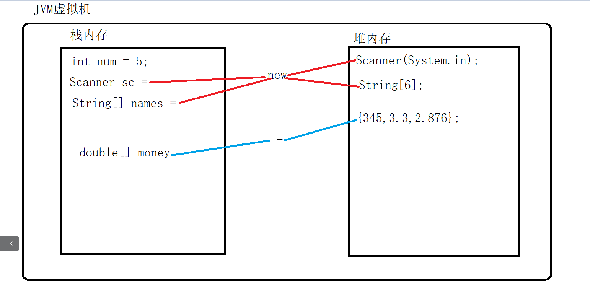
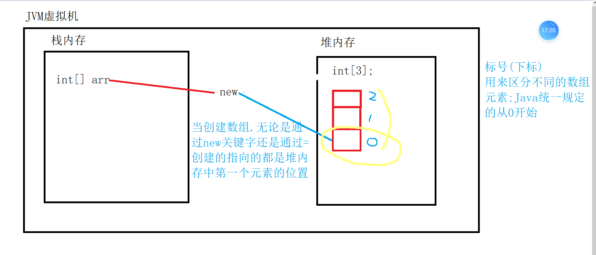
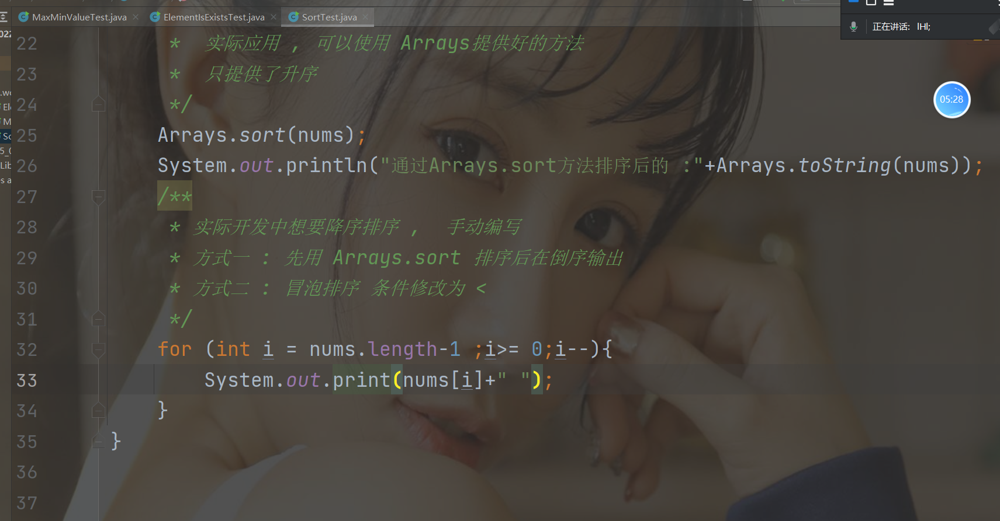

# 数组

**概念**

含义

```java
存储一组相同类型的容器
```

特点

```java
存储数据的类型必须一致.--保证了元素的安全性,存储的数据不够灵活
使用数组进行多个数据存储时,必须标明数组长度--长度固定
```

**使用数组的原因**

```java
1.同时存储多个具有相同含义或者类型的数据,简化了编写
2.可以减少栈内存的存储压力
```

**定义格式**

静态

```java
已知数组中存放的元素的值
1.数据类型[] 数组名 = {值,值,值};
2.数据类型[] 数组名 = new 数据据类型[]{值,值,值};
```

动态

```java
已知数组中存放元素的个数(长度)
数据类型[] 数组名 = new 数据类型[个数]
```

**数组在Jvm存储的位置**

```java
数组是java的特殊的引用数据类型,除了使用new 关键字,指向堆内存以外,还可以直接通过  " = " 发生地址指向的改变(由栈内存,指向堆内存)
```

当创建数组时，通过new在堆内存中分配内存空间，指向的是堆内存的地址。（数组中的第一个元素）

如何区分数组中的元素，通过给每个空间进行一个编号，称为索引（下标）———从0开始



```java
所有的基本数据类型,将数据存储在栈内存中,需要赋值,而引用数据类型(Scanner和数组),创建在栈中完成的
引用数据类型,只有遇到new关键字的时候才会发生地址指向的改变,从栈指向堆.

数组特殊除了new以外还能通过  = 改变
```

**数组在堆中如何存储**



**细节**

```java
直接打印数组名,结果是该数组中堆内存第一个元素所在位置的地址值

如何获取数组中的元素—————数组名[下标]
```

**下标**

```java
如果元素存在,则下标一定是不下于0的数字
如果元素不存在,则下标一定是小于0的数据,为了保持数据的统一性,java规定元素不存在的时候统一下标为-1
数组长度 = 最大下标 + 1(数组元素最大小标,永远比数组长度小1)
数组长度的表达式: 数组名.length
如果没有给指定类型的数组存储元素,则会用该数组类型的默认值进行存储 
```

**二维数组**

含义

```java
将多个相同类型的数组存放到指定的数组中称这样的数组为二维数组,表示矩阵
```

结构

```java
数据类型[][] 数组名 = {数组1,数组2};

数据类型[][] 数组名 = new 数据类型[行][列];
第一个代表行，第二个代表列，第一个长度是要定义的，但是每个数组的长度可以不定义
```

## 按照指定格式显示数组中的元素

含义:

```java
就是遍历数组,for循环实现,然后将数组数值输出,前面和后面加上字符串
```

### 数据复制

java定义好的

**方式一**

```java
由Arrays类提供的
数据类型[] 新数组名 = Arrays.copyOf(数组名,int length);

通过Arrays.copyOf,会得到一个全新的数组
()第一个参数,是提数据的原数组,第二个参数,是复制元素的个数
```

**但是**

```java
当复制的长度比原数组长度小,那么,正常复制
当复制的长度比原数组长,正常的吧原数组的值都复制,然后空余的地方用该数组默认值补全
```

**例如**

```java
int nums1 = Arrays.copyOf(nums,10);
System.out.print(Arrays.toString(nums1));
//放在输出语句中的打印数组内容的语句
Arrays.toString(数组名)
```

**方式二**

由System提供

```java
数据类型[] 新数组 = new 数组类型[长度];
System.arraycopy(原数组,int srcPost,新数组,int destPost,int length);

```

解释:

```java
原数组:原来的数组
新数组:接受复制数据的数组
int srcPost: 从原数组中的指定开始复制
int destPost:将复制的数据,从新数组中指定的位置开始复制
int length:复制的长度
```

下标越界问题(复制的规则)

```java
原数组长度 - 1 - length >= srcPos
目的地数组 - 1 - length >= destPos
```

## 数组的应用

操作数组中的元素

### 冒泡排序

```java
投机取巧版本：
public static void main(String[] args){
    int[] nums = {5,-9,9,7,0,1,3};
    System.out.printly(Arrays.toString(nums));
    for(int i = 0; i <= nums.length - 1;i++){
        for(int j = 0; j < nums.length - 1 -i;j++){
            // 升序排列,前一个元素 ,比后面一个元素值大
            if(nums[j] > nums[j +1]){
                int temp = nums[j];
                nums[j] = nums[j + 1];
                nums[j + 1] = temp;
            }
        }
    }
    System.out.printly(Arrays.toString(nums));
}

```


```java
正宗版本：
    
for (int i = 0; i < arr.length - 1; i++) {
            for (int j = i + 1; j < arr.length; j++) {
                if (arr[j] > arr[i]) {
                    int temp = arr[i];
                    arr[i] = arr[j];
                    arr[j] = temp;
                }
            }
        }
```


### Arrays类提供方法支持,只有升序排序



### 折半查找

原理

```java
对指定的数组重复多次进行折半,取中间值的过程,是排序之后取数据长度的中间值,不是数据的中点.用指定位置上的数据和折点位置上的数据进行比较
```

前提

```java
必须是有序的数据,不论升序还是降序
```

代码

```java
//折半查找：获取指定元素在指定数组中的位置, 指定位置的元素和数组
    public static int ElementPosition(int num,int[] nums){
        sort(nums);
        int begin = 0;
        int end = nums.length - 1;
        while (begin <= end){
            int middle = (begin+end)/2;
            if (num == nums[middle]){
                return middle;
            }else if(num > nums[middle]){
                begin = middle + 1;

            }else{
                end = middle - 1;
            }

        }
        return -1;
    }
```

### 对数组元素的增删改查

更新——-要更新的元素必须是存在的

```java
package cn.wolfcode.HomeWork.Text;

import java.util.Arrays;
import java.util.Scanner;

public class U {
    public static void main(String[] args) {
        String[] names = {"aa", "不变", "cc"};
        System.out.println(Arrays.toString(names));
        Scanner sc = new Scanner(System.in);
        System.out.println("改变的元素");
        String editBefore = sc.next();
        //判断元素是否在数组中
        //假设元素不存在
        int index = -1;
        for (int i = 0; i < names.length; i++) {
            if (editBefore.equals(names[i])) {
                index = i;
                break;
            }
        }
        if (index != -1) {
            //执行修改操作,为什么这里修改呢,是前面有循环操作
            //改变index的数值,意思是找到了相同的元素
            System.out.println("输入修改的值");
            String UAfter = sc.next();
            System.out.println("书否执行修改.(y/n)");
            String flag = sc.next();
            if (flag.equalsIgnoreCase("n")) {
                System.out.println("撤销修改");
            } else {
                names[index] = UAfter;
                System.out.println(Arrays.toString(names));
            }
        } else {
            System.out.println("不存在");
        }
    }
}

```

删除——要删除的元素一定要存在

```java
删除元素后,原来的数组结构会发生改变,就是长度会改变,所以在删除操作时,一定是生成一个新的数组,新的数组长度是原数组长度减一
```

创建

```java
插入元素后,会改变原有的数组的结构,新数组的长度是原数组的长度+1
```

### java中的随机操作

随机验证,防止机器刷机

**由java中Math类提供**

```java
package cn.wolfcode.HomeWork.Text;

public class MathMethod {
    public static void main(String[] args) {
        /**
         * Math.random();
         * 随机产生[0.0，1.0）区间的任意一个无限不循环小数,结果是double
         * 实际开发中,获取给定区间的整数部分,前提给区间进行扩大
         */
        int dou = (int) (Math.random() * 10);
        System.out.println(dou);
        /**
         * 拓展:
         * 想要四位的整数
         * 思路:下扩大,在平移,*9000  + 1000;等于是区间的变化
         *9000,是为了不让0开头,而下面的哪种方法就可以是0开头
         */
        int num = (int) (Math.random() * 9000 + 1000);
        System.out.println(num);
        String code = "";
        for (int i = 1; i < 5; i++) {
            code+= (int)(Math.random()*10);
        }
        System.out.println(code);

    }
}

```


**由java中Random类提供**

```java
package cn.wolfcode.HomeWork.Text;

import java.util.Random;

public class randoms {
    public static void main(String[] args) {
        Random random = new Random();
        System.out.println(random.nextInt());
        System.out.println(random.nextInt(100));

        /**
         * nextInt():获取int的取值范围为内任意一个整数
         * nextInt(int bround ): 获取0---bound的任意一个整数[0,bound)
         */
    }
}

```

数组的简单应用

```java
被static修饰的方法,可以直接用类名.方法名调用
    public static String code(){
    /**
    *数组的动态定义格式
    */
    char[] chs = new char[62];
    //循环存贮A--Z  a---z 0--9 三种类型的内容，通过ASCII码进行遍历存储
    for(int i= 0;i < 26;i++){
        chs[i] = (char)(65+i);
        
    }
    for(int i= 0; i < 26;i++){
        chs[i+26] = (char)(97 +i);
        
	}
    for(int i= 0; i <10;i++){
        chs[i+52] = (char)(48+i);
    }
    //定义一个存储验证码的变量
    String str  =  "";
    for(int i= 0 ; i < 4;i++){
        /**
        *Math.random  取值范围十[0.0,1.0);
        *后面城的数字,是为了改变这个区间的范围
        */
        int index = (int)(Math.random()*62);
        str += chs[index]
    }
    return str;
}
```