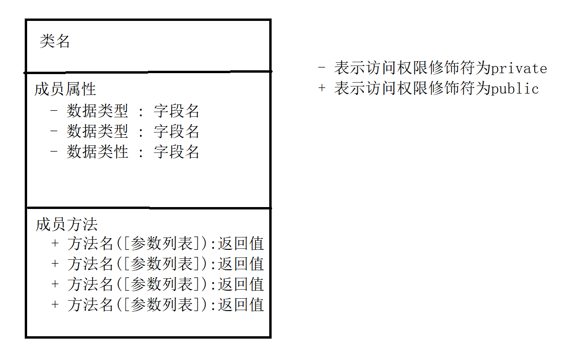

# 封装

## 概念

**含义**

```java
将某些指定的代码保护起来,不被外人轻易的访问
```

**封装的是什么**

```java
成员字段:全部私有化(被private修饰,防止其他人外部随机访问)
成员方法:将功能代码定义到指定到类的指定方法中,简化了主函数的代码操作,,提高了运行效率,在主函数中,只需要实例化对象,对象.调用方法
```

**好处**

```java
提高了代码的安全性
简化主函数的代码编写
降低了类和类之间的耦合度(解耦合)
```

## 值传递

含义
```java
根据不同场景给类中的指定成员字段进行赋值操作
```

**值传递的三种情况**

第一种:直接赋值法

```java
无论是否分装----直接赋值法:在定义成员字段的时候直接赋值;好处是直接,适用于所有的场景,但是后期的维护麻烦,实际开发中多用于常量的操作
```

第二种:  对象 .  调用属性
```java
封装之前:可以在外部通过  对象名.调用属性  赋值的方法;这种方式受访问权限修饰符影响较大,不符合面向对象封装的思想,实际开发中几乎不用
```

第三种 : 构造器赋值

```java
构造器赋值--有参构造器
    
适用get/set方法操作--由java提出的指定格式方法,完成对私有化成员属性操作
```

**实例**

```java
示例:适用get和set 在void后面加set或者是get,命名是符合小驼峰命名法则
    set 设置属性的值
public void setStud_name(String stu_name){
    this.stud_name = stu_name;
}
	get 获取到值
public String getStud_name(){
    return stud_name
}
```

## Java的算法

### 递归和递推

````java
java不侧重算法和数据结构;但是要求会两种算法(递归和递推),和集合部分的地城的存储结构
    
使用前提:
	已知一组数据,具有一定的规律

算法除了写法不一样,其他都一样
  
以上的两种算法含义:
	递归算法:在自身的方法体中,再次调用自己
	递推算法:适用循环语句(for循环)对指定的代码完成重复操作
````


## 类图

**要求**

会画,且能看懂,编辑器自带

