# 核心类库

就是由java定义好的类

## 类的定义格式,关键字总结


| 定义类的关键字 |  含义   |
| :------------: | :-----: |
|     class      | 普通类  |
| abstract class | 抽象类  |
|   intereface   |  接口   |
|      enum      | 枚举 类 |


| 继承类或实现类的关键字 | 含义                                             |
| ---------------------- | ------------------------------------------------ |
| extends                | 继承类(只支持单继承)                             |
| implements             | 实现接口(接口可以多实现,多个接口之间使用“,”分割) |


## 常用包以及常用类

### 包

#### java.lang

是java语言中唯一  一个不用导入的包

**常用**

```java
System类,String(StringBuffer,StringBuilder) Math类  包装类
```

#### java.util

是java的工具包

**常用类**

```java
Scanner类  Random类   Arrays类  UUID类, Date类  Calendar类   BigDecimal类   集合类````
```

#### java.io

是进行过数据传输的包,javaIO流包

**常用类**

```java
IO流类  File类
```

### 常用类

#### System类

作用：Java为了适应不同的操作系统 (Windows Linux Mac) 创建

**简介**

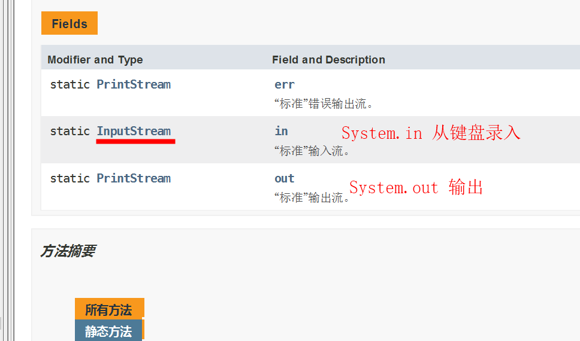

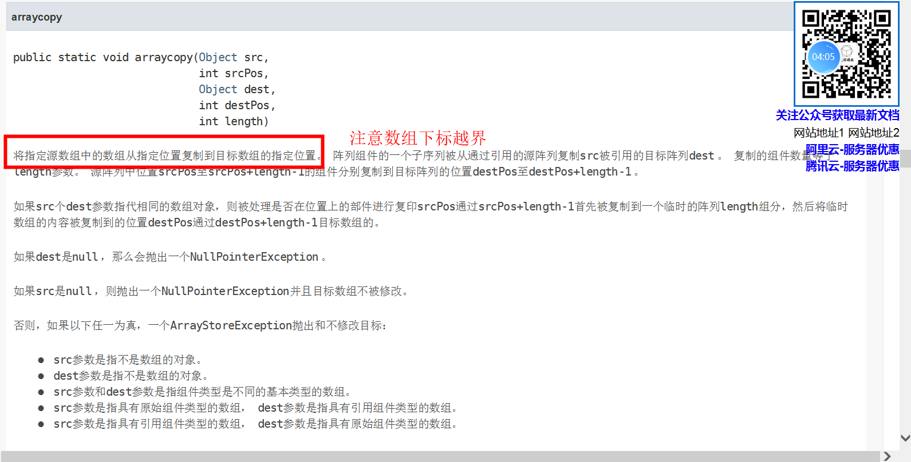


#### Math类

作用：所有的低等数学操作的类

**常用：**

Math.PI ——π


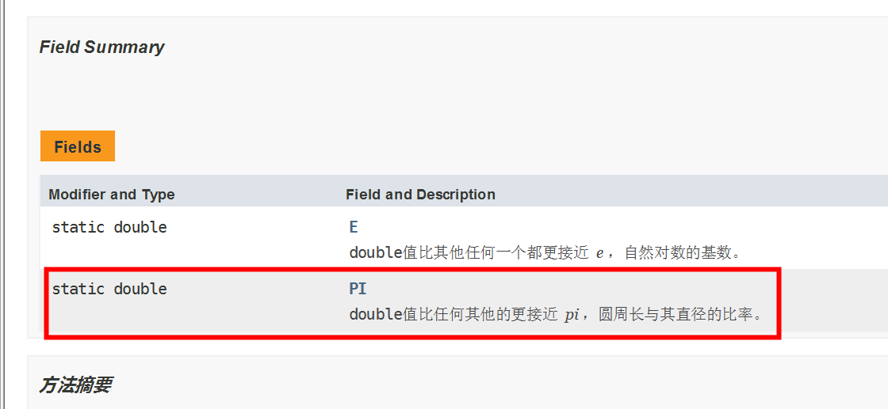

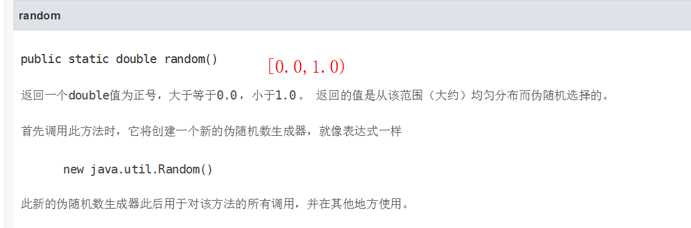

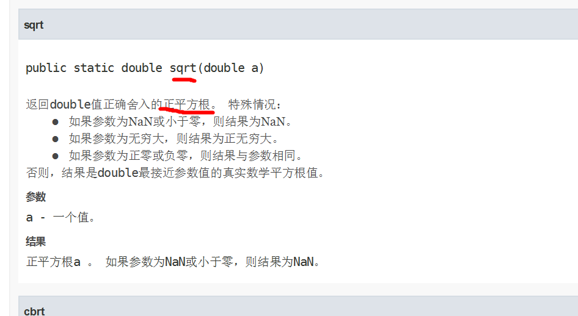


#### 包装类

**出现的原因**

由于Java完全面向对象的 ,      常用类     通过   对象.调用()

对于出现的原因的**补充**：

		Java 是面向对象编程，所以我们会将所有的事物都堪称对象。通过对象调用具体的属性方法来运行程序。但是基本数据类型无法变为对象。那么也就是无法调用一些方法来做简便操作。也无法实现与引用类型的转换。**包装类就是对基本数据类型的封装，将其封装为一个对象。以便我们后续使用。**


**基本数据类型** 无法生成对象 , 因此Java提出一系列的基本数据类型的包装类,通过包装类进行实例化对象 , 调用方法 , 方便操作

**实质**

依然是对基本数据类型操作 , 依然符合基本数据类型的取值范围

**基本数据类型对应的包装类** ————**背会**

| 基本数据类型 | 包装类    |
| ------------ | --------- |
| byte         | Byte      |
| short        | Short     |
| int          | Integer   |
| long         | Long      |
| float        | Float     |
| double       | Double    |
| char         | Character |
| boolean      | Boolean   |


##### Integer特殊复制代码展示：

```java
package cn.fighting.domain;

public class Packages {
    public static void main(String[] args) {
        Integer a = -129;
        Integer b = -129;
        
        Integer c = -128;
        Integer d = -128;
        
        Integer e = 127;
        Integer f = 127;
        
        Integer g = 128;
        Integer h = 128;
        System.out.println("a == b? " + (a == b));
        System.out.println("c == d? " + (c == d));
        System.out.println("e == f? " + (e == f));
        System.out.println("h == g? " + (h == g));
    }
}

```

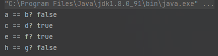


上述代码 **分析** 

相邻两个对象 值 都一致 , 为什么显示结果 有 true 有 false , Java 的 byte取值范围 [-128,127],使用 Integer 完成赋值 == 比较值 是一致 , 当超出这个范围 , 会使用 new Integer(int value) 构造器完成赋值 ,  存储在堆内存中 , 需要使用 equals 比较

就是自己简单理解一下,字节的范围是-128到127的区间中，在范围中的数值用 == 进行比较，不在范围中的，会先new一个空间（这个空间在堆中）然后通过equals进行比较，因为new过得对象是地址改变了，数值在堆里面，找值通过地址寻找，所以会出现false的情况

下面是一个改变的情况

```java
package cn.fighting.domain;

public class Packages {
    public static void main(String[] args) {
        Integer a = -129;
        Integer b = -129;
        Integer c = -128;
        Integer d = -128;
        Integer e = 127;
        Integer f = 127;
        Integer g = 128;
        Integer h = 128;
        System.out.println("a == b? " + (a == b));
        System.out.println("c == d? " + (c == d));
        System.out.println("e == f? " + (e == f));
        System.out.println("h == g? " + (h == g));
        System.out.println("h == g? " + h.equals(g));
    }
}
```

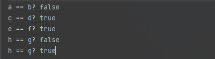


##### “包装类”    和    “基本数据类型” 和 “ String类”相互转换

因为包装类比较多，所以这里就用一个int类型进行举例子

Integer  <——>  int <———>String

###### **基本数据类型  ——>包装类**

有三种方法：

**第一种：**

可以使用包装类  的构造器完成———–但是在JDK9版本,这个方法过时,不推荐使用

```java
public Integer (int value)

默认值是null
```

```java
这个是第一个情况:
package cn.fighting.domain;

public class Package1 {
    public static void main(String[] args) {
        int sum = 12;
        Integer a = new Integer(sum);
    }
}

```


**第二种:**

自动装箱  ,JDK5开始使用

```java
package cn.fighting.domain;

public class Package1 {
    public static void main(String[] args) {
        Integer a = 12;
    }
}
```


**第三种:**

由 Integer  类提供的方法

```java
public static Integer valueOf(int value)
```


```java
package cn.fighting.domain;

public class Package1 {
    public static void main(String[] args) {
        int sum = 12;
        Integer a = Integer.valueOf(sum);
        System.out.println(sum + 6);

        //最后的结果   18
    }
}

```


###### 包装类—–>基本数据类型

**第一种**

自动拆箱   JDk5版本开始

```java
package cn.fighting.domain;

public class Package1 {
    public static void main(String[] args) {

        Integer a = Integer.valueOf(12);
        int b = a;
        System.out.println(b);
    }
}
```


**第二种**

由 Integer 提供的

```java
public int intValue()
```


```java
package cn.fighting.domain;

public class Package1 {
    public static void main(String[] args) {

        Integer a = Integer.valueOf(12);
        int b = a;
        //第二种
        int c = a.intValue();
        System.out.println(b +c);
    }
}
结果是24
```


###### 包装类    到   String    

两个方式

**方式一**

创建 String 类型的变量

```java
package cn.fighting.domain;

public class Package1 {
    public static void main(String[] args) {
        String str = "";
        Integer a = Integer.valueOf(12);
        String newStr = str + a;
        System.out.println(newStr);

    }
}
结果就是个字符串,前面有个空字符串,加上后面通过自动拆箱方式进行字符和数字的拼接
```


**方式二**

通过包装类对象调用方法  完成转换

```java
public String toString()
将任意的数据类型转换为String类型最简单的方式
```


```java
package cn.fighting.domain;

public class Package1 {
    public static void main(String[] args) {
        String str = "";
        Integer a = Integer.valueOf(12);
        String b = a.toString();
        System.out.println(b + 25);
    }
}
1225
```


###### String ——>包装类

有两个方式

**方式一**

通过包装类的  构造器完成

```java
public Integer (String str)
```

**注意**

````java
当使用String  转换数字的时候,,String值也必须是数值
无法将String  类型转换成 char  /  Character
String 转换成   boolean / Boolean
    当 String 的值  不是  true 或者 false 的时候,转换的结果一定是 false,这个时候的 false 不是 Boolean 类型本身的 false 而是 表示转换结果错误
    如果 String 值 是 true 或者 false 的时候,转换的结果才是布尔类型
````

**代码**

展示方式一

```java
package cn.fighting.domain;

public class Package1 {
    public static void main(String[] args) {
        String str = "-500";
        Integer a = new Integer(str);
        System.out.println(a + 6);
    }
}
-496
```

展示布尔

```java
public class Package1 {
    public static void main(String[] args) {
        String str = "-500";
        Boolean c = new Boolean(str);
        System.out.println(c);
    }
}
false
```


**方式二**

由包装类提供的

```java
public static Integer valueOf(String s)
```

```java
public class Package1 {
    public static void main(String[] args) {
        
        String str = "-500";
        Integer c = Integer.parseInt(str);
        System.out.println(c + 10);

    }
}
-490
```


###### 基本数据类型  ——>String

方式一

创建  String  通过  + 的方式进行实现，就可以理解为拼接字符串

```java
package cn.fighting.domain;

public class Package1 {
    public static void main(String[] args) {
        int a = 20;
        String str = "";
        System.out.println(a + str);
    }
}
20
```


方式二

```java
public static String valueOf(int num)
```


```java
public static void main(String[] args){
    int num = -50;
    String str = String.valueOf(num);
    System.out.println(str + "50");
}
```


###### String——>基本数据类型

只有一种方式就是

方法由包装类提供的

```java
public static int parseInt(String s)
```


```java
package cn.fighting.domain;

public class Package1 {
    public static void main(String[] args) {
        String sum = "99";
        int a = Integer.parseInt(sum);
        System.out.println(a);
    }
}
99
```


**图例:转换方法操作**(重点)

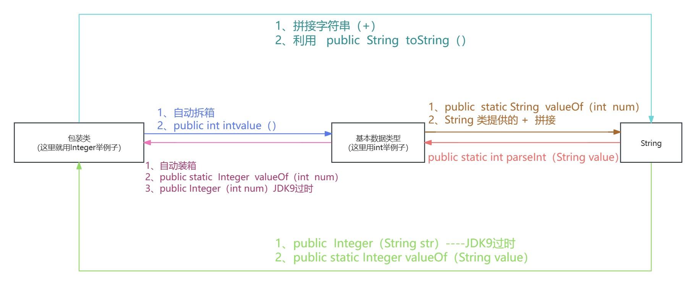  


#### Object类

**简介**

江湖地位

1.是java语言中唯一 一个没有父类的类

2.是java中所有类的父亲

**直接父亲**: 类结构显示中 紧挨着当前类的上一层

**间接父亲**: 类结构中除了第一层以外的类都是间接父类

			补充：**若父类还存在父类。那么就是间接父类。继承链是可以存在多层的。**

3.在java中可以用来表示所有引用数据类型


##### toString

这个类是Object类中的方法，如果没有重写这个Object类里面的 toString，那么将会打印的是对象的地址

```java
public String toString()-------返回对象的字符串表示形式
```


```java
Student stu = new Student();
System.out.print(stu);

没重写 toString 方法----打印的就是地址
```


如果需要打印对象的值,那么就需要重写Object类中的 toString方法,方法体中返回的是什么,打印的就是什么,

代码部分有些在继承中可以看看   和生成那个构造器中的部分一样,代码就不赘述了


##### equals

```java
public boolean equals(Object obj) ，指示其他某个对象是否和这个对象“相等”、
    
```

**注意**

- 只能用作引用数据类型进行对比（基本数据类型不能使用）。

- 若是 Object 类中的 equals 方法，那么底层本质上是对比对象的地址。（比较的是堆内存中的地址）

- 我们所有的类都继承了 Object。我们可以重写 Object 类中的 equals() 方法。那么则可以按照我们自定义的比较规则来比较（比较对象内的值是否相等）。

重写equals 的方法在后面的面试题中：

从后面面试题中可以得到一个结论：

```java
- - 若想比较地址。那么我们直接调用 equals() 方法即可。若想比较对象内的值是否一致，那么就需要我们自己去重写 equals() 方法。（可以自动生成）。

- 
```


###### hashCode简介

```java
public int hashCode()
    
返回对象的哈希码
```

一般会根据一个对象的地址通过某种算法得到了一组数字。

**java中提出：**

可在生成 equals() 方法前。建议你同时生成 HashCode。这样会提高对比效率。

相同对象的 HashCode 大部分都相同。Java 中真正的对比是先去对比 HashCode 是否一致。若不一致则一定不是一个对象。那么就没有必要在去对比 equals() 了。只有 HashCode 相同的情况下。才有可能是一个对象。在进行重写的 equals() 中值的对比。这样会提高效率。

HashCode 本质上他是按照某种算法得到要给结果后。按照大致进行对比。例如：我们要在我们班级找一个叫 Xxx 的女生。那么 HashCode 就类似于先将男女分组。若性别不等于女，则一定不是我们需要找到人。只有性别为女了。才去找 Xxx 这名女生


java提出可以自动生成 equals 方法 但是必须同时生成hashcode 方法


#### 随机类

##### Random类

**含义**

专门生成随机数字的工具类

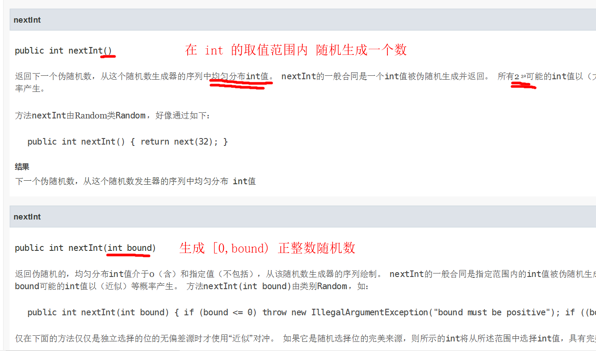


##### UUID类

含义

根据当前计算机的IP,编号等随机组成
```java
public static UUID randomUUID()
```

UUID是有五段16进制的数组组成的   中间是 短横线  - 分割

后续是需要配合String 类,完成指定数据的获取

```java
package cn.fighting.domain;

import java.util.UUID;

public class UUIDs {
    public static void main(String[] args) {
        UUID a = UUID.randomUUID();
        System.out.println(a.toString());
    }
}
UUID a = UUID.randomUUID()-----randomUUID是个里面的方法,可以类名加点调用
```


#### BigDecimal类（会用）

**作用**

用来进行金融项目中数据的精确计算(精度更高,比double的精度更高)

是浮点的一个引用类型

```java
public BigDecimal(String val)
```

```java
package cn.fighting.domain;

import java.math.BigDecimal;

public class BigDecimalMain {
    public static void main(String[] args) {
        BigDecimal a = new BigDecimal("60");
        BigDecimal b = new BigDecimal("3");
        System.out.println(a.add(b));
    }
}
63
```


构造方法中是一个String类型的时候,必须保证这个String的 内容是纯数字才可以,否则将会抛出数字格式化异常

对 BigDecimal 类型的 + - * / 运算。必须通过指定方法才可以是实现。不能使用算数运算符。


**算术运算的制定方法:**

```java
package cn.fighting.domain;

import java.math.BigDecimal;
import java.math.RoundingMode;

public class BigDecimalMain {
    public static void main(String[] args) {
        BigDecimal a = new BigDecimal("60");
        BigDecimal b = new BigDecimal("3");
        System.out.println("+"+a.add(b));
        System.out.println("-" + a.subtract(b));
        System.out.println("*" + a.multiply(b));
        System.out.println("/" + a.divide(b, 2, RoundingMode.HALF_DOWN));
    }
}
+63
-57
*180
/20.00
    
其中 除法 比较特殊,首先调用方法,传递参数,然后是保留几位小数,后面的是是否取整(怎么取整,向上,向下)
```


#### 日期类

是     java.util.Date  类

**作用**
纯 java后台操作日期的类

**简介**

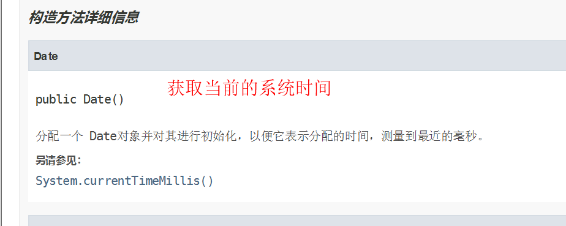


```java
package cn.fighting.domain;

import java.util.Date;

public class Time {
    public static void main(String[] args) {
        Date time = new Date();
        System.out.println(time);
    }
}
Fri Mar 22 15:57:36 CST 2024
```


##### SimpleDateFormat类

简化日期格式,就是日期的格式化,按照年月日的格式显示

**Java中常用的显示日期单位的符号**

| 日期单位符号 (严格区分大小写) | 含义                       |
| ----------------------------- | -------------------------- |
| yyyy                          | 4位的年                    |
| MM                            | 2位月                      |
| dd                            | 2位的天数                  |
| DDD                           | 当年的第几天 (一年有365天) |
| HH                            | 24进制的小时[0,23]         |
| hh                            | 12进制的小时               |
| mm                            | 分钟                       |
| ss                            | 秒钟                       |
| SS                            | 毫秒(以 1000)              |
| aa或者(a)单个a                | 上下午                     |
| EE(E)                         | 周几                       |


```java
package cn.fighting.domain;

import java.text.SimpleDateFormat;
import java.util.Date;

public class Time {
    public static void main(String[] args) {
        Date time = new Date();
        System.out.println(time);
        SimpleDateFormat time2 = new SimpleDateFormat("yyyy-MM-dd HH:mm:ss,SS");
        String time3 = time2.format(time);
        System.out.println(time3);
    }
}
```


```java
public SimpleDateFormat(String pattern) ------实例化对象，并且根据指定的符号设置显示格式

public final String format(Date time)---------通过 SimpleDateFormat 对象调用的，将指定的date对象按指定的格式以 String 显示
```


##### Calendar类

**作用**

计算机操作的时间 使用的是毫秒进行计算的，不利于程序员的操作，提出了Calendar类专门编写操作，将指定的毫秒转换成时间

**注意**

对时间只能进行 +  -  运算

calendar类显示的毫秒从1970 1.1 00:00:00（格林尼治时间）

Java 中的日期是从 1970.1.1 00:00:00 开始的。 英国 格林尼治 小镇的时间为标准日期时间。那么我们中国是东八区。所以我们使用时间是需要 +8:00 的。

**简介**

```java
public static Calendar getInstance()
    使用默认时区和区域设置获取时间,Calendar返回的是基于默认时区的当前时间,默认是FORMAT区域设置
    获得一个日历
```

```java
package cn.fighting.domain;
import java.util.Calendar;

public class Time {
    public static void main(String[] args) {
        Calendar a = Calendar.getInstance();
        System.out.println(a);
    }
}

```


**Calendar 应用**

```java
public int get(int field)
    
根据Calendar类定义好的指定的时间字段获取字段值
```

**注意**

月份是从0开始的,所以在获取月份的时候要加1

周日是一周的开始

**代码**


```java
package cn.fighting.domain;

import java.util.Calendar;

public class Time {
    public static void main(String[] args) {
        Calendar a = Calendar.getInstance();
        System.out.println(a);
        System.out.println("year" + a.get(Calendar.YEAR));
        System.out.println("month " + (a.get(Calendar.MONTH) + 1));
    }
}
上面是简单的案例
```


**Calendar 应用2**

转换:Calendar —–>Date

```java
package cn.fighting.domain;

import java.text.SimpleDateFormat;
import java.util.Calendar;
import java.util.Date;

public class Time {
    public static void main(String[] args) {
        //用Calendar进行转换成date的
        Calendar a = Calendar.getInstance();
        System.out.println(a);
        Date b = a.getTime();
        System.out.println(b);
        //直接用simpleDateFormat进行输出
        SimpleDateFormat c = new SimpleDateFormat("yyyy-MM-dd");
        String d = c.format(b);
        System.out.println(d);
    }
}
自己解释一下,转换的原理是用Calendar获取时间,创建了一个对象,然后定义了一个date的对象,通过Calendar的对象调用getTime方法,获得的时间给了date创建的对象,所以
    Date b = a.getTime();
这里就已经是date的时间

    
而后面用simpleDateFormat创建了对象的输出格式,然后调用format的方法,这个方法中传递的形参就是date的数据.
    
```


**转换:Date———–>Calendar**

```java
Date mydate = new Date();
Calendar c1 = Calendar.getInstance();
c1.setTime(mydate);
```


**Calendar 应用3**

设置

```java
package cn.fighting.domain;

import java.util.Calendar;

public class Calenders {
    public static void main(String[] args) {
        Calendar a = Calendar.getInstance();
        a.set(2024,11,31,23,59,59);
        System.out.println(a.getTime());
        a.add(Calendar.SECOND,1);
        System.out.println(a.getTime());
    }
}

```


### String类

**作用:**

存储连续多个字符的容器,值 必须定义在 “”(双引号中),且默认值为null

String是不可变字符串(生成字符串的值不可变)———a    b     ab    看似两个字符串的拼接,但实际上是创立了第三个字符去存储这个新的字符


#### 赋值方式

直接赋值:        String 变量名 = “值”;

构造器赋值:    String 变量名 = new String(“值”);

**注意**

在栈内存中,可以用 == 进行比较,这个时候的String是直接赋值

堆内存中,必须用equals 进行比较,这个是时候的String是构造器赋值,就是new了一下,存到了堆里面.

匿名赋值方式推荐使用equals 进行比较

**匿名赋值**

```java
String a = new String("abc");
```


#### String类在API的定义

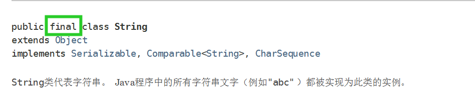


**解释**

final修饰类:      

String类不能被继承 , 后续出现的 StringBuffer和StringBuilder 类 与String没有继承关系,是在String 的基础上 拓展功能类

且String类是final修饰的,且修饰后的值不会改变


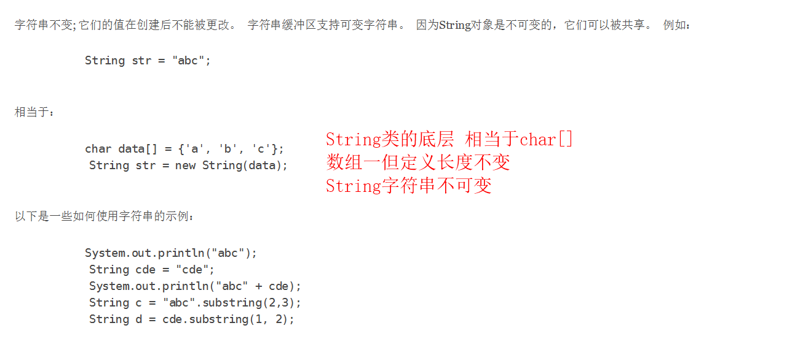

这也是String 不能转换char Character 原因char[]———数组长度一经定义无法改变.    而且String 底层本质上就是char[] 数组,所以String不可以直接转为char[]数组


#### String类常用的方法

##### 转换

##### **String <—->byte[]**

将指定的String转换成 byte[] ——-String 提供

这个是将指定的字符串转换成byte【】

```java
public byte[] getBytes()
```

这个是将byte【】转换成字符串（String）

```java
public String(byte[],int beginIndex,int length)
开始位置,一共转化多长
```


```java
package cn.fighting.domain;

import java.util.Arrays;

public class Calenders {
    public static void main(String[] args) {
        String a = "明天是好节日";
        //String变byte[]
        byte[] bbuf = a.getBytes();
        System.out.println(Arrays.toString(bbuf));
        System.out.println(bbuf.length);
        //byte[]变String
        String b = new String(bbuf,0,bbuf.length-12);
        System.out.println(b);
    }

}
一个汉字是三个字符
    一个字节是八位
在IDEA中已经设置了编码格式-----utf-8
    
    
在utf-8中,一个字符是三个字节
    相邻的两个byte组成一个汉字,其他都占一个字符
    
在gbk中,一个字符是两个字节
    统一的,一个字节是八位(bit)
```


**解释**

```java
String b = new String(bbuf,0,bbuf.length-12);
System.out.println(b);

长度不够转换的时候,会用一个特殊字符进行填充
```


##### String 和 char[]（常用）

将指定的String 转换成 char[]  ———   String提供

````java
public char[] toCharArray()
````

**有个代码展示**

```java

package cn.wolfcode.domain;

import java.util.Arrays;

public class Person {
    public static void main(String[] args) {
        String a = "今天是哥好事";
        char[] b = a.toCharArray();
        System.out.println(Arrays.toString(b));
    }
}
[今, 天, 是, 哥, 好, 事]
```


将指定的字符数组转换成 String

```java
public String (char[] cbuf , int beginIndex, int length)
    后面是开始下标和结束下标
```


````java
package cn.wolfcode.domain;

public class Person {
    public static void main(String[] args) {
        String a = "今天是哥好事";
        char[] b = a.toCharArray();
        String c = new String(b,2,4);
        System.out.println(c);
    }
}
是哥好事
    
    
````


解释一下：

就是用这个String的方法的时候，要给他传入字符的数组，就是先进行String到char数组，然后将这个数组放到String的方法中，第一个参数是数组，第二个是起始的索引，然后是进行多长的转换


**大小写转换**

```java
package cn.wolfcode.domain;

import java.util.Locale;

public class Person {
    public static void main(String[] args) {
        String a = "i lova you";
        System.out.println(a.toUpperCase(Locale.ROOT));
    }
}
I LOVA YOU

只有对英文有效，
toLowerCase()是转换成小写
```


没有增删操作

##### 有改的操作：

###### 修改指定的字符


使用新的字符，替换掉原有的字符，将替换后的String 返回（原有的字符存在的时候才会替换）

```java
public String replace (char old,char newChar)
    
```


结果是：当原有的字符存在的时候，用新的字符替换然后 返回

			如果没有，直接返回原有的所有的字符


```java
package cn.wolfcode.domain;

import java.util.Locale;

public class Person {
    public static void main(String[] args) {
        String a = "i lova you";
        System.out.println(a.toUpperCase(Locale.ROOT));
        System.out.println(a.replace("z", "a"));
        System.out.println(a.replace("o", "hhhhhh"));
    }
}

I LOVA YOU
i lova you
i lhhhhhhva yhhhhhhu

```


###### 去除指定字符串首尾空格


```java
public String trim()
```


```java
package cn.wolfcode.domain;


public class Person {
    public static void main(String[] args) {
        String a = "          i lova yo     u      ";
        System.out.println(a);
        System.out.println(a.trim());

    }
}

          i lova yo     u      
i lova yo     u

```


**附加**

判断字符串是不是为空串,如果是空, 返回true

```java
public boolean isEmpty()
```


##### 查

###### 获取指定位置上的元素


```java
public char charAt(int index)
```


```java
package cn.wolfcode.domain;


public class Person {
    public static void main(String[] args) {
        String a = "nizhendeshihgeshabi";
        System.out.println(a.charAt(0));

    }
}
n
    这个是索引的位置,就是和数组的下标做对比,(相似的)
```

###### 获取指定元素在String中第一次或者最后一次出现的位置

第一次出现的位置

获取指定字符第一次出现的位置  如果不存在返回  -1

int a 表示–——用户即可以传递char 类型的数据，也可以传递char 对应的ASCII值

```java
获取指定字符第一次出现的位置：
public int indexOf(int a)

public int indexOf(String son)

获取指定的字符第一次出现的位置,从指定的位置之后，（就是向后找）第一次出现的位置
public int indexOf(int a,int beginIndex)

public int indexOf(String son, int beginindex)

```


首先是进行第一次出现的位置：

这个是从哪个位置开始后，再开始的位置也会进行比较,来查看是不是也出现过的

```java
package cn.wolfcode.domain;


public class Person {
    public static void main(String[] args) {
        String a = "nizhendeshihgeshabi";
        System.out.println(a.indexOf("a"));
        System.out.println(a.indexOf(97));
        System.out.println(a.indexOf("bbb"));

    }
}
16
16
-1

```


然后是从指定的位置之后获取字符串

```java
        System.out.println(a.indexOf("n", 0));
        System.out.println(a.indexOf("n", 4));

0
5

```


###### 最后一次出现的位置


获取指定字符在String中最后一次出现的位置，如果不存在就返回-1

```java
 最后一次出现的位置
public int lastIndexOf(int a)

public int lastIndexOf(String son)
     
从指定的位置开始计算这个位置之前（就是向前找）最后一次出现的位置，如果不存在就返回-1

public int lastIndexOf(int a,int beginIndex)

public int lastIndexOf(String son , int beginIndex)

```


```java
package cn.wolfcode.domain;


public class Person {
    public static void main(String[] args) {
        String a = "nizhendeshihgeshabi";
        System.out.println(a.lastIndexOf("i"));
        System.out.println(a.lastIndexOf(97));
        System.out.println(a.lastIndexOf("i", 3));
        System.out.println(a.lastIndexOf("i", 18));

    }
}

18
16
1
18
```


###### 截取指定字符串

可以通过UUID获取四位验证码

截取指定字符串的格式：

```java
从指定的位置开始截取到字符串的末尾

    public String substring(int beginIndex)

从指定的位置开始，截取到指定的位置（不包含结束位置）
    public String substring(int beginIndex , int endIndex)

```


```java
package cn.wolfcode.domain;


import java.util.UUID;

public class Person {
    public static void main(String[] args) {
        UUID uuid = UUID.randomUUID();
        System.out.println(uuid);
        String code = uuid.toString();
        System.out.println(code.substring(1));
        System.out.println(code.substring(0, 4));

    }
}
6ddb1690-b38f-4898-835c-bea5875342e4
ddb1690-b38f-4898-835c-bea5875342e4
6ddb

```

解释一下这个代码：

先通过 UUID进行获取验证码，然后有很多组合，就是不重复的一种，然后通过String 的转换，uuid生成的不是字符类型，所以要进行字符类型先进行转换，否则无法进行操作。（下面这个图是没有进行转换的uuid进行获取指定字符串的错误提示）

也可以简单理解，这个substring方法是String类中的方法，uuid不属于String类，所以没有办法调用。

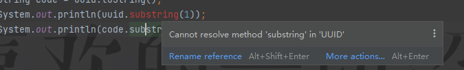


##### 判

###### 按照字典表顺序显示String


比较     **调用的字符串**  和   **参数字符串**  在字典表中顺序；严格区分大小写

规律 ：   结果 =  调用对象  -   参数对象

```java
public int compareTo(string other)
```


当  String 的值一致的时候  返回 0 

当长度一致： 值不一样   返回第一次出现不同符号的ASCII 差值

当长度不一样：

			连续的值一样： 返回的是 长度的差值

理解：（是字符串的长度，什么叫连续的值一样，就是和调用的一样，但是比调用的长度长，所以会有长度的差值）

			连续的值也不一样： 返回的是   第一次出现不同符号的ASCII差值

理解：（就是调用的部分不一样，和调用的部分没有一样的，才会出现第一次不同符号的差值—-ASCII，简单理解，要有ASCII差值，就得有不一样的两个字符，才可以进行差值比较，如果和基准都不一样，那么就不用出现差值，输出长度就行了）

```java
public int compareToIgnoreCase(String other)

    这个忽略大小写
```


```java
package cn.wolfcode.domain;


import java.util.UUID;

public class Person {
    public static void main(String[] args) {
        String a1 = "abc";
        String a2 = "abc";
        String a3 = "Abc";
        String a4 = "abb";
        String a5 = "abcdde";
        String a6 = "aAcdde";

        System.out.println(a1.compareTo(a2));
        System.out.println(a1.compareTo(a3));
        System.out.println(a1.compareTo(a4));
        System.out.println(a1.compareTo(a5));
        System.out.println(a1.compareTo(a6));

    }
}
0
32
1
-3
33

```

对代码的理解：

	首先是定义了一个基准，我要和谁去比，调用的是  . 前面的；参数是括号里面的，所以会有调用的减去参数的差值。

###### 判断string类的值是否一致


```java
public boolean equals(Object obj)

严格区分大小写，用作 用户密码的判断


public boolean equalsIgnoreCase(object obj)

忽略大小写比较；一般用于验证码的判断
```


###### 判断指定的字符串是否在字符串中


```java
public boolean contains(CharSequence str)

用来判断指定的字符序列或者叫  子字符串  是否在 字符串中
```


```java
package cn.wolfcode.domain;


public class Person {
    public static void main(String[] args) {
        String a = "www.zhangweishihundan.com";
        if (a.contains("shbi")){
            System.out.println("字符串是：" + a);
        }else{
            System.out.println("输入错了");
        }
    }
}
输入错了
```


###### 判断字符是指定的数据开头或者结尾


````java
public boolean startsWith(String prefix)

	判断字符串是否是以指定的前缀开头

public boolean endWith(String suffix)
    
    判断字符串是否是以指定的东西结尾
````


```java
package cn.wolfcode.domain;


public class Person {
    public static void main(String[] args) {
        String a = "www.zhangweishihundan.com";
        if (a.contains("shbi")){
            System.out.println("字符串是：" + a);
        }else{
            System.out.println("输入错了");
        }
        if(a.endsWith(".com") || a.startsWith("www")){
            System.out.println(a);
        }else{
            System.out.println("Worry!!!!");
        }
    }
}
输入错了
www.zhangweishihundan.com
```


### StringBuffer  和  StringBuilder

#### 概念

**什么是buffer、builder？**

```JAVA
 缓冲(缓存)技术 : 由 String 底层实现原理 char[] 数组一旦创建长度固定 , 不利String 增删操作 , 因此 Java提出了缓存技术 , 在 JVM 中开辟指定的空间 , 完成对数据的操作 , 操作好了之后会将结果返还给堆栈内存
```


**为什么扩展？为什么要有StringBuffer 和 StringBuilder**

```java
StringBuffer 和 StringBuilder 都存在一个 缓冲（缓存）技术。由于 String 底层是 char[] 数组且被 final 修饰。那么也就说明 String 一旦定义好后，将无法改变。不利于做增删改操作（String类中的增删改方法得到的都是一个新的字符串）。因此 Java 提出了 StringBuffer 和 StringBuilder 。他们是存在缓冲区技术的。可以在内存空间中开辟出一块缓冲控件用来存储数据。直到操作完数据之后，再将结果存储到堆栈内存中。（说人话，就是String不可变。所以不利于增删改。每次都需要创建新的数据。所以利用了  StringBuffer 和 StringBuilder 的缓冲机制，来更好的实现字符串的增删改）。
```


**什么是Buffer**

```java
 是 JDK 1.0 就存在了，他是线程安全的。（更适合多线程操作）。但是安全带来的弊端就是速度相对会慢。之所以安全是因为 StringBuffer 底层的方法都存在 synchronized 同步锁。只有上一个执行结束了下一个才会进来。
```


**什么是buiilder？**

```JAVA
 对指定的内容重新定义 : Java中重新构建  一般 将原有的 多线程操作变为单线程操作

     补充：
- 是 JDK 5 才出现的。他线程不安全（更适合单线程操作）。但是相对来说，他的效率就会高。弊端就是若多线程操作则会容易造成并发问题。

- 
```

 

**如何选用？**

```java
若不考虑并发多线程的问题。我们建议使用 StringBuilder 。反之则使用 StringBuffer
```


**StringBuffer 和 StringBuilder 类的关系 (了解)**

```JAVA
 都是对 String 类的延伸 (照抄之后 , 进行新功能的拓展) 了StringBuffer类多线程操作 , JDK1.0 StringBuilder 类单线程操作 , 对StringBuffer进行重构 JDK5
```


#### StringBuffer类为例演示

**定义格式**

```java
public final class StringBuffer{}
```

 **常用的API**

实例化对象

```java
public StringBuffer() -------实例化对象,并且创建出缓存区

public StringBuffer(String value) ------- 实例化对象,String 存储在缓存区中
```


和 String类同名的方法参考 String就可以了

增

```java
public StringBuffer append(Object  obj)

将任意的数据追加到缓存区末尾

public StringBuffer insert(int index,Object  obj)

将任意的数据类型插入到指定位置,就是将指定的索引替换成了后面的 object 的值
```


```java
package cn.wolfcode.domain;

public class Person {
    public static void main(String[] args) {
        StringBuffer buf = new StringBuffer("多线程安全");
        buf.append(true);
        buf.append(false).append(8);
        buf.insert(1,666);
        System.out.println(buf);
    }
}
多666线程安全truefalse8
```

从键盘录入一串整数，以科学计数法显示

```java
public static void main(String[] args){
    Scanner sc = new Scanner(System.in);
    Integer num = sc.nextInt();
    StringBuilder sbud = new StringBuilder(num.toString());
    if(sbud.length() >= 4){
        for(int i = sbud.length() - 3;i>0;i -=3){
            sbud.insert(i,',');
        }
    }
    System.out.println(sbud);
    sc.close();
}
```


删

```java
public StringBuffer delete(int start , int end)
    删除字符串中 指定范围的所有数据,其中包含 start 不包含 end,左闭右开的
    找的是索引
    
public StringBuffer deleteCharAt(int index)
    删除指定位置上的元素
```


```java
package cn.wolfcode.domain;

public class Person {
    public static void main(String[] args) {
        StringBuffer buf = new StringBuffer("多线程安全");
        buf.delete(0,1);
        System.out.println(buf);
        buf.deleteCharAt(3);
        System.out.println(buf);

    }
}
线程安全
线程安
```


修改

```java
public StringBuffer replace(int start, int end , String value)
    用指定的 String 数据替换字符串中指定范围的数据,其中包含start 不包含end(也是前闭后开)
    
public void setcharAt(int index,char ch)
    使用指定的字符替换原有位置的字符

```


```java
package cn.wolfcode.domain;

public class Person {
    public static void main(String[] args) {
        StringBuffer buf = new StringBuffer("多线程安全");
        buf.replace(0,2,"new name");
        buf.setCharAt(8,'B');
        System.out.println(buf);

    }
}
new nameB安全
```


StringBuild类

```java
public final class StringBuilder

常用API和 StringBuffer 一致
```