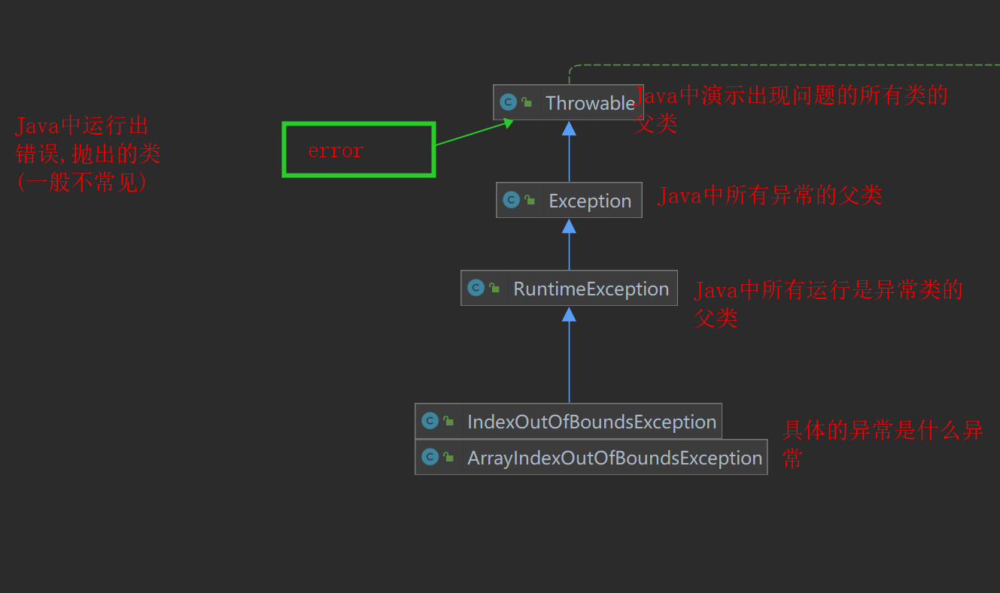
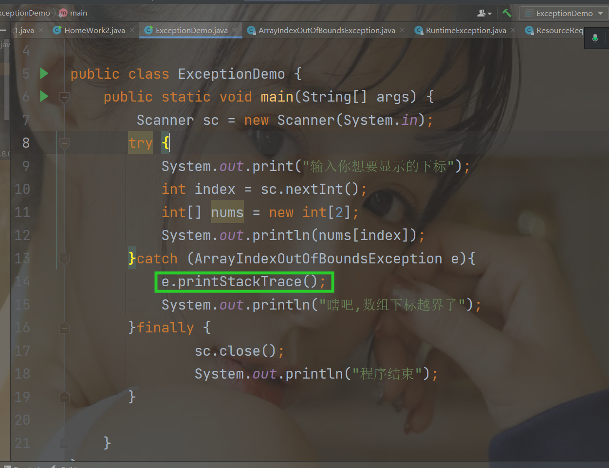
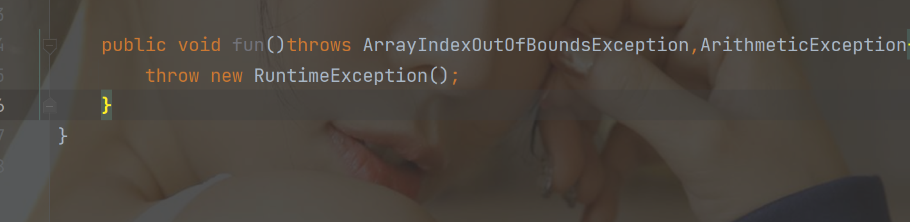

# 异常

含义：异与正常状态的显示 , 即 控制台显示的结果与预想的结果不一致，就是报错

例如

```JAVA
int[] nums = new int[2];
System.out.println(nums[2]);-------抛出异常
```


## 异常分类

**检测性异常：**

称为非运行时异常，一般在编写代码的时候直接爆出（**没有导包，还有没有代码没有编写完整，还有未被使用**）

非检测性异常（常用）：又叫运行时异常，java为运行时异常单独封装一个类————RuntimeException类；一般是编写代码时候没有问题，一旦执行代码，并没有获取到预期的结果。


## 异常类结构



对于异常信息解析越详细，异常类的名字会越长

异常类类名分为两部分，以Exception划分

```java
Exception前：表示对当前的异常出现的详细描述
    
Exception 表示当前的类是异常类
```


## 异常解读

**自己单独写笔记，来记录所有出现过的异常**

下面是解读

Exception : 当前代码存在异常

in thread "main" : 在主线程中

java.lang.Array.... : 表示当前出现的是什么异常

: 值 -- 当前的异常是什么原因引起的

at ..... : 表示异常出现的 代码 行数 , 一定要看 at 单词后面的地址 一定是自己定义的

**特点：**

一旦出现异常，后面定义的代码都不会被执行


## 异常处理机制

**机制：**按照Java规定好的规则 , 完成对数据或者业务指定处理 , 这种操作称之为机制


**分类**

处理异常：由程序员主动处理（后期由框架完成）

抛出异常：不负责的处理，将异常向上抛出，谁调用谁处理


**处理异常**

```java
try{
     捕获异常 : 编写所有可能出现的异常代码;
}catch(异常类1 对象1){
     处理异常 : 完成指定议程的处理操作;
}catch(异常类1 对象1){
     处理异常 : 完成指定议程的处理操作;
}····
    
finally{
    编写无论是否发生异常都要执行的代码 , 一般编写 关闭资源的代码;
}

```


理解：try的后面就是用来捕获异常，发现异常交给后面的catch处理，最后异常走完后，执行后面的代码，前面说到遇到异常的时候代码会终止运行，但是这个方法会避免后面的代码不执行的问题，在finally的代码块中不论是否发生异常都会进行代码的执行


**执行原则**

当在try块中 捕获异常 , 则马上执行 catch块中的内容, try后续的代码都不执行 , 当 catch执行之后 , 再去执行finally块, 如果 try块中 没有捕获异常,直接执行try块中的代码 , 和 finally中的代码

**执行的特点**

组合操作

```java
try catch finally 可以组合出现

try catch  可以组合出现

try  finally 可以组合出现

catch finally  不可以
```


**对特点的补充**

三个代码块之间不能编写任何的代码，这三个代码必须紧密相连

当编写多个catch是否有编写的顺序 和 执行顺序？

```java
catch 既有编写顺序 也有执行顺序，必须是按照异常的详细程度，越详细的越靠前，只会执行最匹配的catch块，完成处理
```

try catch finally可以嵌套。实际开发中用的比较少

如何打印当前的异常信息




## 抛出异常

**throws**：抛出一个或者多个异常，定义的位置在方法的参数列表后面，多个异常类用“，”分隔

**throw**：抛出指定的某一个异常类对象，定义位置在方法体中




## 代码演示

### 自定义异常

```java
package cn.wolfcode.day14.part1.domain;

public class DivisorIsNotZeroExcrption extends Exception{
    public DivisorIsNotZeroExcrption(String message){
        super(message);
    }
}

```


### 自定义使用自定义异常类

```java
package cn.wolfcode.day14.part1.domain;

public class UseDiyException {
    public double div(double num1,double num2)throws DivisorIsNotZeroExcrption{
        if (num2 == 0){
            throw new DivisorIsNotZeroExcrption("除数不可以为0");
        }
        return  num1/num2;
    }
}

```


### 测试

```java
package cn.wolfcode.day14.part1.test;

import cn.wolfcode.day14.part1.domain.DivisorIsNotZeroExcrption;
import cn.wolfcode.day14.part1.domain.UseDiyException;

public class DiyExceptionTest {
    public static void main(String[] args) {
        UseDiyException useDiyException  = new UseDiyException();
        try {
            useDiyException.div(8,0);
        } catch (DivisorIsNotZeroExcrption e) {
            e.printStackTrace();
        }
    }
}
```

理解:在主函数中,我们可以直接类名点方法名,但是这样子对异常处理是有问题的, 而且一定是方法会抛出异常,没有处理,我们可以在错误的地方   alt+ enter,进行抛出异常处理,但是主函数中不推荐这样子在main后面加抛出的异常,

所以我们推荐使用try  catch方法进行捕获异常,处理异常的方法…