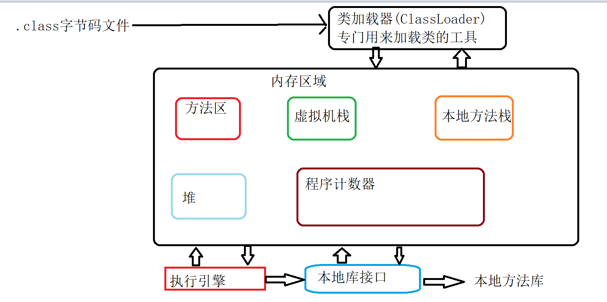

# JVM虚拟机

**java代码的运行原理**

```java
java代码在jvm虚拟机中运行的
```
**运行步骤**

```java
编写.java文件
通过javac命令将指定的.java文件编译成同名的.class文件字节码文件
通过通过 java 命令 执行 指定的 .class文件 (注意 ! !不要加 .class 后缀)
```

## jvm详解

### jvm内存的划分

```java
人为的根据不同的内存存储特点和存储的数据完成划分
```

**程序计数器**

````java
当线程执行字节码文件的行号指示器
````

**本地方法栈**

```java
为虚拟机提供native方法,即为本地方法的执行提供服务
```

**方法区**

```java
线程共享取余,存储已经被虚拟机加载的类的信息,包含,常量,静态变量,即编译器编译的代码数据等(内存回收主要针对常量池的回收)
```

java**虚拟机栈**

```java
平常是叫做栈内存,每一个方法执行的时候,同时会创建一个栈,用来存储这个方法的局部变量,操作栈,动态链接,方法出口信息等,当调用一个方法的时候,就会创建一个栈,方法执行结束之后就会被销毁
```

java**堆**

```java
平常称之为 堆内存 , 被所有线程共享的区域 , 在虚拟机启动的时候创建 ; 将所有的对象的  实例 和  数组 分配到这个区域中, 每次使用new关键字 , 表示在 对内存中开了一块空间

编译实例化后的对象和数组
通过new关键字创建，一旦创建就永远存在


分配空间后会存在一个内存地址，@16进制
```

**栈内存**

```java
编译后的变量（基本数据类型）和运行的方法，用完就死亡

栈内存的内容随着生命周期的结束，自动消亡
```

**垃圾回收处理器(垃圾回收处理机制)**

```java
是java语言区别于其它语言的内在核心,不需要手动的处理JVM中无用的数据（自动处理）
```

能回收的对象

```java
失去生命周期的对象
失去引用的对象
匿名对象
```


