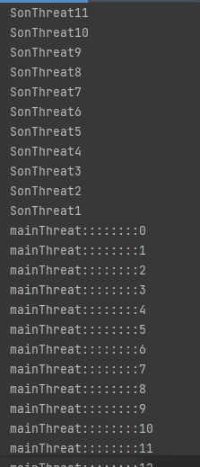
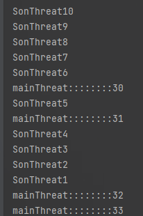
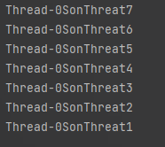
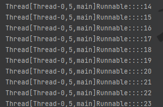
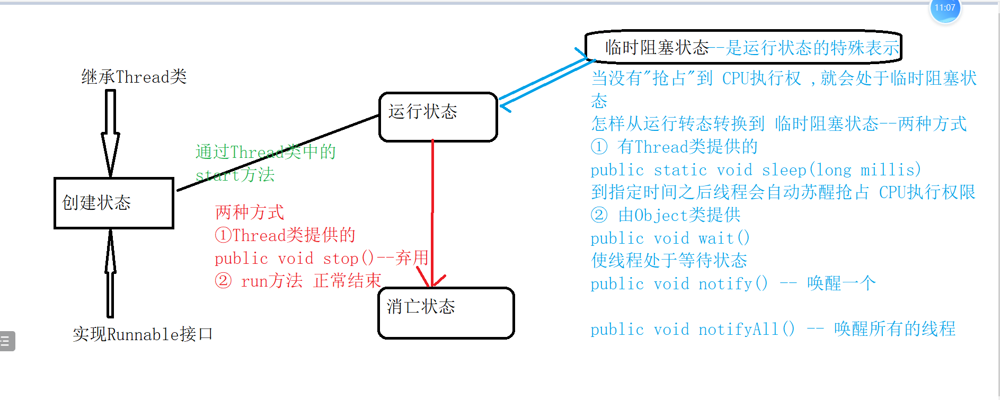
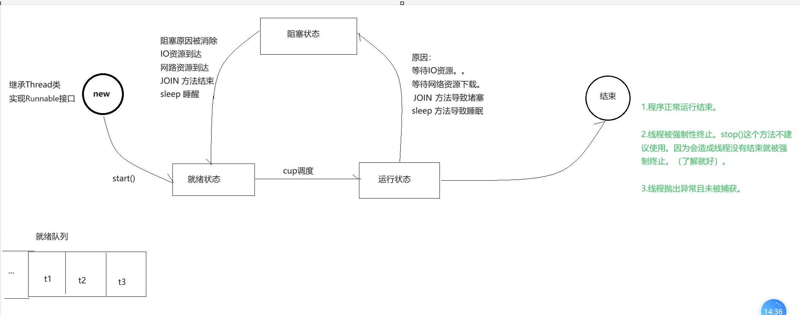

# 多线程

java语言的特点:

简单，健壮，多线程，完全面向对象，跨平台性

## 概念：

### 线程；

控制指定APP（进程）执行的最小的（最基本的）单位

			是被系统独立调度和分派的基本单位，线程自己不拥有系统资源，

因为一个 CPU 在一个进程中只能同时做一件事情。那么就无法满足我们协同操作。此时我们就可以在进程中开辟多条线程来同时协作。我们就称之为多线程

**线程是为了提高进程的使用率**


### 进程；

硬件设备上每一个应用程序

			进程是正在运行的程序的实例

程序进入到我们的内存中。统一交给 CPU 进行管理。

**进程是为了提高CPU的使用率**


### 时间片

提高CPU的利用率，

我们希望在 A 使用用 Scanner 输入时，我们将程序切换到 B 这边运行。直到 A 输入结束。在切换回 A 执行。这样的话 CPU 就可以在多个程序之间来回切换。 此时我们就需要一个能够记录之前完成具体位置的标记。这个标记我们称之为 CPU 的时间片。


### 并行和并发


并行：在同一时刻，多个进程同时使用各自的 CPU,多个进程是并行着执行的。（需要有个 CPU）

并发：在同一时刻，只有一个程序在使用 CPU，但是 CPU 在多个程序之间高速切换。（只需要一个 CPU）（我们要讲解的）


单线程；一个进程中只有一个线程执行，实际生活中不存在

多线程；一个进程至少有两个或者两个以上的线程在执行（线程之间可以并发执行）


进程可以有多个线程，

**Java是如何体现多线程的**

```java
in thread “main”：主线程

垃圾回收处理机制
    
    
java中的线程是抢占式的
```


## 多线程创建方式

### **分三种：**

Thread类

Runnable接口

Callable接口

### 多线程操作：

多个线程在同一时刻操作共同资源

### 第一种：Thread类

Thread类是所有线程类的父亲。线程是程序中的执行程序。java虚拟机允许应用程序并发的运行多个执行程序


继承Thread类，重写run方法（编写多线程操作的代码）通过Thread类或者 Thread类的子类，调用start方法开启多线程并且调用run方法执行多线程操作，每一次执行结果都不一样

——Thread类：java封装的所有关于线程的操作

**代码演示**

**单线程**

先进行**直接调用**run方法的

```java
package cn.wolfcode.day14.part2.domain;

public class SonThreat extends Thread{
    @Override
    public void run() {
        for (int i = 50;i>0;i--){
            System.out.println("SonThreat" + i );
        }
    }
}

```

main

```java
package cn.wolfcode.day14.part2.test;

import cn.wolfcode.day14.part2.domain.SonThreat;

public class ThreatTest {
    public static void main(String[] args) {
        SonThreat a = new SonThreat();
        a.run();//这里是调用执行了run方法，不是开启新线程

        for (int i = 0; i < 50; i++) {
            System.out.println("mainThreat::::::::" + i);
        }
    }
}

```

结果就是按照顺序执行，因为调用的是run方法，可以说没有开启多线程操作，只是调用了方法进行了方法的打印。




上面演示的可以理解为单线程操作

特点就是按照指定顺序执行


**实现多线程操作**

通过Thread类中的  

```java
public void start()
    执行run方法
```


```java
package cn.wolfcode.day14.part2.test;

import cn.wolfcode.day14.part2.domain.SonThreat;

public class ThreatTest {
    public static void main(String[] args) {
        SonThreat a = new SonThreat();
        a.start();

        for (int i = 0; i < 50; i++) {
            System.out.println("mainThreat::::::::" + i);
        }
    }
}

```

最后的结果就是不按照顺序进行, 两个部分同时进行,但是是随机的,没有固定的优先级.




**注意：**

必须调用start() 方法才是开启线程，如果用run（）方法就是调用该线程对象中的run（）方法，不是开启新的线程。

**几个问题**

One：ThreadDemo 程序执行的过程中，存在几条线程？

```java
至少3条线程：主线程、et线程、后台线程
```

Two:进程执行时，从 main 函数开始，main 中可以创建很多其他线程。但是为什么执行的顺序不一致？

```java
因为 Java 是抢占式的。这些线程轮流的在抢占 CPU 资源。程序的执行轨迹是不确定的。
```

拓展：

```java
我们是绝对不能控制 CPU 具体去操作那一条线程的。但是我们可以提高某条线程的优先级。
    

- 每一个线程的优先级默认值为5。取值范围是[1~10]。
- public final void setPriority(int newPriority)    更改线程的优先级。 
- public final int getPriority()                                 获取线程的优先级。 
```


### 第二种:实现Runnable接口

重写  run  方法,  需要调用  Thread  类中的  start()  方法.

```java
- 实现
	- 首先我们需要自定义一个类去实现 Runnable 接口。
	- 重写Runnable 接口中的 run() 方法。
	- 在启动该线程时，我们需要创建一个线程对象 Thread。将该接口实现类作为参数通过构造方法传递给 Thread 对象。
	- 启动线程都是通过 Thread对象.start() 方法才可以开启线程。
```


**直接上代码**

```java
package cn.wolfcode.day14.part2.domain;

public class ThreadRunnableImpl implements Runnable{

    @Override
    public void run() {
        for (int i = 0;i<50;i++){
            System.out.println("Runnable::::" + i);
        }
    }
}

```

main

```java
package cn.wolfcode.day14.part2.test;

import cn.wolfcode.day14.part2.domain.ThreadRunnableImpl;

public class RunnableTest {
    public static void main(String[] args) {
        ThreadRunnableImpl a = new ThreadRunnableImpl();
        Thread t = new Thread(a);
        t.start();

        for (int i = 50;i>0;i--){
            System.out.println("main" + i);
        }
    }
}
需要将  实现 Runnable接口 类 和 Threat 构成联系------通过 Threat 构造器

```


### 一个用法的小总结

通过上述多线程操作,每一次执行之后,效果都不一样

```java
多线程在同时操作相同的资源,就是每个线程去抢占CPU的执行权,谁抢到就是谁去执行,实际上,是CPU在开启的多线程之间快速地切换,称为多线程的执行特点-----"-随机性"
```


能否通过“充值”,提高特定线程的执行权限

```java
可以,java中为每一线程设置初始  vip等级  是5的取值范围[1-10],通过 Thread类 指定的 set方法 设置 vip 等级,就是所谓的优先级,但是并不是优先级越大就越先执行,优先级的大小提高是说提高被执行完的可能性(就是优先级高的有可能先执行完),实际开发中没有特殊要求,不需要设置优先级
```


## Thread类中常用的API


**Thread 类本质上就实现了 Runnable 接口，就是对 Runnable 接口的扩展**


### 创建Thread对象方法

```java
public Thread()----创建Thread类对象

public Thread(Runnable  t)
    将指定的Runnable接口实现类对象,通过Thread构造器和Thread类建立联系
```


### 编写多线程操作代码的方法

```java
public void run()
```


### 开启多线程

```java
public void start()
```


### 获取当前线程的名字

```java
public final String getName()
```


```java
package cn.wolfcode.day14.part2.test;

import cn.wolfcode.day14.part2.domain.SonThreat;

public class ThreatTest {
    public static void main(String[] args) {
        SonThreat a = new SonThreat();
        a.start();

        for (int i = 0; i < 50; i++) {
            System.out.println("mainThreat::::::::" + i);
        }
    }
}

```

这个就是获取到了线程的名字




### **在非Thread子类中互殴当前正在执行的线程对象**

```java
public static Threat currentThread() ----返回当前正在执行的线程
```

可以用在主函数的输出或者重写run的函数里面

```java
package cn.wolfcode.day14.part2.domain;

public class ThreadRunnableImpl implements Runnable{

    @Override
    public void run() {
        for (int i = 0;i<50;i++){
            System.out.println (Thread.currentThread() + "Runnable::::" + i);
        }
    }
}

```



直接打印currentThread方法的值,表示打印当前正在执行的Thread对象

格式:

[线程名,   优先级  当前线程执行的位置]

### 让指定的线程睡眠指定的时间(时间单位   毫秒)

```java
public static void sleep(long millis)
```


### 给线程设置线程名 

一般不常用

```java
public void setName(String name)
```

**这个是Thread的方法,设置名字的方法**

```java
package cn.wolfcode.day14.part2.domain;

public class SonThreat extends Thread{
    @Override
    public void run() {
        setName("134");
        for (int i = 50;i>0;i--){
            System.out.println(getName() +"SonThreat" + i );
        }
    }
}

```


**这个是实现Runnable接口   改名的方法**

```java
package cn.wolfcode.day14.part2.domain;

public class ThreadRunnableImpl implements Runnable{

    @Override
    public void run() {
        Thread.currentThread().setName("123");

        for (int i = 0;i<50;i++){
            System.out.println (Thread.currentThread() + "Runnable::::" + i);
        }
    }
}
重点看改名的地方,用的是
    
    Thread.currentThread().setName()
```


### 设置线程的优先级

优先级的取值范围是[1   -   10]

```java
public void setPriority()
```


### 获取当前线程的优先级

```java
public int getPriority()
```


```java
package cn.wolfcode.day14.part2.domain;

public class ThreadRunnableImpl implements Runnable{

    @Override
    public void run() {
        Thread.currentThread().setName("123");
        Thread.currentThread().setPriority(7);

        for (int i = 0;i<50;i++){
            System.out.println (Thread.currentThread() + "Runnable::::" + i);
            System.out.println(Thread.currentThread().getPriority());
        }
    }
}

```


主要是以Runnable接口方法来看,比较常见,所以多来


## 多线程 的状态和每种状态下线程具备的权限

### 状态图






### 每种状态下是有权限的

| 状态            | 权限                        |
| --------------- | --------------------------- |
| 创建状态        | 只有生存权                  |
| 运行状态        | 既有生存权, 也有执行权      |
| 消亡状态        | 既没有生存权,, 也没有执行权 |
| 临时(阻塞) 状态 | 只有生存权 , 没有执行权     |


**创建状态下的生存权和临时状态下的生存权有区别么**

```java
有
    区别在于多线程的操作是否被开启,创建状态下,没有进行多线程操作,而临时状态下生存权是开启了多线程之后,没有获取到执行权
```


### **处理临时组赛状态的线程的存储位置:**

```java
由JVM提供的线程池中存储.
    先进先出原则-------队列
```


### 等待唤醒机制

**等待**

有的类都继承Thread类,但是只要是java的类,就是多线程操作,等待和唤醒方法共性的方法,定义在所有类的父类中

**目前不常用java提出的接口Lock接口实现该功能**

实际中更喜欢使用sleep方法完成多线程的操作,到时候自动唤醒()


### 让多线程并发变串行

Join

理解：就是必须等A线程查询结果回来以后，B线程才可以去做自己的操作

代码：

```java
package cn.demo.thread.one.domain;

public class JoinThread extends Thread{
    public JoinThread(String name){
        super(name);
    }
    @Override
    public void run() {
        for (int i = 0;i<10;i++){
            System.out.println(Thread.currentThread().getName() + i);
        }
    }
}

```


main

```java
package cn.demo.thread.one.test;

import cn.demo.thread.one.domain.JoinThread;

public class JoinThreadTest {
    public static void main(String[] args) throws InterruptedException {
        JoinThread a = new JoinThread("线程A");
        a.start();
        for (int i = 0;i<10;i++){
            if (i == 2){
                a.join();
            }
            System.out.println(Thread.currentThread().getName() + i);
        }
    }
}

```


### 课堂案例

**多线程安全隐患问题**

原因:

```java
在执行多线程操作的时候,多线程可以同时操作共同资源,当一个线程操作的时候,其他线程有操作的可能性
```


需求：模拟火车售票窗口（3个）统一出售400张票

#### **下面是继承操作**

**首先展示的是没有设置保护的代码**

线程窗口类

```java
package cn.demo.thread.one.domain;

public class ExtendThreads extends Thread {
    public ExtendThreads(String name){
        super(name);
    }
    private int tickets = 50;

    @Override
    public void run() {
        for (int i = 0; i < 10; i++) {
            if (tickets > 0){
                this.tickets--;
                System.out.println(Thread.currentThread().getName() +  "and" + this.tickets);
            }
        }
    }
}

```


main

```java
package cn.demo.thread.one.test;

import cn.demo.thread.one.domain.ExtendThreads;

public class ExtendThreadsTest {
    public static void main(String[] args) {
        ExtendThreads t1 = new ExtendThreads("窗口1:::::");
        ExtendThreads t2 = new ExtendThreads("窗口2~~~~");
        ExtendThreads t3 = new ExtendThreads("敞口3");

        t1.start();
        t2.start();
        t3.start();

    }
}

```

上面的代码看似没有问题，也开启了多线程，但是实质上是每个窗口都开启了一个多线程，就是看似总共卖了10张票，其实是每个窗口都卖了10张，总共30张。

原因：    是因为每个线程访问了同一个资源（共享资源）

如果我们使用了继承的方式，那么说明每次都新建了一个对象，每个对象都有自己的五十张票，说明不是共享了同一个50张，而是各自都有50张————线程安全问题

**解决**

将变量赋值为了静态变量，但是实际中并没有解决超卖的问题，虽然共享了同一个资源，但是还是有同一个时间几个窗口同时访问一个资源并且进行修改，然后数据任然不对

main没有改变，这里不在赘述

```java
package cn.demo.thread.one.domain;

public class ExtendThreads extends Thread {
    public ExtendThreads(String name){
        super(name);
    }
    private static int tickets = 10;

    @Override
    public void run() {
        for (int i = 0; i < 5; i++) {
            if (tickets > 0){
                tickets--;
                System.out.println(Thread.currentThread().getName() +  "and" + this.tickets);
            }
        }
    }
}

```

**出现的问题：**

```java
静态区本就不大。若频繁操作且数据量过多。会造成内存溢出。且拼房的大量资源去操作静态区解决方式也不好。
```


#### **下面是实现的操作**

**首先展示的没有设置保护的代码**

代码：

```java
package cn.wolfcode.day14.part3.domain;

public class TicketsWindow implements Runnable{
    private  int ticket = 400;
    @Override
    public void run() {
        while (true){
            if (ticket > 0){
                System.out.println(Thread.currentThread().getName() + ";;;;;" + ticket--);
            }
        }
    }
}

```

main

```java
package cn.wolfcode.day14.part3.test;

import cn.wolfcode.day14.part3.domain.TicketsWindow;

public class TicketsWindowTest {
    public static void main(String[] args) {
        TicketsWindow a = new TicketsWindow();
        Thread b3 = new Thread(a);
        Thread b1 = new Thread(a);
        Thread b2 = new Thread(a);
        b3.start();
        b1.start();
        b2.start();

    }
}

```

总结就是一个字,,快,但是有报错,就是资源抢占的问题,,同时访问这个资源,同时修改但是没有记录的问题.


我们创建了实现接口的对象只有一个。我们是将该对象作为参数传递给了不同的3个 Thread 类对象。但是本质上我们操作变量的对象就创建了一个。所以不需要静态变量也能解决超卖的问题。


里面有个注意事项,就是在设置  **Thread.sleep 的时候有个报错,就是说我们需要try  catch方法**,代码如下:

```java
package cn.wolfcode.day14.part3.domain;

public class TicketsWindow implements Runnable{
    private  int ticket = 400;
    @Override
    public void run() {
        while (true){
            try {
                Thread.sleep(10);
            }catch (InterruptedException e){
                e.printStackTrace();
            }
            if (ticket > 0){
                System.out.println(Thread.currentThread().getName() + ";;;;;" + ticket--);
            }
        }

```


#### 继承方式和接口方式对比

继承方式：（若没有共享资源可以使用它，相对书写较为简单）

```java
java单继承，若继承了 Thread 类，那么就不能在继承其他的直接父类了。（局限性更大了，耦合度高）。

操作分析：相对操作较为简单，获取线程名字也简单。

多线程分析：继承方式不能多线程共享一个资源。（除非静态。但是！！！不建议使用静态为多线程！！！）。
```


接口方式（若有共享资源可以使用它，相对书写较为复杂）

```java
java类可以实现多个接口，且可以继承一个直接父类。（设计上更优雅，扩展都更高。耦合度相对较低。面向接口编程。接口就是提供规范的）

操作分析：相对复杂，获取线程名字 Thread.currentThread() 方法。

多线程分析：实现方式可以多线程共享一个资源。
```


### 隆重介绍:加锁

在操作共同资源的时候,为操作加锁   —— 同步技术

**synchronized** 理解相关操作

```java
synchronized(Object obj)
    参数是 旗舰锁 三种方式


1.Object obj = new Object()  -------不推荐  Object 锁

2.this ------本类对象锁(推荐)
    
3.TicketWindow.class ------反射机制锁:通过单签类底层字节码文件获取,,超级推荐

这里面TicketWindow 是编写同步的类名,后面的 .class  不变
```


这个是**同步代码块,**下面的是同步代码块,上面的是简单的理解


```java
package cn.wolfcode.day14.part3.domain;

public class TicketsWindow implements Runnable{
    private  int ticket = 400;
    @Override
    public void run() {
        while (true){
            synchronized (TicketsWindow.class){
                try {
                    Thread.sleep(10);
                }catch (InterruptedException e){
                    e.printStackTrace();
                }
                if (ticket > 0){
                    System.out.println(Thread.currentThread().getName() + ";;;;;" + ticket--);
                }
            }
        }
    }
}

```


同步代码块，就是可以为代码块内的内容加锁。这样就能保证每一条线程执行结束之后。另一条线程才能强进来。


**同步函数**

就是将要保护的执行代码单独拿出来,加上关键字,,构成同步函数

```java
package cn.wolfcode.day14.part3.domain;

public class TicketsWindow implements Runnable{
    private  int ticket = 400;
    @Override
    public void run() {
        while (true){
            fun();
        }

    }
    
    public synchronized void fun(){
        try {
            Thread.sleep(10);
        }catch (InterruptedException e){
            e.printStackTrace();
        }
        if (ticket > 0){
            System.out.println(Thread.currentThread().getName() + ";;;;;" + ticket--);
        }
    }
}
这个是一个整体
```


#### 同步函数和同步代码块的区别

```java
锁的数目（个数） 不同
    同步代码块：-----三个锁----常用
    
    	Object 锁
    	this 本类对象锁
    	反射机制锁----上面提及过的

    同步函数  ---- 1个锁

		this 本类对象锁
```