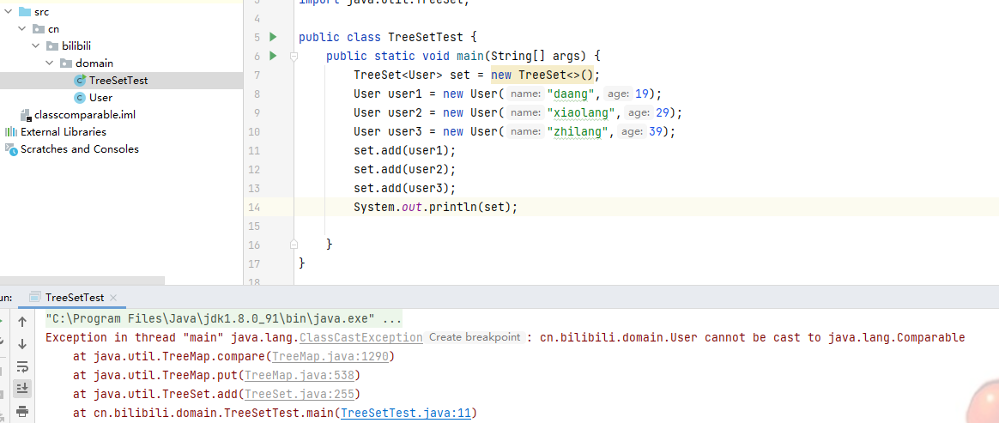
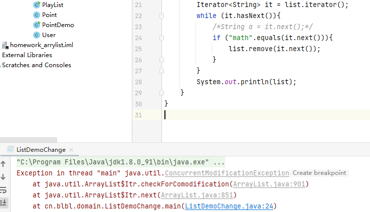
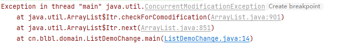

# 集合

## 概念

+ 什么是集合
	+ java的集合框架其实就是对数据结构的封装。
	+ 集合就是用来存储数据的容器。所以我们先了解数据结构。

## 数据结构

+ 所谓的数据结构其实本质就是计算机用来存储数据的方式。

+ 数据结构主要是用来操作数据的存储。增删改查(CRUD)。

+ 常见的数据结构

	+ 数组（Array）

		

		+ 结论：

			+ 在非特定条件下：数组是适合做修改和查询的。不适合做新增和删除。

			

	+ 链表（Link）

		+ 单向链表：只能从头找到尾
		+ 双向链表：能从头找到尾，也能从尾找到头

		

		+ 结论：链表是适合做增加和删除，不适合做修改和查询

		

	

	+ 队列（Queue）
		+ 队列：只允许我们在表前进行删除，在表后进行插入
			+ 插入在尾部（队尾），删除在头部（队头）
			+ 特点：先进先出
			+ 也分为：
				+ 单项队列：只能从头到尾
				+ 双向队列：能从头到尾，也能从尾到头

	

	

	+ 栈（Stack）
		+ 又称之为堆栈，后进先出（LIFO）。（类似手枪弹夹）
	+ 树
	+ 哈希表
	+ 图
	+ 堆

+ 不同的数据结构，底层采用的存储方式是不同的（算法）。再具体的操作的时效率都是不同的

	+ 有些查询和修改速度快
	+ 有些添加和删除速度快
	+ 有些是操作首尾速度快

## 集合的概念

+ 集合是 Java 中的一种容器。可以用来存储多个数据。根据不同的数据结构来进行存储管理数据。

+ 数组也可以存储多个数据（集合与数组的区别）

	+ 数组的长度固定，集合长度可变
	+ 数组只能存储一种数据类型。集合可以存储多种数据类型（虽然可以，但是实际开发中我们只存储一种）
	+ 数组可以存储任意类型（基本数据类型和引用数据类型）。集合只能存储对象（引用数据类型）。（若存储了基本数据类型。那么集合会默认把其使用自动装箱转换为其包装类）

+ 集合分为单列集合和双列集合

	+ 单列集合的最高接口 Collection，之所以是接口，就是为了给我们提供规范，不同的实现类来使用不同的数据结构去做更适合做的事情
	+ 单列集合类结构图

	

	+ 双列集合类结构图

	


### 单列集合-list

+ Collection接口：主要就表示了List 和Set两种存储方式

+ list（列表）：允许重复添加数据，元素可以重复，有序（数据存储的顺序）

	+ 常见实现类：

		+ ArrayList：数组列表，表示数组结构，底层采用动态数组。开始发中用的最多！！！重中之重。
		+ LInkedList：链表，表示双链表和双队列结构。实际开发中使用的并不多。
		+ Stack：栈，表示栈结构。实际开发中使用的并不多。
		+ Vector：向量，其实它本质上就是古老的 ArrayList，采用数组实现。实际开发中使用的并不多。

	+ List中常见的API

		+ 增：

			+ **boolean add(E e)：向列表的尾部添加指定的元素。（重点）**

			+ ```java
				void add(int index,E element)
				```

				+ 在列表的指定位置插入指定元素

			+ ```java
				boolean addAll(Collection c) 
				```

				+ 将指定列表的所有元素添加到当前列表中。（说人话：向集合中添加另一个集合中的所所有数据）。
					+ 注意:都是在集合的尾部添加

			+ 这个是List中的add方法的使用

				```java
				package cn.demo.thread.one.domain;
				
				import java.sql.SQLOutput;
				import java.util.ArrayList;
				import java.util.List;
				
				public class LitArr {
				    public static void main(String[] args) {
				        List list = new ArrayList();
				        list.add("apple");
				        list.add("elephant");
				        list.add(78);
				        System.out.println(list);
				
				        list.add(1,"niubi");
				        list.add(0,"z");
				        System.out.println(list);
				
				        List a = new ArrayList();
				        a.add("zheg");
				        a.add("asdfasf");
				        a.add("asdga");
				        System.out.println(list.addAll(a));
				        System.out.println(list);
				    }
				}
				
				
				```

				

		+ 删

			+ ```java
				E remove(int index)
				```

				+ 从列表中移除指定位置的元素(根据索引删除),,返回被删除的数据

			+ ```java
				boolean remove(Object o)
				```

				+ 从列表中国一处第一次出现的指定元素(根据指定元素删除)

			+ ```java
				boolean removeAll(collection c)
				```

				+ 将指定列表所有元素从当前列表中删除(就是从一个集合中删除一个集合的所有数据)

			+ 代码:

				+ ```java
					package cn.demo.thread.one.domain;
					
					import java.util.ArrayList;
					import java.util.List;
					
					public class DelListArr {
					    public static void main(String[] args) {
					        //集合的添加
					        List list = new ArrayList();
					        list.add("aa");
					        list.add("bb");
					        list.add("cc");
					        list.add("dd");
					        list.add(78);
					        System.out.println(list);
					        //根据元素删除aa
					        System.out.println(list.remove("aa"));
					        System.out.println(list);
					        //在上面的基础山,删除索引为1的元素  数据类型是Object
					        Object a = list.remove(1);
					        System.out.println(a);
					        //在上面删除后的基础上,在进行删除索引是1的元素
					        System.out.println(list.remove(1) + "删除");
					        System.out.println(list);
					        //这个很有意思,如果直接输入数字,就会认为是索引,所以需要进行一个转换,将数值转换成包装类,就可以
					        list.remove(Integer.valueOf(78));
					        System.out.println(list);
					    }
					}
					
					```

				+ 其中比较重要的就是删除数值类型的数据的时候要转换成包装类

		+ 改:

			+ ```java
				E set(int index,E element)
				```

				+ 用指定元素替换列表中指定位置的元素,返回被替换的旧元素

				+ 代码:

				+ ```java
					        list.set(0,"aa");
					        System.out.println(list);
					```

					+ 这个就是结合上面删除的代码,然后一起表示,进行最后一个元素的修改

		+ 查:

			+ ```java
				int size()
				    返回列表中的元素数(数组长度一样),
				```

			+ ```java
				boolean isEmpty()
				    如果列表中不含这个元素,就会返回 true  判断是否是空集合
				```

			+ ```java
				E get(int index)  
				    返回列表中指定位置的元素
				```

			+ ```java
				boolean contains(Object o)
				    如果列表包含指定的元素,则返回 true
				```

			+ ```java
				Object[] toArray()
				    返回按适当顺序包含列表中的所有元素的数组
				```

			+ 代码：

			+ ```java
				package cn.demo.thread.one.domain;
				
				import java.lang.reflect.Array;
				import java.util.ArrayList;
				import java.util.Arrays;
				import java.util.List;
				
				public class SearchArr {
				    public static void main(String[] args) {
				        List a = new ArrayList();
				        a.add("aa");
				        a.add("dd");
				        a.add("rr");
				        a.add("tt");
				        a.add("yy");
				        System.out.println(a);
				
				        System.out.println(a.size());
				        System.out.println(a.isEmpty());
				        System.out.println(a.get(2));
				        System.out.println(a.contains("aa"));
				        //这个展示的是地址
				        System.out.println(a.toArray() + "array展示的");
				
				
				        Object[] b = a.toArray();
				        System.out.println(Arrays.toString(b) + "数组的展示");
				
				        System.out.println(a + "这个是集合的打印");
				    }
				}
				
				```

	+ ArrayList:

	  + ArrayList对象是否有初始长度？如果有，扩容机制是什么

	  	+ 创建为0，初始化后长度为10，扩容机制是原长度的 1.5 倍。

	  + ArrayList：常用方法

	  	+ ```java
	  		public void clear()
	  		    从列表中移除所有元素(可选操作)
	  		```

	  	+ ```java
	  		public int indexOf(Object  o)
	  		    返回列表中第一次出现的指定元素的索引
	  		```

	  	+ ```java
	  		public int lastIndex(Object o)
	  		    返回列表中最后出现的指定元素的索引
	  		```

	  		

	  	+ 代码:

	  	+ ```java
	  		package cn.demo.arraylist.one.domain;
	  		
	  		public class User {
	  		    private String name;
	  		    private int age;
	  		    public User(){
	  		
	  		    }
	  		
	  		    public User(String name, int age) {
	  		        this.name = name;
	  		        this.age = age;
	  		    }
	  		
	  		    public String getName() {
	  		        return name;
	  		    }
	  		
	  		    public void setName(String name) {
	  		        this.name = name;
	  		    }
	  		
      	```
	  	
  	  
	  	
  	  
	  	```java
  	  public int getAge() {
	  		        return age;
  	    }
	  		
  	    public void setAge(int age) {
	  		        this.age = age;
  	    }
	  		
  		  @Override
	  		    public String toString() {
  		      return "User{" +
	  		                "name='" + name + '\'' +
  		              ", age=" + age +
	  		                '}';
  		    }
	  		}
  		```
	  	
	  + main
	  	
	  + ```java
  		  package cn.demo.arraylist.one.domain;
	  	  
	  	  
	  	  import java.util.ArrayList;
	    import java.util.List;
  		  
	  	  
	  	  public class UserArrList {
	  	      public static void main(String[] args) {
	            User user1 = new User("张三",10);
  		          User user2 = new User("李四",40);
	  	          User user3 = new User("王五",20);
  		  
	  	          List tips = new ArrayList();
  	          tips.add(user1);
	  	        tips.add(user2);
	            tips.add(user3);
	  	  
	            System.out.println(tips.size());
	  	          System.out.println(tips);
	  	      }
	  	  }
	  	  
	  	```
	  	
	  	+ 
	  	
	  	+ 其中,长度是可以出现,为三,但是输出集合的时候,显示的是地址,不是里面具体值
	  	
	  		+ 说明:向集合中存储了自定义对象。那么存储的是对象的地址
	  	
	  	+ 集合中如何存储对象类型数据:
	  	
  		+ 
	  	
  		+ 想看到对象中的内容:**需要重写对象的toString方法**
			
		+ 
			
		+ 总结：集合类中存储的都是对象的引用。而且不是对象自身。
	
+ LinkedList: 
	
	+ 双链表 + 双向队列 + 栈的数据结构实现的地层采用的是
	
		+ LinkedList作为List接口的实现类,他继承了List接口中所有的方法
	
		+ LinkedList作为栈(stack)使用
	
			+ ```java
				public void push(E e) 
				    将元素推入此列表所表示的堆栈,将元素插入列表的开头
				```
	
			+ ```java
				public E pop() 
				    从表中所表示的堆栈处弹出来一个元素,返回出栈元素
				```
	
			+ ```java
				public E peek()
				    获取但是不移除列表的头
				```
	
			+ 
	
			+ 代码
	
			+ ```java
				package cn.demo.arraylist.two.damain;
				import java.util.LinkedList;
				public class LinklList {
				    public static void main(String[] args) {
				        LinkedList tips = new LinkedList();
				        tips.push("aaa");
				        tips.push("bbb");
				        tips.push("ccc");
				        tips.push("ddd");
				
				        System.out.println(tips.pop());
				        System.out.println(tips.peek());
				        System.out.println(tips);
				    }
				}
				
				```
	
		+ LinkedList作为双向队列使用
	
		+ 
	
		+ 代码
	
		+ ```java
			package cn.demo.arraylist.two.damain;
			
			import java.util.LinkedList;
			
			public class DouLinkedList {
			    public static void main(String[] args) {
			        LinkedList a = new LinkedList();
			        a.addLast("aa");
			        a.addLast("rr");
			        a.addFirst("bb");
			        Object c = a.removeFirst();
			        System.out.println(c);
			        Object d = a.removeLast();
			        System.out.println(d);
			
			        Object e = a.getFirst();
			        System.out.println(e);
			        Object h = a.getLast();
			        System.out.println(h);
			    }
			}
			
			```
	

### 单列集合-set

+ set集合是Collection集合的子接口

+ 特点

	+ 不允许添加重复数据
	+ 无序且唯一

+ Set集合的常用实现类

	+ HashSet类：底层采用哈希表实现，开发中使用较多的类（重点）。
	+ ThreeSet类：底层采用红黑树实现，可以对集合中的元素进行排序，（使用不多）。

+ 常用方法：

	+ Set 接口继承了 Collection 接口。那么 Set 集合也有 Collection 接口的所有方法。但 Set 集合无法基础添加的顺序，也不允许包含重复元素。所以当我们试图添加两个相同元素进入 Set 集合中。添加失败。返回 false

	+ 增：

		+ ```java
			boolean add(E e)  如果 set 中尚**未存在指定的元素**，则添加此元素（可选操作）。
			```

		+ ```java
			boolean addAll(Collection<? extends E> c)  如果 set 中没有指定 collection 中的所有元素，则将其添加到此 set 
			```

		+ ```java
			
			```

	+ 删:

		+ ```java
			void clear()  移除此 set 中的所有元素（可选操作）。此调用返回后该 set 将是空的。 
			```

		+ ```java
			boolean remove(Object o) 如果 set 中存在指定的元素，则将其移除（可选操作）
			```

		+ ```java
			boolean removeAll(Collection<?> c)  移除 set 中那些包含在指定 collection 中的元素。
			```

	+ Set 集合没有修改和查询方法。因为其没有索引。存储的元素没有顺序也不能重复。不适合做查询和修改。

	+ 特殊方法

		+ ```java
			boolean contains(Object o)  如果 set 包含指定的元素，则返回 true。
			```

		+ ```java
			boolean isEmpty()   如果 set 不包含元素，则返回 true。 
			```

		+ ```java
			int size()  返回 set 中的元素数（其容量）。
			```

		+ ```java
			Object[] toArray()  返回一个包含 set 中所有元素的数组。
			```

		+ 代码

			+ ```java
				package cn.wolfcode.domain;
				
				import java.util.HashSet;
				import java.util.Set;
				
				public class CollectionSet {
				    public static void main(String[] args) {
				        //创建Set无序集合
				        Set<String> set = new HashSet<>();
				        set.add("张三");
				        set.add("脏变");
				        set.add("恐龙");
				        set.add("晚饭");
				        System.out.println(set);
				        //添加重复元素
				        System.out.println(set.add("晚饭"));
				        //删除
				        System.out.println(set.remove("张三"));
				        HashSet<String> set1 = new HashSet<>();
				        set1.add("胡辣汤");
				        set1.add("白展堂");
				        set1.add("沪上天堂");
				        //合并两个集合
				        System.out.println(set.addAll(set1));
				        System.out.println(set);
				        //删除一个集合
				        System.out.println(set.removeAll(set1));
				        System.out.println(set);
				
				    }
				
				}
				
				```

			+ **我们若想向 Set 中添加自定义对象类型就一定要重写 hashCode 和 equals 方法。**
			
				+ 这里稍微解释一下，就是添加数据的时候，按理说set集合中添加的数据是不重复的，但是如果是一条数据中有多个数据体现，那么就会按照hashset的存储方式进行存储，这里hash存储方式并不是按照他数据的内容是否一致进行存储，而是按照数据的内存地址，若内存地址不一致，那么内容上完全相同的两个数据也会算作是不同数据。所以如果按照内容进行区分是否是相同数据，就需要重写集合中equals和hashcode方法。
	
+ **TreeSet**

	+ TreeSet使用元素的自然排序对元素进行排序

	+ Set 本无序，为什么还能自然排序？

		+ TreeSet底层是由红黑树算法实现的。红黑树算法会对元素排序（自然排序，从小到大）。而并非 Set 对其排序。

	+ TreeSet的常用方法：TreeSet 不记录元素的添加顺序，不允许添加重复元素

		+ ```java
			boolean add(E e)  如果 set 中尚**未存在指定的元素**，则添加此元素（可选操作）。
			```

		+ ```java
			boolean remove(Object o) 如果 set 中存在指定的元素，则将其移除（可选操作）
			```

		+ 查的方法,只有个size(),改的方法没有

		+ 遍历

			+ ```java
				while(it.hasNext()){
				    System.out.print(it.next);
				}
				
				for(String a : set){
				    System.out.print(a);
				}
				```

			+ 

	+ TreeSet原理

		+ 在常规的创建自定义对象中，直接使用TreeSet集合进行创建，使用add方法进行添加后，是不可以直接添加的。

			

			+ 因为传递进入的TreeSet 的元素是需要比较大小的（所谓的自然排序）。那我们 User 对象是我们自定义类。
			+ TreeSet 底层是红黑树。那么每次添加数据时。他底层的树不在平衡时。他将强制将其转换为平衡二叉树。
			+ 解决我们刚刚出现的问题。String、Integer 这些都是能够比较大小的（底层已经做好了排序规则,实现了Comparable接口）。那么也就是我们自定义对象 User 我们并没有给其排序规则。所以无法添加元素。
			+ TreeSet 中的元素才去自然排序，此时要求元素对象必须实现 Comparable 接口，大多数 JDK 中自带的类都实现了这个接口。提供了对应的比较策略。例如 八大基本数据类型的包装类。String这些。并重写了 compareto() 方法。

		+ comparable接口和比较策略（内部比较接口）

			+ 解决不能向TreeSet集合中添加自定义对象User的方法

				+ 将自定义User 类实现Comparable接口
				+ 在User类中重写Comparable接口中的CompareTo（）方法。自定义比较规则

			+ 代码：

				+ User

					+ ```java
						package cn.bilibili.domain;
						
						public class User implements Comparable<User>{
						    private String name;
						    private int age;
						    public User(){
						
						    }
						
						    public User(String name, int age) {
						        this.name = name;
						        this.age = age;
						    }
						
						    public String getName() {
						        return name;
						    }
						
						    public void setName(String name) {
						        this.name = name;
						    }
						
						    public int getAge() {
						        return age;
						    }
						
						    public void setAge(int age) {
						        this.age = age;
						    }
						
						    @Override
						    public String toString() {
						        return "User{" +
						                "name='" + name + '\'' +
						                ", age=" + age +
						                '}';
						    }
						
						    @Override
						    public int compareTo(User o) {
						        //这个是利用逻辑进行书写，冗杂麻烦
						      /*  if (this.getAge() < o.getAge()){
						            return -1;
						        }else if (this.getAge() == o.getAge()){
						            return 0;
						        }else{
						            return 1;
						        }*/
						        //接下里是代码的优化
						        //return this.getAge()-o.getAge();
						        //先比较年龄，然后年龄相同比较名字
						        return this.getAge() - o.getAge() == 0 ? this.getName().compareTo(o.getName()) :this.getAge() - o.getAge();
						
						
						    }
						}
						
						```

				+ TreeSetTest

					+ ```java
						package cn.bilibili.domain;
						
						import java.util.TreeSet;
						
						public class TreeSetTest {
						    public static void main(String[] args) {
						        TreeSet<User> set = new TreeSet<>();
						        User user1 = new User("daang",19);
						        User user2 = new User("xiaolang",29);
						        User user3 = new User("zhilang",19);
						        set.add(user1);
						        set.add(user2);
						        set.add(user3);
						        System.out.println(set);
						    }
						}
						
						```

				+ 总结：

					+ 添加到 TreeSet 集合中的元素比较要和底层 平衡二叉树 的 Root 节点来进行比较。所以我们传递的对象必须要有 比较能力。（例如我们的 User）。我们解决的方案实现 Comparable 接口，重写 compareTo() 方法。
					+ compareTo() 方法其实就是我们对我们自定义对象明确指出的排序规则（可以按照哪些字段进行排序）

	+ Comparator 接口比较器（外部比较）

		+ 强行对某个对象 collection 进行*整体排序* 的比较函数。可以将 Comparator 传递给 sort 方法，从而允许在排序顺序上实现精确控制

		+ 让字符串按照长度排序。（由于默认规则是按照ASCII码排序。String 类是由 JDK 提供的。所以我们需要更改其排序规则并不能去到 String 类中去重写 compareTo() 方法。所以我们需要传递要给排序规则给 TreeSet()。）。就可以按照我们指定的排序规则进行排序了。

		+ 代码

			+ ```java
				package cn.bilibili.domain;
				import java.util.Comparator;
				import java.util.TreeSet;
				
				public class CompartorClass {
				    public static void main(String[] args) {
				        //实例化Comparator对象，把这个方法单独写出来，因为是抽象的。也可以用匿名内部类的方法
				        Comparator<String> set = new LenComparator();
				        //定义TreeSet集合，传递比较方法给TreeSet集合
				        TreeSet<String> tree = new TreeSet<>(set);
				        tree.add("asdaf");
				        tree.add("bnbana");
				        tree.add("orange");
				        System.out.println(tree);
				    }
				    //定义在外的比较方法
				    static class  LenComparator implements Comparator<String>{
				        @Override
				        public int compare(String o1, String o2) {
				            return o1.length() - o2.length();
				        }
				    }
				}
				
				```

		+ Comparator接口使用方法：

			+ 添加元素时，创建一个 TreeSet 对象。

			+ 如果是无参构造。那么就使用自身携带的比较规则。（从Comparable接口）中的默认比较规则。

			+ 如果传递了一个 (Comparator) 接口。那么添加到集合中的元素就按照 Comparator 接口中的 compare() 方法中自定义的比较规则进行比较。

			+ 代码

				+ ```java
					package cn.bilibili.domain;
					
					import sun.reflect.generics.tree.Tree;
					
					import java.util.Comparator;
					import java.util.TreeSet;
					
					public class ComparatorClassIn {
					    public static void main(String[] args) {
					        //使用匿名内部类的方法进行排序方法设定
					        /**
					         * 定义集合  以及 Comparator 实现类
					         * */
					        /*
					        * 这里我实现的是将Comparator外写，实际仍然是匿名内部类。然后将定义好的排序方式传递给treeSet集合
					        * */
					        Comparator<String> ator = new Comparator<String>() {
					            @Override
					            public int compare(String o1, String o2) {
					                return o1.length() - o2.length();
					            }
					        };
					        TreeSet<String> tree = new TreeSet<>(ator);
					        tree.add("name");
					        tree.add("age");
					        tree.add("apple");
					        tree.add("orange");
					        System.out.println(tree);
					    }
					}
					
					```

+ Set集合。将来工作中用的最多的还是 HashSet()。 TreeSet 用的很少。TreeSet 使用时，若传递的是自定义对象。那么我们需要为其提供比较规则。使用的方式是

	+ 实现 Comparable() 接口。重写 compareTo() 方法。在  compareTo() 方法中重写比较规则
	+ 创建 TreeSet 集合时。在其构造方法中传递 Comparator 接口的实现类（或匿名内部类的方式）。重写 compare() 方法。在里面重新定义比较规则。


## 泛型

+ 含义:

	+ 一种参数类型。主要用于某个类或接口中的数据不确定时。我们可以通过一种标识符来表示位置的数据类型。然后当我们使用该类或接口时，我们传递的真实类型来去覆盖泛型。

+ 可以使用泛型的场景

	+ 接口、类、方法（集合中）。我们可以理解为它就是一个数据类型的模板。

+ 为什么使用泛型

	+ 以集合为例：从容器中获取元素，需要将类型强制转换。若不限制容器的类型。那么数据过多则容易记忆混乱。若强转错误则会抛类型转换异常。
	+ 结论:实际中,我们都会为集合规定泛型

+ 语法:

	+ ```java
		public class 类名<T>{
		    //类中的泛型规定了该类中的方法以及变量可以使用那种泛型
		    变量上使用:
		    	修饰符  泛型  变量名
		        private T x;
		
			方法上使用:
		    	返回值直接写对应的泛型.如果是参数,参数类型就是泛型
		            public class Point<T>{
		                
		            }
		    		
		    		public Point(T x,T y){
		                this.x = x;
		                this.y = y;
		            }
		}
		```

	+ 泛型的使用:

		+ ```java
			Point<string> point = new Point<>();
			```

	+ 常用的泛型字母

		+ | Java中规定的泛型字母 | 含义                                                        |
			| -------------------- | ----------------------------------------------------------- |
			| E                    | Element，表示元素。集合中使用代表集合中可以存储元素的类型。 |
			| R                    | Result，表示方法的返回值类型。（二阶段会看到）              |
			| K                    | Key，表示 Map 集合中的键类型。                              |
			| V                    | Value，表示 Map 集合中的值类型。                            |
			| T                    | Type，表示当前存储的数据类型                                |
			| ?                    | 表示不确定是任意的一种数据类型                              |

	+ 集合中泛型的使用

		+ 给集合规定指定类型。使用泛型的集合。那么将来使用该集合时。只能存储指定泛型被传递后的类型。

		+ 当我们不使用泛型的时候,参数是Object类型,也就是我们可以传递任意类型,获取数据也是Object

			+ 没有使用泛型的时候

		+ 

			+ 使用泛型后

		+ 

		+ 代码:

			+ ```java
				package cn.demo.arraylist.three.domain;
				
				import java.util.ArrayList;
				
				public class Aggregate {
				    public static void main(String[] args) {
				        ArrayList a = new ArrayList();
				        a.add("ss");
				        a.add(false);
				        a.add(3);
				
				        ArrayList<String> arrayList = new ArrayList<>();
				        arrayList.add("dd");
				        System.out.println(arrayList);
				        String b = arrayList.get(0);
				
				
				    }
				}
				
				```


## 迭代器

### 含义

+ 实际开发中 吗产品的更新换代; 

+ 但是在集合中 所谓的迭代就是 操作 (存和取) 指定集合中的元素

+ 因为不同的集合数据结构都是不同的。所以迭代的方式也不同。那么就会诞生多种迭代器对象。Iterable 是 Collection 的超级接口。所以所有集合都可以使用 Iterable 中的迭代方法。该接口中就有一个  Iterator 的方法。该方法就可以帮我们返回一个 Iterator 接口的实现类对象。该对象就是迭代器。

+ 有两个重要的方法;

	+ ```java
		boolean hasNext()
		    询问是否还有下一个元素
		```

	+ ```java
		E next()
		    返回迭代的下一个元素
		```

	+ 


### 一系列存取数据的操作

+ **数据对于元素的存和取操作**

	+ 存—–——普通for

		```java
		for(int i= 0;i<数组.length;i++){
		    数组名[i] = 值;
		}
		```

	+ 取数据

		+ ```java
			//操作下标 _____普通for
			for(int i= 0;i<数组.length;i++){
			    变量 = 数组名[i];
			}
			
			//直接操作元素-----增强for 又叫 for each
			for(数据类型 变量名 : 数组名){
			    操作变量;
			}
			```

+ **单列集合存和取的操作**

	+ 对于List集合

		+ 存————普通for

			+ ```java
				for(int i= 0;i<数值;i++){
				    集合对象名.add(E e);
				}
				while(true){
				    集合对象名.add(E e);
				    if(判定条件){
				        break;
				    }
				}
				```

		+ 取数据

			+ ```java
				//方式一:
					根据元素下标获取元素-----普通for
				        
				for(int i= 0;i<集合名.size();i++){
				    对象 = 集合名.get(i);
				}
				//方式二: 直接操作元素,----------增强for循环
				for(类 对象: 集合){
				    操作对象;
				}
				
				//方式三: 迭代器 在没有增强for的时候,java封装的迭代接口
				
				Iterator<集合的泛型> it = 集合对象名.iterator();
				while(it.hasNext()){
				    对象 = it.next();
				}
				```

+ Set集合对元素的存和取操作

	+ 由于Set集合存储没有顺序，所以没有索引存在。我们就不能使用普通 for 循环来遍历。只能使用 forEach || Iterator

	+ 存数据
	
	  + ```java
	  	// 由 于set 集合没有关于位置的操作 while()  ----- 不知道循环几次,所以使用while
	  	while (true){
	  		集合对象名.add(E e);
	  		if(判定条件){
	  			break;
	  		}
	  	
    	```
	
  }
	  	```
	
	+ 取数据
	
	  + ```java
	  	//方式一 增强for -- 猛猛推荐
	  	for(类 对象 : 集合名){
	  	    操作对象;
	  	}
	  	//方式二 :迭代器
	  	Iterator<集合泛型类型> it = 集合对象名.iterator();
    	while(it.hasNext()){
	  	    it.next();
		}
	  	```
	
	  + 


### hasNext方法

+ 游标指针操作原理
	+ 通过集合对象获取迭代器对象 , 通过迭代器对象调用 hasNext() ,此时游标指针创建 , 默认停放的位置 是 -1, 表示没有获取到元素 . 通过while循环启动游标指针 在指定的 单例集合中 移动 , 在迭代器中对该方法进行 限定移动范围 [0,集合对象名.size())


### 迭代器代码演示

```java
package cn.demo0425.part1.test;

import java.util.HashSet;
import java.util.Iterator;

//迭代器的使用
public class ListIteratorTest {
    public static void main(String[] args) {
        /**
         * 这个是集合的单列集合的使用，hashSet集合中，元素是没有顺序的，所以存储的时候
         * 存储的时候不会存储相同的数据，就是只有不同的数据才会存在集合中
         */
        HashSet<Integer> it = new HashSet<>();
        //这个是进行十个不同数据的存储
        while (it.size()<10){
            it.add((int)(Math.random()*1000));
        }
        System.out.println("it: " + it);
        //这个是迭代器，  Iterator   ，规定了泛型，然后对应的是已知的数据。
       ///通过hasNext进行判断下一个地址是不是有数据，如果有，就返回true，通过包装类
       //进行接受数据，获取到下一个元素进行数据的存储

        Iterator<Integer> the = it.iterator();
        while (the.hasNext()){
            Integer a = the.next();
            if (a>50){
                System.out.println(a);
            }
        }
    }
}

```


### 扩展：并发修改异常

+ 我这里竟然没有出现并发修改异常？？？？？？？？


+ ```java
	package cn.wolfcode.domain;
	import java.util.ArrayList;
	public class ListIterator {
	    public static void main(String[] args) {
	        //创建集合，ArrayList集合，单列集合
	        ArrayList<String> list = new ArrayList<>();
	        //添加元素
	        list.add("陈泽");
	        list.add("西施");
	        list.add("宇将军");
	        list.add("大黄");
	        //输出
	        System.out.println(list);
	        //通过控制下标进行的元素的获取以及去除指定元素
	 /*       for (int i=0;i<list.size();i++){
	            if ("大黄".equals(list.get(i))){
	                list.remove("大黄");
	            }
	        }
	        System.out.println(list);*/
	
	        //for  each进行元素的遍历
	        for(String a : list){
	            if ("宇将军".equals(a)){
	                list.remove("宇将军");
	            }
	        }
	        System.out.println(list);
	
	
	    }
	}
	
	```

	+ 保留疑问奥，我的这里没有异常，是正常修改的。
	
		+ 解释一下，为什么会正常，因为操作的元素不一样，上面代码操作的是字符串，也就是绕过去了操作同一个元素的过程，因为是两个对象。
	
	+ 异常代码：
	
		+ ```java
			package cn.blbl.domain;
			
			import java.util.ArrayList;
			
			public class ListDemoChange {
			    public static void main(String[] args) {
			        ArrayList<String> list = new ArrayList<>();
			        //add
			        list.add("math");
			        list.add("phenomthon");
			        list.add("connection");
			        list.add("luffy");
			        //找元素的过程
			        for (String a : list){
			            if ("math".equals(a)){
			                list.remove(a);
			            }
			        }
			    }
			}
			```
	
		+ 
	
		+ 


## 双列集合：Map集合接口

+ Map集合存储数据的特点
	+ 以键值对(KEY - VALUE)形式存储数据
	+ 特点:
		+ 将键值对看做一个对象进行存储
		+ KEY不能重复,VALUE 可以重复
		+ 每一对KEY-VALUE都是单独的映射关系
+ MAP集合是双列集合,由两个单列集合组成的
	+ KEY-VALUE所在的集合是那种单列集合
		+ KEY不可以重复——KEY 所在的集合 一定是在 Set
		+ VALUE 可以重复的 -- VALUE所在的集合 是 Collection (可以重复且无序)
+ 

### HashMap常用API

+ 创建HashMap对象

	+ ```java
		package cn.demo0425.part1.domain;
		
		import java.util.HashMap;
		
		public class CreatHashMap {
		    public static void main(String[] args) {
		        //这是进行Hashmap的创建，这个泛型是K和V，是对应关系
		        HashMap<String,Object> it = new HashMap<>();
		        System.out.println("map" + it);
		    }
		}
		
		```

+ 增:

	+ ```java
		public V put(Object key,Object value)
		    将指定的键值对存放到指定的Map集合中
		```

	+ ```java
		package cn.demo0425.part1.domain;
		
		import java.util.HashMap;
		
		public class CreatHashMap {
		    public static void main(String[] args) {
		        //这是进行Hashmap的创建，这个泛型是K和V，是对应关系
		        HashMap<String,Object> it = new HashMap<>();
		        System.out.println("map" + it);
		        System.out.println(it.put("hh", "1234"));
		        System.out.println(it.put("aa", "qwe"));
		        System.out.println(it.put("bb", "ad"));
		        System.out.println(it.put("cc", "zxc"));
		        System.out.println(it);
		    }
		}
		map{}
		null
		null
		null
		null
		{hh=1234, aa=qwe, bb=ad, cc=zxc}
		```

		+ 解释一下输出为什么为空:
		+ 当key 不存在 返回值结果 为 null ,表示当前的键值关系还没有确立 , 可以存储到map 中

+ 删:

	+ ```java
		public void clear()
		    清空所有的键值对保留集合结构
		```

	+ ```java
		public V remove(Object KEY)
		    根据指定的KEY移除指定的键值对,返回VALUe(如果KEY存在)
		```

	+ ```java
		public boolean remove (Object key , Object value)
			当且仅当 key 和 value 为键值关系的时候 才执行 移除操作
		```

		+ ```java
			package cn.demo0425.part1.domain;
			
			import java.util.HashMap;
			
			public class CreatHashMap {
			    public static void main(String[] args) {
			        //这是进行Hashmap的创建，这个泛型是K和V，是对应关系
			        HashMap<String,Object> it = new HashMap<>();
			        System.out.println("map" + it);
			        System.out.println(it.put("hh", "1234"));
			        System.out.println(it.put("aa", "qwe"));
			        System.out.println(it.put("bb", "ad"));
			        System.out.println(it.put("cc", "zxc"));
			        System.out.println(it);
			
			        
			        //delete operation
			        //珊瑚键为bb的键值对，有的话返回键对应的数值
			        System.out.println(it.remove("bb"));
			        //删除键为dd的键值对，和上面的进行对比
			        System.out.println(it.remove("dd"));
			        //删除单独键值对，有的话删除，返回boolean
			        System.out.println(it.remove("aa", "qwe"));
			        System.out.println(it);
			
			    }
			}
			ad
			null
			true
			{hh=1234, cc=zxc}
			
			```

+ 改：

	+ ```java
		public V replace (Object key , Object newValue)
			使用参数VALUE 替换指定的key 原有 VALUE (如果KEY存在)
		```

	+ ```java
		public boolean replace (Object key,Object old ,Object newValue)
		     当且仅当key 与 old 为键值对 时 , 才使用 newValue 替换 old值
		```

		+ ```java
			package cn.demo0425.part1.domain;
			
			import java.util.HashMap;
			
			public class CreatHashMap {
			    public static void main(String[] args) {
			        //这是进行Hashmap的创建，这个泛型是K和V，是对应关系
			        HashMap<String,Object> it = new HashMap<>();
			        System.out.println("map" + it);
			        System.out.println(it.put("hh", "1234"));
			        System.out.println(it.put("aa", "qwe"));
			        System.out.println(it.put("bb", "ad"));
			        System.out.println(it.put("cc", "zxc"));
			        System.out.println(it);
			
			
			        //delete operation
			        //珊瑚键为bb的键值对，有的话返回键对应的数值
			        System.out.println(it.remove("bb"));
			        //删除键为dd的键值对，和上面的进行对比
			        System.out.println(it.remove("dd"));
			        //删除单独键值对，有的话删除，返回boolean
			        System.out.println(it.remove("aa", "qwe"));
			
			
			        System.out.println(it);
			
			        System.out.println(it.replace("hh", 5678));
			        it.replace("cc","zxc",123);
			        System.out.println(it);
			
			
			    }
			}
			
			```

+ 查：

	+ ```java
		public V get(Object key)
			根据指定的key 获取 VALUE
		```

	+ ```java
		public Set<KEY>  keySet()
			获取Map集合所有的KEY所在的集合
		```

	+ ```java
		public Collection<VALUE> values()
		    获取Map集合中所有VALUE所在的集合
		```

	+ ```java
		public int size ()
			获取集合中键值对的个数
		```

		+ ```java
			package cn.demo0425.part1.domain;
			
			import java.util.HashMap;
			import java.util.Set;
			
			public class CreatHashMap {
			    public static void main(String[] args) {
			        //这是进行Hashmap的创建，这个泛型是K和V，是对应关系
			        HashMap<String,Object> it = new HashMap<>();
			        System.out.println("map" + it);
			        System.out.println(it.put("hh", "1234"));
			        System.out.println(it.put("aa", "qwe"));
			        System.out.println(it.put("bb", "ad"));
			        System.out.println(it.put("cc", "zxc"));
			        System.out.println(it);
			
			
			        //delete operation
			        //珊瑚键为bb的键值对，有的话返回键对应的数值
			        System.out.println(it.remove("bb"));
			        //删除键为dd的键值对，和上面的进行对比
			        System.out.println(it.remove("dd"));
			        //删除单独键值对，有的话删除，返回boolean
			        System.out.println(it.remove("aa", "qwe"));
			
			
			        System.out.println(it);
			        //改的操作
			        System.out.println(it.sreplace("hh", 5678));
			        it.replace("cc","zxc",123);
			        System.out.println(it);
			        //查的操作
			        System.out.println(it.get("hh"));
			        System.out.println(it.keySet());
			        System.out.println(it.values());
			        System.out.println(it.size());
			        //集合中，设置了泛型，来专门获取it的键的所有信息，然后存在了string类型的集合a中
			        /*
			        * 用了加强for循环，进行内容的操作，遍历集合，用键值对呼应上。
			        * */
			        Set<String> a = it.keySet();
			        for (String b : a){
			            System.out.println(b + "::" + it.get(b));
			        }
			
			
			
			    }
			}
			
			```

+ 判

	+ ```java
		public boolean containsKey(Object key)
			判断指定的key 是否存在集合中
		```

	+ ```java
		public boolean containsValue(Object value)
			判断指定的 value 是否存在集合中
		```

		+ ```java
			        System.out.println(it.containsKey("hh"));
			        System.out.println(it.containsValue(123));
			```

+ 遍历方法：

  + ```java
  	public Set<Map.Entry<K,V>> entrySet()    返回此映射所包含的映射关系的 Set 视图
  	```

  	+ 我们可以认为 Map 中的每一组映射 就是一个对象。那我们为这组对象起名为 entry

  	+ 代码：

  		+ ```java
  			package cn.bilibili.domain;
  			
  			import java.util.HashMap;
  			import java.util.Iterator;
  			import java.util.Map;
  			import java.util.Set;
  			
  			public class MapDemo {
  			    public static void main(String[] args) {
  			        //多态的表示hashmap
  			        Map<String,String> map = new HashMap<>();
  			        map.put("first","1111111");
  			        map.put("second","222222");
  			        map.put("third","333333");
  			        map.put("forth","444444");
  			        System.out.println(map);
  			        //map中每一组映射就是一组对象，我们将这个每一组对象取名为entry
  			        Set<Map.Entry<String,String>> set = map.entrySet();
  			        //迭代器
  			        Iterator<Map.Entry<String,String>> it = set.iterator();
  			        /*
  			        * 利用hasnext 以及 next
  			        * */
  			        while (it.hasNext()){
  			            //下一个存在的数据赋值给entry
  			            Map.Entry<String,String> entry = it.next();
  			            System.out.println(entry.getKey());
  			            System.out.println(entry.getValue());
  			        }
  			
  			    }
  			}
  			```

  		+ 

  + ```java
  	public Set<K> keySet()    返回此映射中所包含的键的 Set 视图   该方法就会拿到 Map 中所有的 Key 。再去遍历这个 Map即可。
  	```

  	+ 代码：

  		+ ```java
  			package cn.bilibili.domain;
  			
  			import java.util.HashMap;
  			import java.util.Iterator;
  			import java.util.Map;
  			import java.util.Set;
  			
  			public class MapDemo {
  			    public static void main(String[] args) {
  			        //多态的表示hashmap
  			        Map<String,String> map = new HashMap<>();
  			        map.put("first","1111111");
  			        map.put("second","222222");
  			        map.put("third","333333");
  			        map.put("forth","444444");
  			        System.out.println(map);
  			
  			        //keyset 拿到的是map集合中所有的key
  			        Set<String> keys = map.keySet();
  			        //迭代器
  			        Iterator<String> it = keys.iterator();
  			        while (it.hasNext()){
  			            //将获取到的key存储，然后利用方法获取key对应的value，最后组合输出
  			            String key = it.next();
  			            String value = map.get(key);
  			            System.out.println(key + ":::" + value);
  			        }
  			
  			
  			    }
  			}
  			
  			```
  			
  			

+ 总结的遍历方法：三种代码体现：

	+ ```java
		package cn.blbl.domain;
		import java.util.HashMap;
		import java.util.Iterator;
		import java.util.Map;
		import java.util.Set;
		
		public class HashMapDemo2 {
		    public static void main(String[] args) {
		        HashMap<String,String> hash = new HashMap<>();
		        hash.put("frst","aaaaaa");
		        hash.put("second","bbbbb");
		        hash.put("fourth","cccccc");
		        hash.put("third","dddddd");
		
		        System.out.println(hash);
		
		        //遍历, 利用Set<Entry>entrySet,用 Entry 进行的获取每一组数据
		
		        Set<Map.Entry<String,String>> set = hash.entrySet();
		
		        Iterator<Map.Entry<String,String>> it = set.iterator();
		        while (it.hasNext()){
		//            System.out.println(it.next());
		            Map.Entry<String,String> entry = it.next();
		            System.out.println(entry.getKey());
		            System.out.println(entry.getValue());
		        }
		
		        //遍历 获取数据中所有的key，然后通过iterator进行key的迭代，通过key获得value
		        Set<String> set1 = hash.keySet();
		        Iterator<String> it1 = set1.iterator();
		        while (it1.hasNext()){
		            String key = it1.next();
		            String value = hash.get(key);
		            System.out.println(key + " " + value);
		        }
		
		        //第三种遍历，利用ForEach EntrySet
		        for (Map.Entry<String,String> entry : hash.entrySet()){
		            System.out.println(entry.getKey() + entry.getValue());
		        }
		
		
		    }
		}
		
		```

	+ 