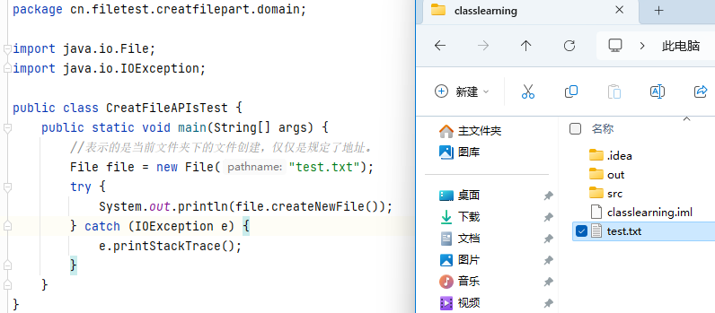
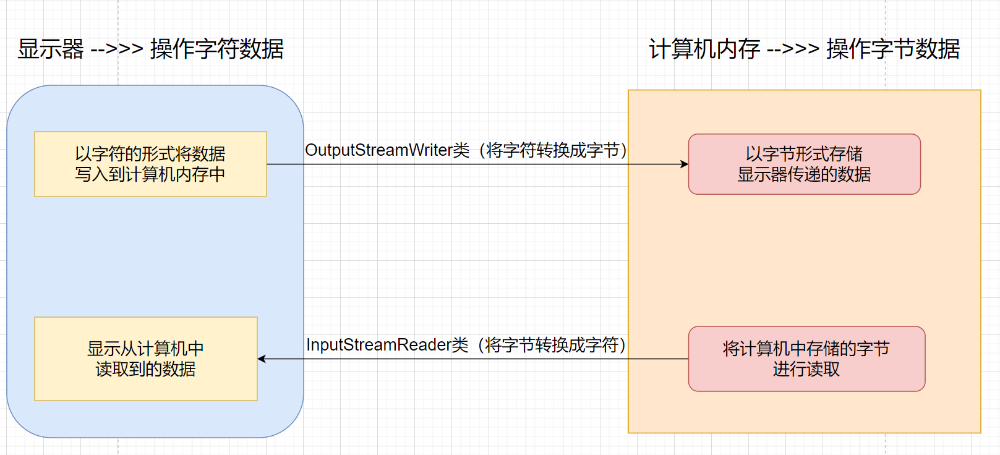

# File类

## 概念

+ 为了方便程序猿通过代码操作文件/文件夹，从而封装的一个指定类

+ 常用API

	+ ```java
	boolean exists()
		    判断文件是否还存在
		```
	
	+ ```java
	boolean isFile()
		    判断是否是文件
		```
	
+ ```java
	boolean delete（）
		    删除文件
	```
	
+ 
	
	+ ```java
	  // 实例化File类对象（即构造器）
	  public File(String fileName);
    ```
	```
	
	+ ```java
	  // 创建：创建文件和文件夹
    // 创建文件
	public boolean createNewFile();
	```
	
	+ ```java
	  // 创建指定的一层文件夹
    public boolean mkdir();
	  ```
	```
	
	+ ```java
    // 创建指定的多层文件夹
	  public boolean mkdirs();
	```
	
	+ ```java
    // 修改
	  public boolean renameTo(File file);
	  ```
	```
	
  + ```java
	  // 获取文件（掌握）
	  // 获取文件的绝对路径
	public String getAbsolutePath();
	```
  
	+ ```java
  // 获取文件对象
	public File getAbsoluteFile();
	  ```
	
	+ ```java
	  // 获取文件名
	  public String getName();
    ```
	
  + ```java
	// 获取指定路径下的所有文件对象
	  public File[] listFiles();
	  ```
	```
	
	```
	
+ ```java
	  // 判断指定的路径（当前File类对象）是否是文件夹
  public boolean isDirectory();
	```
	
	  + 实例化File类对象传递参数路径写法:
	
	  	+ 绝对路径:从盘开始
	        		+ 优点:用户方便获取
	  
	                		+ 不足:代码移植时,容易出现盘符不存在异常
	  	+ 相对路径:没有盘符
	        		+ 优点: 将指定的文件创建在当前的项目下,相对安全
	                		+ 不足: 用户获取比较麻烦
	
	  + 总结: File类构造器,,参数表示在指定位置创建文件,并不能直接创建
	
	  	+ 简单理解,,用构造器创建文件的时候,我就只是给文件规定了位置,然后创建的时候使用的是独有的API进行创建.然后文件才会在目标位置显示.
	
	  + 代码:
	
	   +  ```java
	        
	        ```
	
	  		package cn.filetest.creatfilepart.domain;
	  		
	  		import java.io.File;
	  		import java.io.IOException;
	  		
	  		public class CreatFileAPIsTest {
	  		    public static void main(String[] args) {
	  		        //表示的是当前文件夹下的文件创建，仅仅是规定了地址。
	  		        File file = null;
	  		        //一级目录的创建
	  		        File file1 = null;
	  		        //多级目录的创建
	  		        File file2 =null;
	  		        try {
	  		            file = new File("test.txt");
	  		            file1 = new File("E:\\JAVA_working\\NewWorking\\classlearning\\创建的训练文件夹");
	  		            file2 = new File("E:\\JAVA_working\\NewWorking\\classlearning\\创建的训练文件夹\\first\\second");
    		            System.out.println(file.createNewFile());
	  		            System.out.println(file1.mkdir());
    		            System.out.println(file2.mkdirs());
	  		
    		            //修改：
	  		            file.renameTo(new File("new.docx"));
    		            System.out.println(file.getName());
	  		            //获取绝对路径
    		            System.out.println(file.getAbsolutePath());
	  		            //获取文件的对象，虽然结果和上面获取路径是一样的，但是含义不一样，一个是获取的道德路径，一个是获取到文件本身
    		            System.out.println(file.getAbsoluteFile());
	  		        } catch (IOException e) {
	  		            e.printStackTrace();
	  		        }
	  		    }
	  		}
	  		
	  		```
	  		
	  	+ 
	
	  + 案例:
	  
	  	+ 自定义方法,获取指定路径下的所有格式的文件,并且将获取到的文件名打在控制台上,自定义文件夹,存储多个不同类型的文件和文件夹
	  
	   +  代码:
	          	
	
	        ```java
	        
	        ```
	
	  	package cn.filetest.creatfilepart.domain;
	  			
	  	import java.io.File;
	  			
	  	public class FileClassTest {
	  				    public static void main(String[] args) {
	  				        //先获取文件地址
	  				        File file = new File("E:\\JAVA_working\\NewWorking\\classlearning\\创建的训练文件夹");
	  				        //进行查找操作，方法自定
	  				        findFile(file,".md");
	  				    }
    				//产地参数，一个是进行找的文件，一个是找哪一种文件
	  				    private static void findFile(File file,String suffex) {
	  				        //获取到文件夹中所有的所有的文件，存放进数组中
	  				        File[] a=  file.listFiles();
	  				        //利用数组进行加强for循环。
	  				        for (File b : a){
	  				            //判断子文件夹是不是有文件
	  				            if (b.isDirectory()){
	  				                //有的话在进行一个操作，就是再进行查找操作
	  				                findFile(b,suffex);
	  				                //否则，找文件，文件是先获取到文件的名字，然后再看截尾是不是以这个方式截尾的，正确的输出
	  				            }else if (b.getName().endsWith(suffex)){
	  				                System.out.println(b.getName());
	  				            }
	  				        }
	  				    }
	  				
	  				}
	  				
	  				```
	  	
	  		+ 第二个案例：API的使用
	  		
	  			+ ```java
	  				package cn.classfiledemo;
	  			
	  				import com.sun.org.apache.bcel.internal.classfile.Field;
	  				
	  				import java.io.File;
	  				import java.io.IOException;
	  				
	  				public class FileDemo {
	  				    public static void main(String[] args) throws Exception {
	  				        //创建文件路径，后面是创建的文件的名字
	  				        File file = new File("E:\\JAVA_working\\NewWorking\\classfiledemo\\file.txt");
	  				        File file1 = new File("E:\\JAVA_working\\NewWorking\\classfiledemo\\file1.txt");
	  				        File file2 = new File("E:\\JAVA_working\\NewWorking\\classfiledemo\\file2.txt");
	  				        //打印路径名字，就是指定好的file地址
	  				        System.out.println(file);
	  				        //获得路径，绝对路径和普通路径
	  				        System.out.println(file.getAbsolutePath());
	  				        System.out.println(file.getPath());
	  				        //获得上级目录并且获取名字
	  				        System.out.println(file.getParentFile().getName());
	  				        //判断文件是否存在
	  				        System.out.println(file.exists());
	  				        //判断是不是文件
	  				        System.out.println(file.isFile());
	  				        //判断是不是文件夹
	  				        System.out.println(file.isDirectory());
	  				        //构建文件
	  				        if (file.exists()){
	  				            System.out.println("文件存在");
	  				        }else{
	  				            //如果文件存在就输出文件存在，不存在就创建一个新的文件
	  				            boolean create = file.createNewFile();
	  				            boolean create1 = file1.createNewFile();
	  				            boolean create2 = file2.createNewFile();
	  				            //查看是否创建成功。
	  				            if (create && create1 && create2){
	  				                System.out.println("ok了");
	  				            }else{
	  				                System.out.println("Worry");
	  				            }
	  				        }
	  				        //删除文件
	  				        boolean fileDel = file.delete();
	  				        if (fileDel){
	  				            System.out.println("删掉了");
	  				        }else{
	  				            System.out.println("失败了");
	  				        }
	  				        //创建多级目录
	  				        File file3 = new File("E:\\JAVA_working\\NewWorking\\classfiledemo\\mkdirs1\\makirs2\\mkdirs3");
	  				        if (file3.exists()){
	  				            System.out.println("目录已经存在");
	  				        }else{
	  				            boolean mkdirs = file3.mkdirs();
	  				            System.out.println(mkdirs ? "ok" : "worry");
	  				        }
	  				        //查看文件夹(这个是先查看文件夹中文文件，就是现有的，不是迭代后的，有什么就会打印什么，不会向里面文件夹  )
	  				        File file4 = new File("E:\\JAVA_working\\NewWorking\\classfiledemo\\mkdirs1");
	  				        //列出所有文件路径，字符串数组
	  				        File[] list =file4.listFiles();
	  				        for (File a : list){
	  				            System.out.println(a);
	  				        }
	  				        //列出所有文件对象
	  				        File file5 = new File("E:\\JAVA_working\\NewWorking\\classfiledemo\\mkdirs1");
	  				        String[] list1 = file5.list();
	  				        for (String a : list1){
	  				            System.out.println(a);
	  				        }
	  				        //递归遍历文件夹内容，是遍历文件，不是文件里面的值
	  				        File file6 = new File("E:\\A_dddownload\\周末班");
	  				        printDir(file6);
	  				    }
	  				    public static void printDir(File dir){
	  				        //这个是传入的文件目录
	  				        System.out.println(dir);
	  				        //获取文件夹和文件
	  				        File[] files = dir.listFiles();
	  				        //对于集合或者数组，要判断是不是null和有没有长度
	  				        if (files != null && files.length>0){
	  				            for (File a : files){
	  				                //判断对象还是不是文件夹，如果是，那么就继续遍历，如果不是，输出路径
	  				                if (a.isDirectory()){
	  				                    printDir(a);
	  				                }else{
	  				                    System.out.println(a.getPath());
	  				                }
	  				            }
	  				        }
	  				    }
	  				}
	  				
	  				```


## 编码和解码

+ 两个代码，一个是初步了解代码，一个是模拟浏览器进行编码解码过程

+ 字符在的编码和解码操作

	+ 编码：把字符串变成byte数组，String ——>byte[ ]

	+ 解码：把byte转换成字符串       byte[ ] ——>String

	+ ```java
		package cn.encoding;
		
		import java.io.UnsupportedEncodingException;
		import java.util.Arrays;
		
		public class Ecodingdemo {
		    public static void main(String[] args) throws Exception {
		        String str = "国";
		        //转换成byte数组并且传一个编码方式，就可以看到编码的区别
		        byte[] a = str.getBytes("GBK");
		        System.out.println(Arrays.toString(a));
		        //编码：把字符或字符串按照某种指定的字符集转换为对应的字节序列 (byte[]) 的一个过程
		        byte[] b = str.getBytes("UTF-8");
		        System.out.println(Arrays.toString(b));
		
		        // 解码：把字节序列 (byte[]) 按照某种指定的字符集转换为对应的字符或字符串的过程
		        byte[] c = {-27, -101, -67};
		        String str1 = new String(c,"UTF-8");
		        System.out.println(str1);
		    }
		}
		
		```

+ 这个是案例

	+ ```java
		package cn.encoding;
		import java.util.Arrays;
		
		public class EcodingDemo1 {
		    public static void main(String[] args) throws Exception {
		        //经典案例
		        // 页面把用户输入的字符串（浏览器使用 UTF-8）变成字节序列
		        String str = "宝贝";
		        byte[] input =str.getBytes("UTF-8");
		        System.out.println(Arrays.toString(input));
		
		        // 服务器默认编码字符集为 ISO-8859-1  编码
		        byte[] serves = {-27, -82, -99, -24, -76, -99};
		        String mid = new String(serves,"ISO-8859-1");
		        System.out.println(mid);
		
		        //开发者拿到的 mid，此时开发者 str 在使用 IOS-8859-1 重新编码
		        byte[] last = mid.getBytes("ISO-8859-1");
		        System.out.println(Arrays.toString(last));
		        //使用UTF-8解码
		        String encodingStr = new String(last,"UTF-8");
		        System.out.println(encodingStr);
		    }
		}
		
		```

	+ 


## IO流操作

**实质**

+ 将数据从指定文件中获取，或将指定的数据写入指定文件中的技术

分类:

+ 核心：4大基流，8个子流
	+ 按照流向分：
		+ 输入流
		+ 输出流
	+ 按照操作元素的类型分
		+ **字符流：**
			+ 字符输入流————Reader(读者)
				+ FileReader 
				+ BufferedReader
			+ 字符输出流————Writer(作者)
				+ FileWriter    
				+ BufferedWriter
		+ **字节流：**
			+ InputStream 字节输入流
				+ FileInputStream      
				+ BufferedInputStream
			+ OutputStream字节输出流
				+ FileOutputStream  
				+ BufferedOutputStream
	+ 总结特点：
		+ 前缀：
			+ File：表示使用指定的流资源技术操作File本身
			+ Buffered：表示使用指定的流资源技术操作缓冲区，前提是要将操作的文件存储到缓冲区
		+ 后缀：
			+ 表示当前流资源类属于那种流资源

## 字符流（重点掌握）

+ Java中将所有的基流，定义为抽象类，因此需要使用具体的子类完成对象实例化操作，从而完成对数据操作

+ 在字节流的基础上延申出来的

+ **FileWriter类**

	+ 常用API

		+ ```java
			// 构造器 -->>> 参数表示将数据写入到指定的位置上
			public FileWriter(String path);
			```

		+ ```java
			// 一组写的方法
			// 在指定流对象中尾部追加一个字符元素
			public Writer append(char ch);
			```

		+ ```java
			// 在指定的流对象中写入一个字符/字符的ASCII值
			public void write(int ch);
			```

		+ ```java
			// 在指定的流对象中写入一个字符数组
			public void write(char[] cbuf);
			```

		+ ```java
			// 在指定的流对象中从指定位置开始，写入指定长度的字符数组
			public void write(char[] cbuf,int beginIndex,int length);
			```

		+ ```java
			// 在指定的流对象中写入一个字符串
			public void write(String value);
			```

		+ ```java
			// 在指定的流对象中从指定位置开始，写入指定长度的字符串
			public void write(String value,int beginIndex,int length);
			```

		+ ```java
			// 将流对象中的数据资源写入到目的地（文件）中
			// 刷新
			public void flush();
			// 关闭流资源，并进行最后一次刷新操作
			public void close();
			```

			+ 代码：
	
			+ 
			
			+ 一个一个添加：
			
			+ ```java
				package cn.filetest.creatfilepart.domain;
				import java.io.FileWriter;
				import java.io.IOException;
				
				public class FileWirterAPI {
				    public static void main(String[] args) {
				        FileWriter file = null;
				        try {
				            file = new FileWriter("E:\\JAVA_working\\NewWorking\\classlearning\\创建的训练文件夹\\test.txt");
				
				            file.append("shalaf,");
				            file.write(66);
				            file.write("\n\r");
				            file.write('$');
				
				            file.write(new char[]{'f','2','4'});
				            file.write(new char[]{'a','b','c','d'},0,2);
				            file.write("这个是美好的一天");
				            //这是刷新操作，进行将数据写到文件中。
				            file.flush();
				
				        } catch (IOException e) {
				            e.printStackTrace();
				        }finally {
				            try {
				                //进行一次空值判断，如果是空，那就不用进行刷新操作，因为数据没有进去
				                //如果不是空，就是有数据，为了避免数据没有安全加载进去，我们在进行一次刷新
				                if (file != null){
				                    file.close();
				                }
				            } catch (IOException e) {
				                e.printStackTrace();
				            }
				        }
				
				    }
				}
				
				```
			
				+ 其中规范是标准规范，书写io流的基本规范，而且FileWrter是覆盖的操作，会将已经存在文件进行覆盖。
			
		
	+ **总结**
	
		+ 使用所有的IO流操作步骤
			+ 创建指定流资源对象，并赋值为null
			+ 在try模块中实例化流资源类对象，通过对象调用方法，完成数据操作
			+ 在finally块中关闭流资源对象，前提要对流资源对象进行非空判断
	
+ **bufferedWriter类**

	+ 字符输出高效流

	+ 常用API

		+ ```java
			// 构造器：参数表示告诉计算机将指定的文件存储在缓冲区中，在缓冲区中完成的数据写入的操作
			public BufferedWriter(Writer out); 
			
			// 写的方法和刷新、关闭资源的操作都与FileWriter类一致
			
			// 换行操作,就是换行的操作
			public void newLine();
			```

			+ 代码：

				+ ```java
					package cn.filetest.creatfilepart.domain;
					
					import java.io.BufferedWriter;
					import java.io.FileWriter;
					import java.io.IOException;
					
					public class BufferedWriterAPI {
					    public static void main(String[] args) {
					        BufferedWriter file = null;
					        try {
					            file = new BufferedWriter(new FileWriter("E:\\JAVA_working\\NewWorking\\classlearning\\创建的训练文件夹\\newtest.txt"));
					            file.append("shalaf,");
					            file.write(66);
					            file.newLine();
					            file.write('$');
					
					            file.write(new char[]{'f','2','4'});
					            file.write(new char[]{'a','b','c','d'},0,2);
					            file.write("这个是美好的一天");
					            //这是刷新操作，进行将数据写到文件中。
					            file.flush();
					        } catch (IOException e) {
					            e.printStackTrace();
					        }finally {
					            try {
					                if (file != null){
					                    file.close();
					                }
					            } catch (IOException e) {
					                e.printStackTrace();
					            }
					        }
					    }
					}
					
					```

					+ 这个也是覆盖操作

				+ 高效的体现：

					+ 提供高效方法：
					+ 由于操作的是缓冲区，因此一定程度上降低堆栈内存的损耗

	+ 案例

		+ 将数据写入到指定的文件中

			+ ```java
				package cn.filetest.creatfilepart.classtest.domain;
				
				import java.io.BufferedWriter;
				import java.io.File;
				import java.io.FileWriter;
				import java.io.IOException;
				import java.util.ArrayList;
				import java.util.List;
				
				public class BufferedWriteClassWork {
				    private static List<Order> orders ;
				    static {
				        orders= new ArrayList<>();
				        orders.add(new Order(1L,"金枪鱼",23,10.22,235.06));
				        orders.add(new Order(2L,"物资",23,10.22,235.06));
				        orders.add(new Order(3L,"这个鱼",23,10.22,235.06));
				    }
				    //这个是将数据写到文件中的方法
				    public void orderToFile(){
				        BufferedWriter file = null;
				        try {
				            file = new BufferedWriter(new FileWriter("E:\\JAVA_working\\NewWorking\\classlearning\\创建的训练文件夹\\newtest.txt"));
				            for (Order a : orders){
				                file.write(a.toString());
				                file.newLine();
				                file.flush();
				            }
				        } catch (IOException e) {
				            e.printStackTrace();
				        }finally {
				            try {
				                if (file != null){
				                    file.close();
				                }
				            } catch (IOException e) {
				                e.printStackTrace();
				            }
				        }
				    }
				
				}
				
				```

+ **FileReader类：字符输入流**

	+ 常用API

		+ ```java
			// 构造器
			public FileReader(String fileName);
			
			```

		+ ```java
			// 一组读的方法
			/* 
				读取一个字符对应的ASCII值，读到文件末尾返回-1
				拓展：读取方法中的返回值int有两层含义
					1 如果读到的是指定字符，表示字符对应的ASCII值
					2 如果读到文件结尾，表示最后一个元素的下标，为-1
			*/
			public int read();
			```

		+ ```java
			// 将指定的数据去读取到数组中完成存储
			public int read(char[] cbuf)
			```

		+ ```java
			// 将数据从指定位置开始，读取指定个数，读取到指定的数组中
			public int read(char[]cbuf,int beginIndex,int length);
			
			```

		+ ```java
			// 关闭资源
			public void close();
			```

			+ 代码：

				+ ```java
					package cn.filetest.creatfilepart.domain;
					import java.io.FileNotFoundException;
					import java.io.FileReader;
					import java.io.IOException;
					public class FileReaderAPI {
					    public static void main(String[] args) {
					        FileReader file = null;
					        //进行文件的获取，然后定义一个数组
					        try {
					            file = new FileReader("E:\\JAVA_working\\NewWorking\\classlearning\\创建的训练文件夹\\newtest.txt");
					            char[] abc = new char[1024 * 99];
					            //这里不能直接使用date = file.read(abc),不然的话会一直循环，无法退出循环，因为read是动态过程
					            int date = 0;
					            while ((date = file.read(abc)) != -1) {
					                System.out.println(new String(abc, 0, date));
					            }
					        } catch (FileNotFoundException e) {
					            e.printStackTrace();
					        } catch (IOException e) {
					            e.printStackTrace();
					        } finally {
					            try {
					                if (file != null) {
					                    file.close();
					                }
					            } catch (IOException e) {
					                e.printStackTrace();
					            }
					        }
					
					    }
					}
					
					```

				+ 定义数组：存储读取到的元素：——》》Java规定数组长度为1024的整数倍

				+ 定义数组的长度，太小不够存储，太大容易造成堆内存溢出

				+ 而且，我们在显示数据的时候，我们是必须转换成string类型才可以显示

			+ 拓展：

				+ 实际开发中无论调用读和写的操作，是读一个还是读一组，或写一个还是写一组，底层调用的都是读一个或写一个的方法

+ **BufferedReader类：字符输入高效流**

	+ 常用API

		+ ```java
			// 构造器
			public BufferedReader(Reader in);
			```

		+ ```java
			// 读一行 -->>> 当读到文件结尾处，返回null
			public String readLine();
			```

		+ ```java
			// 其余方法与FileReader类一致
			```

		+ ```java
			package cn.filetest.creatfilepart.domain;
			
			import java.io.*;
			
			public class BufferedReaderAPI {
			    public static void main(String[] args) {
			        //进行构造器实例化
			        BufferedReader file = null;
			        try {
			            file = new BufferedReader(new FileReader("E:\\JAVA_working\\NewWorking\\classlearning\\创建的训练文件夹\\newtest.txt"));
			            //API的返回值类型是String类型，所以用String类型的data进行数据的接受
			            //正好是String类型就可以打印出来，每个读取出来的数据进行打印
			            String data = null;
			            while ((data = file.readLine()) != null){
			                System.out.println(data);
			            }
			        } catch (FileNotFoundException e) {
			            e.printStackTrace();
			        } catch (IOException e) {
			            e.printStackTrace();
			        } finally {
			            try {
			                if (file != null){
			                    file.close();
			                }
			            } catch (IOException e) {
			                e.printStackTrace();
			            }
			        }
			    }
			}
			
			```

		+ 


## 字节流

+ 地位：计算机底层操作数据交互的核心技术

+ FileOutputStream类：字节输出流

	+ 常用API

		+ ```java
			// 构造器：在指定路径下创建文件，如果没有就创建，否则就覆盖
			public FileOutputStream(String path);
			
			// 一组写的方法：由于FileOutputStream类直接通过字节流操作文件本身，因此可以直接将数据写入到文件中
			// 写入一个字节
			public void write(int b);
			
			// 写入一个字节数组
			public void write(byte[] bbuf);
			
			// 从指定字节数组的指定位置开始，写入指定长度
			public void write(byte[] bbfu,int beginIndex,int length);
			
			// 关闭资源操作
			public void close();
			```

		+ 代码：

			+ ```java
				package cn.lesson.domain;
				
				import java.io.FileNotFoundException;
				import java.io.FileOutputStream;
				import java.io.IOException;
				
				public class ClassFileOutputStream {
				    public static void main(String[] args) {
				        //创建FileOutputStream 字节输出流。
				        FileOutputStream file =null;
				        try {
				            //指定文件的位置
				            file = new FileOutputStream("first.txt");
				            //给文件写入内容
				            file.write('b');
				            file.write(new byte[]{3,4,2,4,5});
				            file.write(new byte[]{3,4,2,4,5},2,1);
				            file.write("今天的天气是阴天".getBytes());
				
				        } catch (FileNotFoundException e) {
				            e.printStackTrace();
				        } catch (IOException e) {
				            e.printStackTrace();
				        } finally {
				            if (file != null){
				                try {
				                    file.close();
				                } catch (IOException e) {
				                    e.printStackTrace();
				                }
				            }
				        }
				    }
				}
				
				```

+ BufferedOutputStream类：字节输出高效流：

	+ 通过查看API帮助文档发现并没有提供高效操作方法，那么还要使用该类的原因就是因为操作的是缓冲区，一定程度上降低堆栈内存的损耗

	+ 常用API

		+ ```java
			// 构造器
			public BufferedOutputStream(OutputStream out);
			
			// 刷新：由于当前的数据操作在缓冲区，而文件在堆栈内存，因此需要刷新
			public void flush();
			
			// 关闭资源，在关闭前执行最后一次刷新操作
			public void close();
			```

		+ 代码：

			+ ```java
				package cn.lesson.domain;
				
				import java.io.BufferedOutputStream;
				import java.io.FileNotFoundException;
				import java.io.FileOutputStream;
				import java.io.IOException;
				
				public class ClassBufferedOutputStream {
				    public static void main(String[] args) {
				        //创建BufferedOutputStream 字节输出高效流
				        BufferedOutputStream buf = null;
				        try {
				            //指定地址
				            buf = new BufferedOutputStream(new FileOutputStream("buf.txt"));
				            //开始写入：
				            buf.write('f');
				            buf.write("字节搞笑留".getBytes());
				            buf.flush();
				        } catch (FileNotFoundException e) {
				            e.printStackTrace();
				        } catch (IOException e) {
				            e.printStackTrace();
				        } finally{
				            if (buf != null){
				                try {
				                    buf.close();
				                } catch (IOException e) {
				                    e.printStackTrace();
				                }
				            }
				        }
				    }
				}
				
				```

+ FileInputStream类：字节输入流

  + 常用API

  	+ ```java
  		// 构造器
  		public FileInputStream(String fileName);
  		
  		// 读一个字节：返回值含义与字符输入流一致
  		public int read();
  		
  		// 读一组
  		public int read(byte[] bbuf);
  		
  		// 将读取的数据存储到指定字节数组，从指定位置开始，存储指定个数
  		public int read(byte[] bbuf,int beginIndex,int length);
  		
  		// 关闭资源操作
  		public void close();
  		```

  	+ 代码：

  	+ 一个可以优化的代码：就是一个一个拿元素变成了可以循环
  	
  		+ ```java
  		package cn.fileinputstreamdemo;
  			
  			import java.io.File;
  			import java.io.FileInputStream;
  			
  			public class FileInputStreamDemo {
  			    public static void main(String[] args) throws Exception {
  			        //确定路径
  			        File file = new File("E:\\JAVA_working\\NewWorking\\classfiledemo\\file1.txt");
  			        //确定字节输入流对象。字节输入流是读取数据，读取文件中存在数据
  			        FileInputStream fis = new FileInputStream(file);
  			        //读数据，一次只能读一个
  			/*        int a = 0;
  			        a = fis.read();
  			        System.out.println(a);
  			        a = fis.read();
  			        System.out.println(a);
  			        a = fis.read();
  			        System.out.println(a);
  			        a = fis.read();
  			        System.out.println(a);
  			        a = fis.read();
  			        System.out.println(a);*/
  			        //结果是文件中的文本进行转码展示的
  			
  			        //优化代码，让代码一次能读玩，不是一次一次读
  			        //设置字节数组，因为这个是字节输入流
  			        byte[] b = new byte[2];//定义字节数组的步长，这个是；每次循环都会重新走进来
  			        int c = 0;
  			        StringBuilder sb = new StringBuilder();
  			        while ((c = fis.read(b)) != -1){
  			            String str = new String(b,0,c,"UTF-8");
  			            sb.append(str);
  			        }
  			        System.out.println(sb);
  			        fis.close();
  			    }
  			}
  			
  			```
  			
  		+ 
  		
  		+ 
  		
  		+ ```java
  		  package cn.lesson.domain;
  		  
  		  import java.io.FileInputStream;
  		  import java.io.IOException;
  		  
  		  public class ClassFileInputStream {
  		      public static void main(String[] args) {
  		          FileInputStream file = null;
  		          try {
  		              file = new FileInputStream("buf.txt");
  		              //写入
  		              int date = 0;
  		              byte[] abc = new byte[1024];
  		              while ((date =  file.read(abc)) != -1){
  		                  System.out.println(new String(abc,0,date));
  		              }
  		          } catch (IOException e) {
  		              e.printStackTrace();
  		          } finally{
  		              if (file != null){
  		                  try {
  		                      file.close();
  		                  } catch (IOException e) {
  		                      e.printStackTrace();
  		                  }
  		              }
  		          }
  		      }
  		  }
  		  
  		  ```

+ BufferedInputStream类：字节输入高效流：

+ 通过查看API帮助文档发现并没有提供高效操作方法，那么还要使用该类的原因就是因为操作的是缓冲区，一定程度上降低堆栈内存的损耗

	+ 常用API

		+ ```java
			// 构造器
			public BufferedInputStream(InputStream in);
			
			```

		+ 代码：

			+ ```java
				package cn.lesson.domain;
				
				import java.io.BufferedInputStream;
				import java.io.FileInputStream;
				import java.io.FileNotFoundException;
				import java.io.IOException;
				
				public class ClassBufferedInputSstream {
				    public static void main(String[] args) {
				        BufferedInputStream buf = null;
				        try {
				            buf = new BufferedInputStream(new FileInputStream("buf.txt"));
				            int date = 0;
				            byte[] buf_abc = new byte[1024];
				            while ((date =  buf.read(buf_abc)) != -1){
				                System.out.println(new String(buf_abc, 0, date));
				            }
				        } catch (FileNotFoundException e) {
				            e.printStackTrace();
				        } catch (IOException e) {
				            e.printStackTrace();
				        } finally {
				            if (buf != null){
				                try {
				                    buf.close();
				                } catch (IOException e) {
				                    e.printStackTrace();
				                }
				            }
				        }
				    }
				}
				
				```

			+ 


## 转换流




## 序列化和反序列化

+ 含义：

	+ 序列化可以理解为给指定的对象（数据）进行一个具有唯一标识的编号；反序列化对指定对象（数据）的唯一标识编号进行解析

+ 拓展：

	+ 序列化

		+ 上传：输出操作（写）

		+ 技术：OutputStream流 -->>> ObjectOutputStream类

		+ 代码：

		+ Java中先要进行序列化和反序列化操作时候，必须实现一个接口： Serializable接口（申明接口，接口中没有任何的抽象方法，实现这种接口，只证明当前类具备某种功能）

			+ **User类**

			+ ```java
				package cn.lesson.domain;
				
				import java.io.Serializable;
				
				public class User implements Serializable {
				    private static final long serialVersionUID = 1L;
				    private Long id;
				    private String name;
				    private String password;
				    public User(){}
				
				    public User(Long id, String name, String password) {
				        this.id = id;
				        this.name = name;
				        this.password = password;
				    }
				
				    public Long getId() {
				        return id;
				    }
				
				    public void setId(Long id) {
				        this.id = id;
				    }
				
				    public String getName() {
				        return name;
				    }
				
				    public void setName(String name) {
				        this.name = name;
				    }
				
				    public String getPassword() {
				        return password;
				    }
				
				    public void setPassword(String password) {
				        this.password = password;
				    }
				
				    @Override
				    public String toString() {
				        return "User{" +
				                "id=" + id +
				                ", name='" + name + '\'' +
				                ", password='" + password + '\'' +
				                '}';
				    }
				}
				
				```

			+ **Serializable类**

			+ ```java
				package cn.lesson.domain;
				
				import java.io.*;
				
				public class SerializableTest {
				    public static void main(String[] args) {
				        //序列化
				        ObjectOutputStream oos = null;
				        try {
				            //序列化操作
				            oos = new ObjectOutputStream(new FileOutputStream("oos.txt"));
				            //实例化对象
				            User user = new User(1L,"WYJ","000000");
				            //通过对象字节输出流调用方法将指定的方法写入到指定的文件夹中
				            oos.writeObject(user);
				            oos.flush();
				        } catch (IOException e) {
				            e.printStackTrace();
				        }finally {
				            if (oos != null){
				                try {
				                    oos.close();
				                } catch (IOException e) {
				                    e.printStackTrace();
				                }
				            }
				        }
				
				        //反序列化
				        ObjectInputStream ois = null;
				        try {
				            ois = new ObjectInputStream(new  FileInputStream("oos.txt"));
				            //通过对象字节输入流调用方法读取指定文件的数据封装到指定的对象中。
				            User your = (User)ois.readObject();
				            System.out.println(your.toString());
				        } catch (IOException e) {
				            e.printStackTrace();
				        } catch (ClassNotFoundException e) {
				            e.printStackTrace();
				        } finally {
				            if (ois != null){
				                try {
				                    ois.close();
				                } catch (IOException e) {
				                    e.printStackTrace();
				                }
				            }
				        }
				
				    }
				}
				
				```


+ 文件内容的复制 ——————文字的复制

	+ 代码：

		+ ```java
			package cn.lesson.domain;
			
			import java.io.File;
			import java.io.FileReader;
			import java.io.FileWriter;
			
			public class CopyDemo {
			    public static void main(String[] args) throws Exception {
			        //找到路径,file是读的文件位置
			        File file = new File("E:\\JAVA_working\\NewWorking\\classfileoutputstream\\copy_before.txt");
			        File file2 = new File("E:\\JAVA_working\\NewWorking\\classfileoutputstream\\copy_after.txt");
			        //确定使用什么方法，输入输出，因为有汉字，所以使用字符流
			        FileReader fr = new FileReader(file);
			        FileWriter fw = new FileWriter(file2);
			        //读进来，写出去
			        char[] chars = new char[1024];
			        int len = 0;
			        while ((len = fr.read(chars)) != -1){
			            fw.write(chars,0,len);
			        }
			        //刷新缓冲区,写的部分进行刷新缓存
			        fw.flush();
			
			        //关闭资源
			        fw.close();
			        fr.close();
			    }
			}
			
			```

+ 图片的复制

+ 操作文件，图片，还有视频都是用字节流

	+ 代码：

		+ ```java
			package cn.lesson.domain;
			
			import java.io.File;
			import java.io.FileInputStream;
			import java.io.FileOutputStream;
			
			public class ImgCopyDemo {
			    public static void main(String[] args) throws Exception {
			        //找到路径，复制和被复制的文件。
			        File file = new File("E:\\A_EGdownload\\photo\\copy_before.jpg");
			        File file2 = new File("copy_after.jpg");
			        //确定使用那种输入输出流,图片，使用的是字节输出输出流
			        FileInputStream fis = new FileInputStream(file);
			        FileOutputStream fos = new FileOutputStream(file2);
			
			        //读进来写出去，写的部分要刷新 ,2*1KB
			        byte[] bytes = new byte[1024*2];
			        int len = 0;
			        while ((len = fis.read(bytes)) != -1){
			            fos.write(bytes,0,len);
			        }
			
			        //刷新缓存
			        fos.flush();
			        //关闭资源
			        fos.close();
			        fis.close();
			    }
			}
			
			```

		+ 