awesome

# 变量和数据类型

## 变量

 含义

```java
一个数据存储空间的表示
将一个可以改变的量,存储在内存当中并且表示出来就叫做变量
首字母小写,不能数字开头,小驼峰命名
```


 特点

```java
随机性和唯一性
```

特点的解释:

```java
随机性:变量的存储位置是随机的
唯一性:变量的存储名字是唯一的		(JVM内存地址是以16进制的数组存储的)
```


 定义格式

```java
数据类型 变量名 = 值;
```

## 常量

**含义**    **这里是成员常量** **同对象使用**

```java
在某个特定时期内,值和位置相对稳定
```

**定义格式**

```java
public static final 数据类型 常量名 = 值;

public static final int MAXWORK = 5*8*60*60*1000;
public void show(){
    System.out.println(MAXWORK);
}
```

**解释**

```java
static:常量存储的位置相对稳定,final表示常量的值相对稳定,并且必须有值        
常量名  要求:全部大写
static和final修饰符位置,不能改变
```


注意

```java
目前操作的都是局部变量,只作用于某个指定的代码块{}
局部变量必须编写初始值
命名中可以包含字母,数字,_ $,但是不能是数字开头,不能出现特殊字符,中文汉字,空格
```


## 数据类型

### 三类八种(也可以叫四类八种)

两大类:—————基本数据类型  和  引用数据类型

基本数据类型:

```java
数值型,浮点型,字符型,布尔型
```

解释:

```java
数值型:
		byte---字节型整数,取值范围[-128,127]
        short--短整型
		int----整形
		long---长整型,值后面要编写L,   long age = 10L;
浮点型:

		float--单精度浮点型.后面要写F
        double-双精度浮点型,java中默认的浮点型
字符型:
		char---只能存放一个字符,值必须是在单引号中,默认值是空格
布尔型:
		boolean  默认值是false
		布尔类型只有两个值-----true 和 false

```

**数据类型的默认值**

| 常见数据类型 | 默认值 |
| ------------ | ------ |
| double       | 0.0    |
| int          | 0      |
| String       | null   |
| char         | 空格   |
| boolean      | false  |

## 合理化赋值

**重要性**

```java
对于用户输入数据进行合理化判断,维护代码的健壮性
```

现阶段可以通过条件运算符进行判断

实际的开发过程中,一般常用合理化复制判断,主要针对数值型(int   double) String类型

```java
对于数值型
	特殊值判断,一般情况判断0
    
对于 String:不能为 nulll (空)不能为""(空串)

当需要判断的类型是任意一种引用数据类型
	针对 null
```


### 数据类型的转换

分类:

自动转换    和    强制转换

#### 强制转换

含义:

```java
大的数值存放在小的数据类型当中
```

格式

```java
小的数据类型 变量名 = (小的数据类型)大的数据类型的值
```

例如:

```java
double dou = 3.14;
int num = (int)dou;
```

不足:

```java
降低数据的精确度
```


#### 自动转换

含义:

```java
小的数值可以存放进大的数据类型中
```

存放顺序:

```java
byte
short ---int -----long----float ----double
char
```

注意:

```java
char可以和数值类型相互转换------通过ASCII对应转换,每个字符都有与之对应的整数,0-65535
A--Z:  65-90
a--z:  97-122
0-9 :  48-57
```


## 运算符分类

### 分类

```java
算术运算符
关系运算符
逻辑运算符
条件运算符
赋值运算符
```


### 优先级

从高到低:

```java
（）
一元运算符，只对一个元素进行处理: ！ ++  --
算数运算符：*  /  %  +  -
 关系运算符：>   >= <   <=  =  !=
逻辑： &&  ||
条件运算符(三元运算符)：	（关系或者逻辑表达式）？：
赋值运算符： *=  /=  +=  -=   =
```

### 逻辑运算符

|  逻辑运算符   |                       怎么比较                       |
| :-----------: | :--------------------------------------------------: |
|  ! (逻辑非)   |       取反 , 原有的如果是true ,取反之后是false       |
| \|\| (逻辑或) |   符号两侧 有一个为 true 则结果为 true 否则为false   |
|  && (逻辑与)  | 符号两侧 , 同时为true , 整体结果为true , 否则为false |

### 注意

````java
1.(+)如果操作的变量中有一个是STring类型,则进行拼接操作,如果操作的变量是除了布尔以外的基本数据类型那么做和运算
2.(/)如果相同类型相除,结果一定还是该类型,
	如果不同数据类型,结果一定是数据类型较大的类型
3.(%)余数的正负只有和---被除数有关系,取余用来判断两数的关系,而/是用来做运算
4.比较运算符:比较的结果一定是布尔类型
````

按位与和按位或同逻辑运算符
```java
相同条件下,当前一个表达式能够判断整体的运行结果的时候,&&只运行前一个 &所有的都要运行,效率低
```


# 流程控制语句

含义:

```java
根据用户传递的参数进行业务逻辑判断,根据不同的条件完成指定的操作
```

## 条件分支结构

### if

原理:

```java
当关系表达式为真,执行操作代码,否则跳过if向下执行其他操作
```

结构
```java
if(关系表达式){
    操作代码;
}
```

### if….else

原理

```java
当关系表达式为真,执行操作代码,否则跳过if向下执行其他操作
```

结构:

```java
if(关系表达式){
    操作代码
}else{
    操作代码;
}
```

java中的流程语句可以嵌套

```java
在一个完成的流程控制语句中编写了另外的流程控制语句中------慎用
当满足一个条件之后,才可以进行另外一个条件的判断
```


注意:

```java
if   和   if   else 中的{}可以省略,当且仅当操作代码只有一条语句的时候,可以省略

if  结构可以单独使用,但是一旦有了else之后,一定有唯一的if存在且对应
```

### if…..else  if….else

流程

```java
根据每一个if条件进行判断,如果满足,则执行当前代码if的代码块,并且结束判断,如果都不满足,则执行最后的else
```

结构

````java
if(关系表达式){
    操作代码
}else if(关系表达式){
    操作代码
}.....
 else{
     操作代码
 } 
````


### switch

结构:

```java
switch(等值表达式){
    case 值:
        操作代码;
        break;
    case 值:
        操作代码;
        break;
	....
    default:
        操作代码
}
```

解释:

````java
等指表达式:
	通过该表示式子,一定可以计算出一个具体的结果值,这个结果有多种可可能性

根据等指表达式的结果匹配最合适的case完成操作代码,当都不匹配的时候,会执行default

break,存在是为了防止case的贯穿.-----根据等值表达式结果,找到最匹配的case执行,如果有break ,执行到break结束,否则会执行后面所有可以执行的代码
````


## 循环结构

分类

```java
while循环
do...while循环
for循环
```

### while

流程

```java
首先进行判断,是否能进入到循环中去,然后进行执行循环体,一边结束后,在判定,直到判定结果为假的额时候结束循环.
```


结构

```java
初始化条件;
while(判定条件){
    循环体;
    结束条件(循环增量);
}
```


### do…while循环

流程

````java
首先进行循环体的一次执行,然后进行判断,满足条件,就是while中的判断语句为真,就继续执行,然后继续执行do代码快,否则,结束循环.
````

结构

```java
do{
    循环体;
    循环增量;
}while(判定条件);
```

注意

```java
所有循环中,只有do...while循环在while()后面有个   分号" ; "
```

### for循环

流程

```java
限制行初始化值,根据判定条件进行判定,为真,进行循环体的执行,当执行一遍之后,循环增量被最后执行,然后在进行条件的判定,真,执行;假,退出循环
```

结构

```java
for(初始化值;判定条件;循环增量){
    循环体;
}
```


### 双重for循环

流程

```java
外层循环控制行,内存循环控制列
外循环执行一次,内循环执行完整的一次
```


### 加强for循环

适用

```java
适用于直接操作数组中的元素
```

结构

```java
for(数据类型 变量名 : 数组名){
    操作代码
}
```


### 循环的特殊状态

特殊状态—————循环的特殊状态

**while和do…while死循环**

```java
while(true){
    循环体
}

do{
    循环体;
}while(true);
```

**for循环的死循环**

```java
for(;;){
    
}

for(初始化值;判定条件;){
    
}

for(初始化值;;循环增量){
    
}
```

 

### 结束语句:

前提————————–必须配合流程控制语句编写

作用————————–结束与之对应位置最近的流程控制语句,是结束掉结束语句所在的循环,不结束外面的大循环

#### 分类

```java
break和continue
```

#### 结束掉指定层流程控制语句

方式一:

**给指定层流程控制语句起别名**

```java
bieming:while(true){
    循环体;
    while(true){
        循环体;
        break bieming;
    }
}
```

方式二

**定义布尔类型变量作为结束标记点**

```java
boolean flag  = true;
while(flag){
    循环体;
    在这里到某个条件后,定义:flag = false;
    循环到外面进行判断的时候,就会自动退出循环
}
```


# JVM虚拟机

**java代码的运行原理**

```java
java代码在jvm虚拟机中运行的
```

**运行步骤**

```java
编写.java文件
通过javac命令将指定的.java文件编译成同名的.class文件字节码文件
通过通过 java 命令 执行 指定的 .class文件 (注意 ! !不要加 .class 后缀)
```

## jvm详解

### jvm内存的划分

```java
人为的根据不同的内存存储特点和存储的数据完成划分
```

**程序计数器**

````java
当线程执行字节码文件的行号指示器
````

**本地方法栈**

```java
为虚拟机提供native方法,即为本地方法的执行提供服务
```

**方法区**

```java
线程共享取余,存储已经被虚拟机加载的类的信息,包含,常量,静态变量,即编译器编译的代码数据等(内存回收主要针对常量池的回收)
```

java**虚拟机栈**

```java
平常是叫做栈内存,每一个方法执行的时候,同时会创建一个栈,用来存储这个方法的局部变量,操作栈,动态链接,方法出口信息等,当调用一个方法的时候,就会创建一个栈,方法执行结束之后就会被销毁
```

java**堆**

```java
平常称之为 堆内存 , 被所有线程共享的区域 , 在虚拟机启动的时候创建 ; 将所有的对象的  实例 和  数组 分配到这个区域中, 每次使用new关键字 , 表示在 对内存中开了一块空间

编译实例化后的对象和数组
通过new关键字创建，一旦创建就永远存在


分配空间后会存在一个内存地址，@16进制
```

**栈内存**

```java
编译后的变量（基本数据类型）和运行的方法，用完就死亡

栈内存的内容随着生命周期的结束，自动消亡
```

**垃圾回收处理器(垃圾回收处理机制)**

```java
是java语言区别于其它语言的内在核心,不需要手动的处理JVM中无用的数据（自动处理）
```

能回收的对象

```java
失去生命周期的对象
失去引用的对象
匿名对象
```


# 数组

**概念**

含义

```java
存储一组相同类型的容器
```

特点

```java
存储数据的类型必须一致.--保证了元素的安全性,存储的数据不够灵活
使用数组进行多个数据存储时,必须标明数组长度--长度固定
```

**使用数组的原因**

```java
1.同时存储多个具有相同含义或者类型的数据,简化了编写
2.可以减少栈内存的存储压力
```

**定义格式**

静态

```java
已知数组中存放的元素的值
1.数据类型[] 数组名 = {值,值,值};
2.数据类型[] 数组名 = new 数据据类型[]{值,值,值};
```

动态

```java
已知数组中存放元素的个数(长度)
数据类型[] 数组名 = new 数据类型[个数]
```

**数组在Jvm存储的位置**

```java
数组是java的特殊的引用数据类型,除了使用new 关键字,指向堆内存以外,还可以直接通过  " = " 发生地址指向的改变(由栈内存,指向堆内存)
```

当创建数组时，通过new在堆内存中分配内存空间，指向的是堆内存的地址。（数组中的第一个元素）

如何区分数组中的元素，通过给每个空间进行一个编号，称为索引（下标）———从0开始

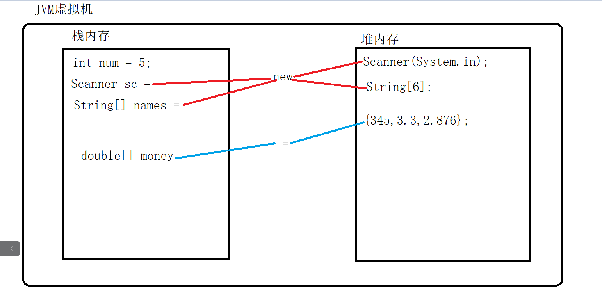

```java
所有的基本数据类型,将数据存储在栈内存中,需要赋值,而引用数据类型(Scanner和数组),创建在栈中完成的
引用数据类型,只有遇到new关键字的时候才会发生地址指向的改变,从栈指向堆.

数组特殊除了new以外还能通过  = 改变
```

**数组在堆中如何存储**

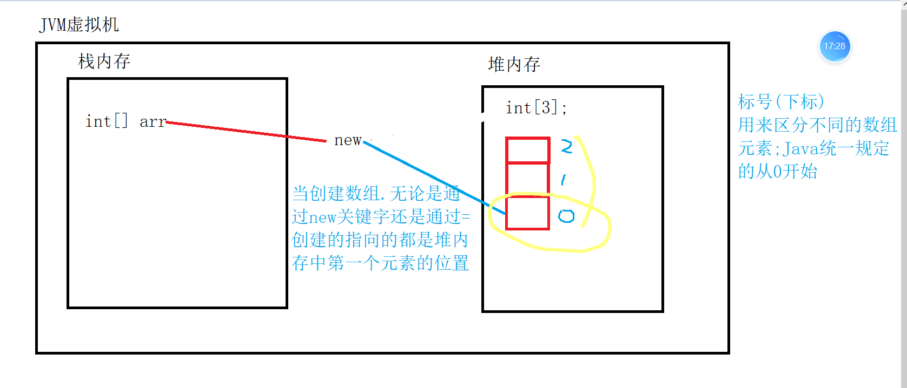

**细节**

```java
直接打印数组名,结果是该数组中堆内存第一个元素所在位置的地址值

如何获取数组中的元素—————数组名[下标]
```

**下标**

```java
如果元素存在,则下标一定是不下于0的数字
如果元素不存在,则下标一定是小于0的数据,为了保持数据的统一性,java规定元素不存在的时候统一下标为-1
数组长度 = 最大下标 + 1(数组元素最大小标,永远比数组长度小1)
数组长度的表达式: 数组名.length
如果没有给指定类型的数组存储元素,则会用该数组类型的默认值进行存储 
```

**二维数组**

含义

```java
将多个相同类型的数组存放到指定的数组中称这样的数组为二维数组,表示矩阵
```

结构

```java
数据类型[][] 数组名 = {数组1,数组2};

数据类型[][] 数组名 = new 数据类型[行][列];
第一个代表行，第二个代表列，第一个长度是要定义的，但是每个数组的长度可以不定义
```

## 按照指定格式显示数组中的元素

含义:

```java
就是遍历数组,for循环实现,然后将数组数值输出,前面和后面加上字符串
```

### 数据复制

java定义好的

**方式一**

```java
由Arrays类提供的
数据类型[] 新数组名 = Arrays.copyOf(数组名,int length);

通过Arrays.copyOf,会得到一个全新的数组
()第一个参数,是提数据的原数组,第二个参数,是复制元素的个数
```

**但是**

```java
当复制的长度比原数组长度小,那么,正常复制
当复制的长度比原数组长,正常的吧原数组的值都复制,然后空余的地方用该数组默认值补全
```

**例如**

```java
int nums1 = Arrays.copyOf(nums,10);
System.out.print(Arrays.toString(nums1));
//放在输出语句中的打印数组内容的语句
Arrays.toString(数组名)
```

**方式二**

由System提供

```java
数据类型[] 新数组 = new 数组类型[长度];
System.arraycopy(原数组,int srcPost,新数组,int destPost,int length);

```

解释:

```java
原数组:原来的数组
新数组:接受复制数据的数组
int srcPost: 从原数组中的指定开始复制
int destPost:将复制的数据,从新数组中指定的位置开始复制
int length:复制的长度
```

下标越界问题(复制的规则)

```java
原数组长度 - 1 - length >= srcPos
目的地数组 - 1 - length >= destPos
```

## 数组的应用

操作数组中的元素

### 冒泡排序

```java
投机取巧版本：
public static void main(String[] args){
    int[] nums = {5,-9,9,7,0,1,3};
    System.out.printly(Arrays.toString(nums));
    for(int i = 0; i <= nums.length - 1;i++){
        for(int j = 0; j < nums.length - 1 -i;j++){
            // 升序排列,前一个元素 ,比后面一个元素值大
            if(nums[j] > nums[j +1]){
                int temp = nums[j];
                nums[j] = nums[j + 1];
                nums[j + 1] = temp;
            }
        }
    }
    System.out.printly(Arrays.toString(nums));
}

```


```java
正宗版本：
    
for (int i = 0; i < arr.length - 1; i++) {
            for (int j = i + 1; j < arr.length; j++) {
                if (arr[j] > arr[i]) {
                    int temp = arr[i];
                    arr[i] = arr[j];
                    arr[j] = temp;
                }
            }
        }
```


### Arrays类提供方法支持,只有升序排序

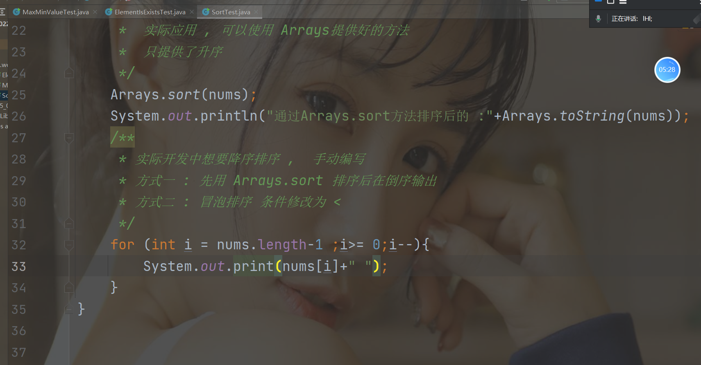

### 折半查找

原理

```java
对指定的数组重复多次进行折半,取中间值的过程,是排序之后取数据长度的中间值,不是数据的中点.用指定位置上的数据和折点位置上的数据进行比较
```

前提

```java
必须是有序的数据,不论升序还是降序
```

代码

```java
//折半查找：获取指定元素在指定数组中的位置, 指定位置的元素和数组
    public static int ElementPosition(int num,int[] nums){
        sort(nums);
        int begin = 0;
        int end = nums.length - 1;
        while (begin <= end){
            int middle = (begin+end)/2;
            if (num == nums[middle]){
                return middle;
            }else if(num > nums[middle]){
                begin = middle + 1;

            }else{
                end = middle - 1;
            }

        }
        return -1;
    }
```

### 对数组元素的增删改查

更新——-要更新的元素必须是存在的

```java
package cn.wolfcode.HomeWork.Text;

import java.util.Arrays;
import java.util.Scanner;

public class U {
    public static void main(String[] args) {
        String[] names = {"aa", "不变", "cc"};
        System.out.println(Arrays.toString(names));
        Scanner sc = new Scanner(System.in);
        System.out.println("改变的元素");
        String editBefore = sc.next();
        //判断元素是否在数组中
        //假设元素不存在
        int index = -1;
        for (int i = 0; i < names.length; i++) {
            if (editBefore.equals(names[i])) {
                index = i;
                break;
            }
        }
        if (index != -1) {
            //执行修改操作,为什么这里修改呢,是前面有循环操作
            //改变index的数值,意思是找到了相同的元素
            System.out.println("输入修改的值");
            String UAfter = sc.next();
            System.out.println("书否执行修改.(y/n)");
            String flag = sc.next();
            if (flag.equalsIgnoreCase("n")) {
                System.out.println("撤销修改");
            } else {
                names[index] = UAfter;
                System.out.println(Arrays.toString(names));
            }
        } else {
            System.out.println("不存在");
        }
    }
}

```

删除——要删除的元素一定要存在

```java
删除元素后,原来的数组结构会发生改变,就是长度会改变,所以在删除操作时,一定是生成一个新的数组,新的数组长度是原数组长度减一
```

创建

```java
插入元素后,会改变原有的数组的结构,新数组的长度是原数组的长度+1
```

### java中的随机操作

随机验证,防止机器刷机

**由java中Math类提供**

```java
package cn.wolfcode.HomeWork.Text;

public class MathMethod {
    public static void main(String[] args) {
        /**
         * Math.random();
         * 随机产生[0.0，1.0）区间的任意一个无限不循环小数,结果是double
         * 实际开发中,获取给定区间的整数部分,前提给区间进行扩大
         */
        int dou = (int) (Math.random() * 10);
        System.out.println(dou);
        /**
         * 拓展:
         * 想要四位的整数
         * 思路:下扩大,在平移,*9000  + 1000;等于是区间的变化
         *9000,是为了不让0开头,而下面的哪种方法就可以是0开头
         */
        int num = (int) (Math.random() * 9000 + 1000);
        System.out.println(num);
        String code = "";
        for (int i = 1; i < 5; i++) {
            code+= (int)(Math.random()*10);
        }
        System.out.println(code);

    }
}

```


**由java中Random类提供**

```java
package cn.wolfcode.HomeWork.Text;

import java.util.Random;

public class randoms {
    public static void main(String[] args) {
        Random random = new Random();
        System.out.println(random.nextInt());
        System.out.println(random.nextInt(100));

        /**
         * nextInt():获取int的取值范围为内任意一个整数
         * nextInt(int bround ): 获取0---bound的任意一个整数[0,bound)
         */
    }
}

```

数组的简单应用

```java
被static修饰的方法,可以直接用类名.方法名调用
    public static String code(){
    /**
    *数组的动态定义格式
    */
    char[] chs = new char[62];
    //循环存贮A--Z  a---z 0--9 三种类型的内容，通过ASCII码进行遍历存储
    for(int i= 0;i < 26;i++){
        chs[i] = (char)(65+i);
        
    }
    for(int i= 0; i < 26;i++){
        chs[i+26] = (char)(97 +i);
        
	}
    for(int i= 0; i <10;i++){
        chs[i+52] = (char)(48+i);
    }
    //定义一个存储验证码的变量
    String str  =  "";
    for(int i= 0 ; i < 4;i++){
        /**
        *Math.random  取值范围十[0.0,1.0);
        *后面城的数字,是为了改变这个区间的范围
        */
        int index = (int)(Math.random()*62);
        str += chs[index]
    }
    return str;
}
```


# 方法

Method,表示方法(函数)

## 相关概念

含义:

```java
表示某一个或者某一类事务所具备的功能
```

好处

```java
将部分的功能代码,定义在指定的格式中,方便其他人调用-----代码的复用
将部分功能代码从主函数中抽离,可以一定程度上缓解主函数加载的压力,调高效率
增加代码的可维护性
```

**定义格式**

```java
方法必须在指定的类中(不要再主函数中)
               //返回值类型可有可无
[访问权限修饰符] [修饰符] [返回值类型]方法名([参数列表]) [throws 异常类] [{
    方法体;
    [return 返回值结果];
}]
```

**解释**

访问权限修饰符

```java
限定用户在什么位置能够进行访问,目前只需要知道访问权限public(共有的,后续编写方法的时候最常用,最常见的访问权限);一个方法只能有一个访问权限修饰符
```

修饰符

```java
在方法中可以是定义多个修饰符,用来描述方法的特点,目前定义方法统一定义为static(在主方法中可以直接调用)
```

返回值类型——-必须存在

```java
表示通过当前的方法的方法体操作之后,得到的结果;
返回值的具体类型是根据用户的实际需求完成的,可以是任意类型;当一个方法的操作结果,是其他方法的判定条件,建议这个方法定义为有返回值的
       1.有返回值,数据类型可以是java中任意一种数据类型
       2.无返回值,返回值部分,必须编写void,直接显示操作结果
       3.当方法有返回值,在方法体中至少编写一次return
```

方法名

```java
通过方法名找到方法并且调用方法,同变量一致:小驼峰命名格式
```

参数列表

```java
(可以是任意个.但是不建议过多):用户根据实际的需求完成传递几个数值,我们定义的一种形式上的参数,没有实际得值,(每个参数我们都可以理解为在方法中定义了一个变量)
```

throws异常

```java
根据用户的实际需要完成定义的
```

方法体

```java
该方法编写的执行功能(抽象方法没有方法体)
```

return

```java
	方法的返回值,如果一个方法指定了返回值类型(只要不是void),那就必须得有return语句来返回和返回值类型相容的数据(实际开发中,一般返回值和定义的返回值类型一致).
	如果这个方法不需要任何返回值(void占位),return可有可无,如果写了,return表示方法执行结束.而且是最后一条可执行的语句,凡是在return后面的语句都不执行.
```

注意

````java
	1.定义方法的时候只需要考虑方法是否需要返回值,是否需要参数,其他没有特殊要求的时候,访问权限修饰符是public;修饰符一般不写,但是目前阶段需要些]写static

	2.在类中,可以定义一个或者定义多个方法,没有先后顺序
	3.方法和方法之间"不存在嵌套,但是可以相互调用"
	4.方法只有调用的时候才会执行,自己不会执行,
````

## 方法分类

### 是否有参数分类

**什么是参数**

```java
形参:
	在定义方法的时候后面括号中给的一个虚假的参数,等于是站着参数的位置,让我们知道这里将会有参数
        
实参:
	在调用方法中传递给方法中的参数,叫做实参,实际参与到方法中计算的参数
```


**无参方法**

```java
就是()没有传递参数
    
九九乘法表:当 方法 被 static 修饰的时候,可以通过
    
类名.方法名   进行调用
```

**有参方法**

```java
()中有传递参数
1.定参方法:固定参数个数的方法
2.可变参数方法:表示方法传递参数的个数是不确定的;实际开发中可变参数使用不多,参数的个数不固定安全性比较底,容易造成堆污染.必须定义在最后一位,有且仅有一个可变参数.
可变参数是一个数组,存储数据的容器
```

可变参数
```java
public static void fun(数据类型... 变量名){
            方法体;
        }
这就是三个点,没看错,就是点
```

### 是否有返回值分类

无返回值方法

```java
方法定义的时候，返回值部分写的是void,意思是编写好的程序是直接打印结果的,不用里面的数据
```

有返回值方法

```java
返回值类型可以定义java中任意的类型，必须在方法体中至少编写一次return语句，将操作的结果返回,这里的返回数据,意思是要使用里面的数据,给下一个部分使用,所以可以返回,有    return   语句
```

## 方法调用

调用流程

```java
调用的流程:
1.根据方法名找到对应的方法
2.若存在参数列表,按照顺序传递对应的实参
3.执行方法体
4.如果存在返回值,那么方法运行的结果返回
```

## 方法使用场景

单独使用———没有返回值的可以单独使用(逻辑)

打印调用———有返回值

赋值调用———有返回值(做判断)

## return关键字

```java
表示方法的结束,在后面不能定义任何的功能性代码,有了也不执行,返回之后就退出方法了,无法执行
    
    
一个方法中可以定义多个关键字,但是最终只能返回一个return的确定值

有返回值的方法,当想要显示结果,可以用变量接收这个结果,也可以在输出语句中调用方法

如何快速找到指定的方法或者变量

    ctrl + 鼠标左键
    直接    滚轮
```

## 方法的重载

含义

```java
同一个类中,具有相同功能的方法(方法名一致),但是方法的形参参数不一致,这中操作被称为方法的重载
```

**如何构成方法重载**

```java
方法名一致(方法的签名一致)  &&  
与访问权限修饰符和返回值无关 &&  
参数列表不同:(个数不同 || 参数不同类型顺序不同 || 数据类型不同)

主要看方法名和参数列表 
```


## 方法重写

**含义**

```java
子类对父类已经有的方法进行功能性的增强,需要在子类中重新定义该方法,称之为方法重写
```

**前提条件**

```java
类和类必须具备"继承"关系
重写的方法一定是父类中已经有的,并且一定进行功能性增强,(子类方法和父类方法功能有差距,就叫功能性增强)
```

**构成方法重写的要素**

```java
方法名一致 
参数列表一致
返回值一致或者父类方法返回值类型的子类
访问权限不严于父类(子类的访问权限>=父类的访问权限)
```

**实例**

```java
访问权限修饰符   返回值,就是person  然后是名为get的方法
    
父类:
protected Person get(){
    方式一:
    	先实例化对象然后再返回
		Person p = new Person();
    	return p;
	便于获取,但是会浪费栈内存空间
    
    方式二:
    	返回匿名对象
		return new Person();
    	节省内存空间但是不容易获取
    	
}


子类,进行重写
public Student get(){
    return null;
}

其中,访问权限不严于父类,返回值是Person的子类中的get方法
```


**方法重写和重载的区别**

| 比较项     | 方法的重载(OverLoad)                         | 方法的重写(Override)           |
| ---------- | -------------------------------------------- | ------------------------------ |
| 定义的位置 | 同一个类中                                   | 发生继承中，子类重写父类       |
| 方法名     | 相同                                         | 相同                           |
| 参数列表   | 不同(个数\|\|类型不同\|\|不同类型的顺序不同) | 相同                           |
| 返回值类型 | 无关                                         | 相同                           |
| 访问权限   | 无关                                         | 子类不严于父类（不能比父类低） |


## 方法的参数传递

**基本数据类型**

```java
当方法中传递的参数是"基本数据类型"
    只会在栈内存完成参数传递,传递参数的时候是"值传递"
```

**引用数据类型**

```java
会先到堆内存中将引用数据类型的地址进行传递,操作引用数据类型参数的时候,也会到堆内存从指定的地址获取,完成操作
    方法调用的时候,进行的是"地址传递"
```

**特殊类型**

```java
String,虽然是引用数据类型,但是具有基本数据类型的特征,在创建String 时候,直接赋值的String,进行的是值传递
```

地址传递的例子
```java
public class MethodDemo{
    public static void fun(int num){
        
    }
}

public class MethodTest{
    public static void main(String[] args){
        MethodDemo.fun(8);
    }
}
```


# 面向对象

## 概述

### 面向过程—C语言

```java
面向过程最早的一种编程思想,第一个完善的编程思想,从编程的过程角度出发考虑问题,面向过程关注的是程序执行的流程，每一个功能都需要我们亲力亲为。详细到每一处细节。
```

强调———–**我该怎么做**

特点

```java
系统适应能力差,可扩展性差,可维护性低
```

### 面向对象—java语言

含义

```java
面向对象是一种基于面向过程的编程思想;从对象的角度出发考虑问题,将不同的功能存放在不同的对象中,当我们需要使用某一个功能的时候，我们不关心执行的步骤，只需要找到一个能帮我们完成这个功能的实例来帮我们做就可以
```

强调 ——–**我让谁去做**

**前提**

```java
必须在类的基础上完成对象的创建,通过对象调用该类中的功能(方法);而对象,表示当前类的 一个具体的实例

java中只有引用数据类型(类 类型)才能产生对象
```

**好处**

```java
稳定性高,可重用性高,易于开发大型产品,具有良好的维护性
可以解决程序耦合度高的问题，低内聚，高耦合
```

**开闭原则**

```java
对扩展开放，对修改关系开放。
在不影响软件的基础功能的前提下，对程序进行平滑的扩展
```

## 类,  对象  类成员

### 概念解释

类

```java
某一类事务的抽象概念,是一个模子（将现实生活中一类事物抽象成我们java中类的概念）
最小的程序单位是"类"----类是面向对象思想中最小的单位
关键字————class
我们写程序就是在写类
"类是对象的模版，对象是类的实例"
类，是引用数据类型，每创建一个类，就相当于我们自己申明了一种数据类型
```

对象

```java
符合某一类事务的具体的实例
类和对象是互推的关系
"类是对象的模版，对象是类的实例"
```

类成员

```java
能够在类中能定义的内容
包括:
	成员变量(属性 全局变量)--描述该类事物
    成员方法--该类事务所具备的功能(能力)
	构造器(构造方法)--用来实例化对象
```

### **类和类成员的定义格式**

```java
类:[访问权限修饰符] [修饰符(一般只有一个)] class 类名{
    
    //成员属性
    [访问权限修饰符] [修饰符(可以有多个)] 数据类型 属性名[ =值 ];//其中的值可写可不写
    
    
    //构造器(构造方法)  格式是固定的
    [访问权限修饰符] 类名([参数列表]){}//参数列表可写可不写
   
    
    //成员方法--------成员方法不用static修饰
    [访问权限修饰符][修饰符("不是static")] 返回值类型 方法名([参数列表])[throws异常类][{
        方法体;
        [return 返回值结果;]
    }]
    
}

```

简单代码展示类的定义方式

```java
//定义了一个   人的类
public class ren{
    //定义了一个方法
    public static void main(String[] args){
        //现在是有一个操作,人 开门,在人这个类中,打开一扇门,
        
		//以往学习的方式是:  men.open();门表示一类,实际中,不可能打开一类门或者购买一类东西,应该具体化,具体到某个物体身上,就是只能获取一个,指定的一个,不推荐使用类来类来调用方法,应该用一个具体的对象调用
        创建(实例化)门的具体对象;
        对象.open();
    }
}

//定义了一个   门的类
public class men{
    
}
```

**注意**

```java
类中可以定义无限个类成员,只要有需求
```

### 构造方法

*构造方法也是方法,是一种特殊的方法*    ———-alt  +   inster
**构造器和方法对比**

```java
没有返回值
名称必须和类名一样   (构造器-----构造方法)--------特点
```

**构造器的作用**

```java
"创建对象的(也可以在创建对象的过程中为对象同时赋初始值)"
    
类在创建好之后,就会将成员属性和成员方法一并申明出来并且附上初始值,但是我们在实际开发中不会使用默认值,我们也可以用构造方法在创建对象后,为对象的属性赋值------值传递
```

**注意1**

```java
构造方法的方法名必须和类名相同，大小也相同

构造方法没有返回值类型，不可以用void占位

构造方法不能return一个具体的值
```

**注意2**

```java
需要在其它类中,给当前类属性设置值,可以定义对应属性的有参构造器完成
    1:有参构造器中参数定义的顺序,要和成员属性定义顺序一致
	2:有参构造器中参数的名字,一般和成员属性名一致
构造方法可以重载(必须是得在同一个类中)
```


### **成员变量和局部变量**

```java
成员变量：----必须在类里，方法的外面
				尽量不要写static关键字
				不初始化----初值：String ：null
    							char：空格（一个字符）
								double：0.0
								int：0
    							boolean：false
java中没有真正的全局变量，可以理解成员变量就是我们的全局变量
```


```java
局部变量：
    	局部变量在使用前必须初始化（赋值）
		而且只能在方法的内部使用
```

**类中全局变量和局部变量的区别**

```java
定义的位置不同:
	局部变量定义在方法内部(参数中),成员变量定义在类中-----类中有方法

作用域不同:
	局部变量只能在定义的方法内部区使用,成员变量(全局变量)可以整个类通用
	
默认值不同:
	局部变量没有默认值,在设置局部变量的时候必须初始化,给他赋初值,成员变量如果没有手动为期赋值的情况下,是有默认值的,上面写了.(方法的形参就是一个局部变量,传递参数的过程就是为了变量赋值的过程)

内存位置不同:
	局部变量在栈内存中,成员变量在堆内存中

生命周期不同:
	局部变量在栈内存中,随着方法的进栈诞生,方法的出栈消失
	成员变量在堆内存中,随着类的创建去创建,知道成为垃圾后被垃圾回收机制回收.

```


### 关键字:this

用法:

```java
当成员属性名  和  参数属性名  一致的时候,并且使用（局部属性）参数属性给成员属性赋值,通过this.成员属性 = 局部属性,进行区分
```

表示:

```java
当前类对象
```

**理解**

```java
其中，这个用this.的方法进行赋值,是多用在有参构造器中的,this的作用是为了给成员属性赋值,而不是给他本身赋值,所以用this.进行区分.(编程采用就近原则,不用this区分的话,会找到同名的其它参数,而不是成员中要找的名字(成员属性).所以在编程的时候,需要指定的操作完成同名的区分)
```

**等价代换**

```java
如果不使用有参构造器的话，会使用
Person p = new Person（）;－－－－实例化对象
p.name  =  name；
这个和this.是一样的，通过实例化对象，然后通过.的方式进行赋值，一般无参的时候就可以用这个方式进行实例化然后赋值。
```

注意——–使用“this.”

```java
使用传递参数给成员赋值

当成员属性名和参数属性名一致的时候,不能直接编写     成员属性名 =  参数属性名-----name = name;错误的

"this."  必须在方法体中使用
```

**this的三种用法**

在子类构造方法中,使用this(参数列表)调用本类的构造方法

在子类中,使用 this. 属性名  调用的是本类的属性

在子类中, 使用this.方法名  调用的是本类的方法名


## 对象

对象创建在堆内存中(每个对象都有自己的属性和行为)

对象的产生————声明    和   实例化

运行程序就是在运行对象

对象就是现实生活中真实存在的个体，是具体的概念。

需要使用（构造器，构造函数，构造方法）才可以创建对象。

**声明**

```java
数据类型 对象名;

public Worker worker;
```

**实例化**（就是创建对象的方法）

```java
数据类型 对象名 = new 数据类型([参数列表]);
类名  引用名 = new 类名（）;
```

调用对象成员属性：对象引用名.属性名  的方式调用

调用对象的成员方法:  对象引用名.方法名 的方式调用

**声明和实例化的区别**

```java
个数不同:
	声明:只在栈内存声明一个类的对象 
	实例化:即在栈内存创建对象,同时也通过new关键字将地址指向堆内存

能否直接应用:
	声明的对象:不能应用,会报错,空指针(空指向)异常
	实例化对象:可以直接使用
```

**特殊的引用数据类型**  ———  **数组**

```java
除了可以通过new 关键字发生地址指向的改变还能通过 = 发生地址指向的改变
```

### 成员属性

**作用**

```java
用来描述一类事务 或者一个具体的对象

叫法: 
	全局属性 ;全局变量;成员字段(Field,javaBean规范讲解);成员变量
```

**成员常量**

已经在开头中提到成员常量和定义方式
**分类**

按照作用域划分

```java
局部变量:作用于指定的代码块中
局部变量定义在代码块中的时候必须定义初始值,否则不能调用

成员变量:作用于 整个类
```

按照动静态划分

```java
成员变量--实际开发中操作最多;值会根据不同的用户(不同的条件),进行不同的赋值

成员常量--数据值(final)和存储位置static都相对稳定,实际开发中没有特殊要求,一般不定义成员常量
```


## 编程规范 JavaBean规范

```java
分包

主函数中,只有两步操作
	实例化对象
    对象.调用方法   调用成员字段,成员属性
    
在没有特殊要求的时候,所有的成员字段,均用private作为访问权限修饰符
    
在没有特殊要求的时候,所有的成员方法(包括构造器)都用public作为访问权限修饰符

```

**JavaBean**

含义

```java
符合指定定义规范(或规范)的java类的统称;以后编码的时候只要看到了bean这个词,表示需要配置java类
```

在javaBean中能够定义的内容:

```java
属性(property) 
字段(Field)
方法(Method)
事件(Event)
```

如何区分属性和属性字段

```java
字段(Field):java类中 被访问权限修饰符 修饰的变量----一定是成员变量
属性(property):----java中指定字段的get/set方法去掉get/set之后,单词首字母小写 和成员字段名一致,称呼为属性
```

拓展:当成员字段的数据类型是boolean时候,其对应的get方法会变为isXxx()—有的时候是编辑器引起的,有的不是


## 访问权限修饰符

访问权限修饰符的分类———-类的访问权限修饰符     和     类成员的访问权限修饰符

### 类的访问权限修饰符

public     和     缺省(在java中不常用缺省,C语言常用)
```java
在同一个 .java文件中,支持定义多个类(实际开发中,不推荐这么写,会受到访问权限的影响)
```

**注意**

```java
类名不能相同
只有一个类可以被public修饰,其余的都是缺省
是否任意的类,都可以被public修饰呢?----错,只有"类名"和 .java文件名同名的类,必须使用public作为访问权限修饰符
```


### 类成员的访问权限修饰符

作用范围从大到小

|      作用范围       | 本类 | 同包 | 子类/自包 | 任意 |
| :-----------------: | :--: | :--: | :-------: | :--: |
|   public(共有的)    |  *   |  *   |     *     |  *   |
| protected(受保护的) |  *   |  *   |     *     |      |
|        缺省         |  *   |  *   |           |      |
|   private(私有的)   |  *   |      |           |      |


## 修饰符

(实际开发中,如果没有特殊要求,一般的时候不写)

### static

**相关概念**

静态的,指被修饰的内容,位置相对稳定

一旦被static修饰,那么被修饰的内容将不属于自身,而是属于该类,本类对象共享这个被static修饰的这个部分

**能够修饰**

```java
成员属性
成员方法
静态代码块
```

**特点**

```java
被static修饰的成员属性  成员字段,"可以直接通过   类名.   调用"
    
主要还是和类有关,和对象无关
静态的成员在类被加载的同时就被创建。
那么也就意味着他是优于对象先创建的。所以被 static 修饰的是优于对象创建。
静态是优于非静态所创建。

优先主函数加载,并且在程序整个执行过程中只加载一次(在第一次开启被加载)

在静态的代码块中调用其它类成员,则,该列成员也必须是静态的.(同类型调用)


而且,在方法中对static的内容进行赋值后,那么后面的调用static的语句内容,都将会是最后一次被赋值后的数值.

静态方法中不能有  this  和  super  关键字
    
    
```

代码块

```java
static{
    
}
```

为什么不是所有的类成员都用  static 修饰

```java
好处:可以通过  类名.  调用,省去  创建对象,造成内存空间的浪费的浪费操作

不足:由于被static修饰,类成员的位置相对稳定,不利于JVM虚拟机的清除,因此在实际开发中不推荐使用
```


在同一个类中：当静态方法和成员方法相互调用时

```java
静态方法不能直接调用成员方法
    因为再有静态方法的时候,成员方法还没有被加载(加载顺序的问题)

成员方法可以直接调用静态方法
    
静态方法可以直接调用静态方法

成员方法可以直接调用成员方法
```


**静态方法的注意事项**

```java
- 在类中，除了声明语句外，不能定义其他的独立语句。若想定义必须定义在代码块中

- 语句块是优于构造方法先执行的。(就是代码块,用"{}"进行单独书写,没有访问权限修饰符,没有发返回类型,没有名字,只有一个 static 或者什么都没有)


    
无论是成员变量还是成员方法，当被 static 关键字修饰后，那么都可以通过  类名.属性||方法 名的方式调用。（若在被类中调用可以省略类名）。

- 静态只能访问静态，不能直接访问非静态；（加载顺序）
- 静态中不能使用 this super 关键字。
- 静态的属性及方法被改类的所有对象共享
```


### abstract

(抽象的)

**修饰过后**

```java
类:不能通过new关键字来实例化对象
成员方法:没有方法体
```


格式

```java
[访问权限修饰符] abstract class 类名{ }
```

抽象方法:  没有方法体的方法我们称之为抽象方法

```java
抽象方法就是用来被继承的，

如果一个类继承了一个抽象类，那么必须实现里面所有的抽象方法，（实现关键字：implements）
    
如果没有吧所有的抽象方法重写，那么这个类还是一个抽象类
```


抽象类中一定存在抽象方法么?

```java
不是,抽象类中可以没有抽象方法(就是可以定义普通方法----有方法体的方法)

但是有抽象方法的类,一定是抽象类
```


**抽象类的特点:**

```java
抽象类是类,是类就可以存在构造方法
    
但是抽象类不能被实例化(因为可能存在抽象方法.抽象方法没有方法体,所以不知道该执行什么)
```


### final

(最终的)

**修饰后**

```java
类:不能被继承(没有子类)
成员字段:要求必须定义初始值
成员方法:不能被重写
```


如果定义最终变量没有被赋值,我 们可以使用有参构造方法的方式去赋值,但是被赋值后将无法改变

```java
public class Student{
    public final String NAME;
    
    public Student(String name){
        this.NAME = name;
    }
}
```

总之,被final 修饰的内容,初始值赋值之后,就无法改变内容了.

而且被final修饰的**“引用数据类”**型将不能改变地址(但是可以改变引用数据类型里面的值)

**abstract 和 final 的区别**
final 是不能被类继承或重写，abstract 就是让类去继承或重写。 所以他俩是互斥的。不能同时出现。实际开发中不推荐使用抽象类。而是接口。


**注意**

```java
常用于和 static 配合使用,定义的是成员常量

    
被 final 修饰的变量将成为常量。不可修改。命名方式为全部大写！。多个单词组成由_区分。 FIRST_NAME

被 final 修饰的成员方法变为最终方法，该方法不能被重写。
	被修饰的类是不能被继承的

static 保证位置相对不动，  final保证值相对不动
```

*常量见文章开头的定义格式*


### synchronized

(特点: 同步)

**修饰什么**

```java
成员方法   和  代码块
```


**修饰符的总结**

| 修饰符       | 含义 | 能够修饰什么       | 特征                                                         |
| ------------ | ---- | ------------------ | ------------------------------------------------------------ |
| static       | 静态 | 方法、属性、代码块 | 类名.的方法就可以直接调用。被静态修饰的由于成员先执行。他与对象无关，与类有关 |
| final        | 最终 | 类、属性、方法     | 类：不能被继承、属性：值不能被改变。方法：不能被重写         |
| abstract     | 抽象 | 类、方法           | 类：不能实例化。方法：没有方法体                             |
| synchronized | 同步 | 方法、代码块       | 同一时间只能做一个操作。同步的。                             |


## 总结步骤

1.先编写domain包下的实体类———符合JvaBean规范

```java
1.根据用户需求定义成员字段,并且全部私有化
2.定义对应类的  "有参"  和   "无参"  构造器
3.定义对应所有字段的"get/set"方法
4.根据用户的实际需求,判断是否需要定义toString方法----打印类的信息
5.根据用户需求,定义成员方法
```


2.编写test包的测试类

```java
编写主函数,调用方法进行测试
```

## 总结2

```
类
    相同属性和方法的一组"对象"的集合
    
对象
    描述客观事物的实体,有"一组属性和方法"构成
    
属性(成员变量,局部变量)
    "对象"具有的各种特征
    
方法(方法调用,方法重载)
    对象执行的操作,或者说是"对象具有的功能",是程序中最小的执行单元
    
值传递
```


# 封装

## 概念

**含义**

```java
将某些指定的代码保护起来,不被外人轻易的访问
```

**封装的是什么**

```java
成员字段:全部私有化(被private修饰,防止其他人外部随机访问)
成员方法:将功能代码定义到指定到类的指定方法中,简化了主函数的代码操作,,提高了运行效率,在主函数中,只需要实例化对象,对象.调用方法
```

**好处**

```java
提高了代码的安全性
简化主函数的代码编写
降低了类和类之间的耦合度(解耦合)
```

## 值传递

含义
```java
根据不同场景给类中的指定成员字段进行赋值操作
```

**值传递的三种情况**

第一种:直接赋值法

```java
无论是否分装----直接赋值法:在定义成员字段的时候直接赋值;好处是直接,适用于所有的场景,但是后期的维护麻烦,实际开发中多用于常量的操作
```

第二种:  对象 .  调用属性
```java
封装之前:可以在外部通过  对象名.调用属性  赋值的方法;这种方式受访问权限修饰符影响较大,不符合面向对象封装的思想,实际开发中几乎不用
```

第三种 : 构造器赋值

```java
构造器赋值--有参构造器
    
适用get/set方法操作--由java提出的指定格式方法,完成对私有化成员属性操作
```

**实例**

```java
示例:适用get和set 在void后面加set或者是get,命名是符合小驼峰命名法则
    set 设置属性的值
public void setStud_name(String stu_name){
    this.stud_name = stu_name;
}
	get 获取到值
public String getStud_name(){
    return stud_name
}
```

## Java的算法

### 递归和递推

````java
java不侧重算法和数据结构;但是要求会两种算法(递归和递推),和集合部分的地城的存储结构
    
使用前提:
	已知一组数据,具有一定的规律

算法除了写法不一样,其他都一样
  
以上的两种算法含义:
	递归算法:在自身的方法体中,再次调用自己
	递推算法:适用循环语句(for循环)对指定的代码完成重复操作
````


## 类图

**要求**

会画,且能看懂,编辑器自带

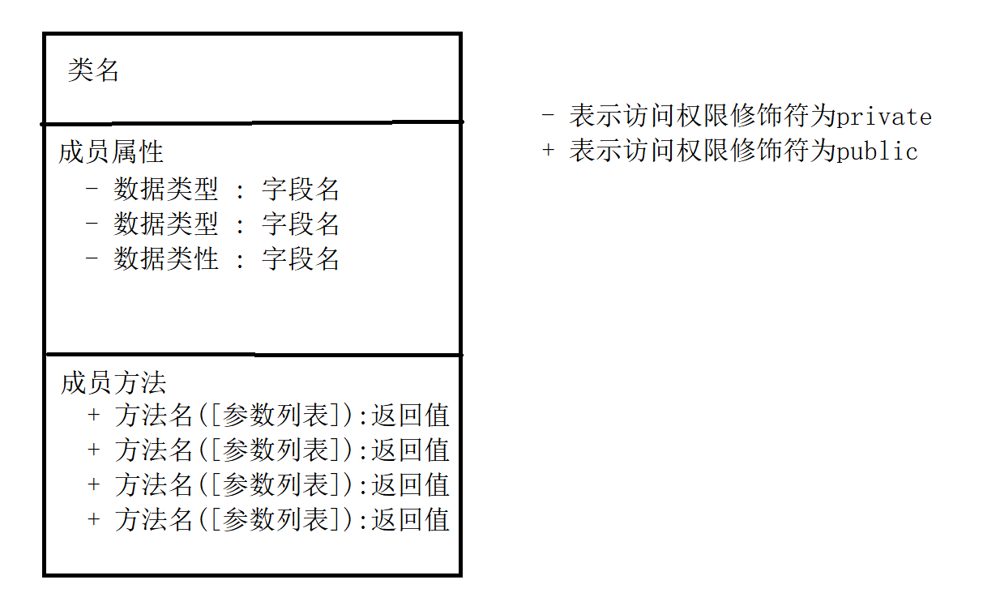


# 继承(泛化)

## 概念

**含义**

```java
将多个类之间存在的"共同点"(成员属性和成员方法)拿出来,定义在一个指定的类中,这个指定的类称为父类(超类,基类);存放"特性"的类称为子类,"父类和子类之间的关系"称为继承关系，或者泛化关系

有点像我们的提取公因子
```

**为什么学习继承**

```java
类和类之间 具备某些内在的联系,一般指的是有相同含义的属性或者(相似)功能
```

**好处**

```java
简化子类代码的编写-----父类中拥有的功能子类中都有,直接继承,省去编写
提高了代码的重用性(复用性)
```

**不足**

```java
提高了类和类之间的耦合度(类和类之间的关系加强了),这种耦合度的提升是在封装的可控范围之内的
```

**继承的格式**

```java
public [修饰符] class 类名 extends 父类{}

注意:
	编程,先写父类,再写子类 
```


## 案例

| 类       | Student | Worker   | Teacher | Person          |
| -------- | ------- | -------- | ------- | --------------- |
| 成员属性 | score   | workType | subject | id/name/age/sex |
| 成员方法 | 学习()  | 工作()   | 教学()  | 吃()            |

这当中,person是父类,其他是子类,集合的关系


## 关键字super

```java
super 关键字:
	1.代表父类对象,等价于:
	Person p = new Person(p_id,p_name,p_age)
	2.什么时候用:
		当子类想要调用父类的类成员
	3.顺序:
		当super和this关键字同时出现,一定是先写super
	4.定义的位置:
		定义在方法体中

实际的继承中是
	super(p_id,p_name,p_age)

括号里面的变量是成员属性, Person,是类
```


**super的三种用法**

注意:  super()关键字必须是**第一行书写.**

在子类构造方法中使用  super（参数列表）调用父类的的构造方法——有参或者无参

在子类中，使用super.属性名     调用的是父类的属性

在子类中,使用super.方法名,    调用的是父类的方法


**toString**

```java
如果想连同父类的信息一起打印,那么return的部分,需要自己写 ,调用父类的toString然后拼接子类的toString内容

在子类中定义toString方法,返回的是字符类型,也是一种构造器
```


```java
public String toString(){
	System.out.print(super.toString());
	System.out.print(getP_name();----定义好的

}
```

**注意**

```java
在测试类中直接调用toString方法
显示是子类定义好的,因为有就近原则
当子类没有定义,会向上找,如果找不到,----报错
所以在子类指定的方法中调用父类toString
当子类想要调用父子类同名方法,必须使用super关键字调用
    当子类调用父类独有方法,不需要用super,super主要用来区分是谁的(和this差不多)

	代码看上面的内容toString部分
```

继承的构造方法 是否能被重载,是否能被重写,是否能被子类调用父类构造器
(也就是构造器能这样子么)

```java
能重载
不能重写
通过super关键字进行子类调用父类构造器
	super()----表示调用父类无参构造器
    super(参数列表)----调用父类的有参构造器
```


## 继承总结

```java
java中继承的特点
	"只支持单继承" 
    
子类可以直接继承 public 和 protected 修饰的属性、方法。但是 protected 修饰的属性和方法被继承后不能在外界直接使用。必须在子类中使用。
    
- 间接继承：在同一个包下可以继承缺省的属性及方法

- 不能继承：父类被 private 私有的修饰的属性及方法不能继承。
    
    

java中子类一定能够继承什么,一定不能够继承什么,选择继承什么
	1.一定能继承的(可以调用父类的内容):
		父类中所有被public和protected修饰符修饰的类成员
	2.子类中一定不能继承(不可以调用父类的内容):
		父类中被private修饰的类成员
	3.子类选择继承的(当满足特定条件,才能调用):
		同包下,父类被缺省修饰的类成员
```


# 抽象

## 概念

**为什么使用抽象**（面向对象编程思想的特殊应用）

````java
当父子类具有共性的方法,需要定义在父类中,但是父类无法实现功能,必须要有子类实现,此时需要将父类定义的共性方法,去掉方法体,变为概念,称为抽象方法(抽象方法必须定义在抽象类中 )

没有方法体,能够节省内存空间

就是说,在父类中定义概念,但是具体功能在子类中实现,父类当做载体
````

**抽象类和抽象方法**

定义格式

```java
public abstract class 类名{
    public abstract 返回值类型 方法名([参数列表]); 
}
```

## 当父类是抽象方法的时候,子类怎么操作

```java
让当前的类变为抽象类：
    就是在把子类变为抽象类,因为父类是抽象的,子类继承之后,也是抽象的

添加未被实现的抽象方法：
	就是在子类中添加方法体，因为父类中是抽象的，没有方法体，在子类中添加一个方法，给抽象的父类一个方法体，赋予功能
```


**注意**

```java
当子类重写父类方法（已经实现）称之为重写
当子类定义父类抽象方法，称之为实现（ implements ）
    
实际开发中，如果没有特殊要求，不推荐使用抽象父类，这样会在此增加类和类之间的耦合度

```


# 接口

含义

```
为已知的类提供该类不具备的功能
```

**作用**

避免java中单继承的局限性


## 怎样使用接口

下面是一个整体，直到下一个大标题

```java
public abstract class Door{
    abstract void openDoor();
    abstract void closeDoor();
}
public abstract class Lock{
    abstract void openLock();
    abstract void closeLock();
}

//继承
public class FangDao extends Door,lock{
    void openDoor();
	void closeDoor();
	void openLock();
	void closeLock();
}

这个是个错误的方法

```

但是由于java中只支持单继承，上面例子中的写法**不能实现**，java提出了类似于“多继承”的操作------实现多接口

分析不同的门具有不同的开门效果，父类只需要定义概念，由子类实现，方法都是抽象的

需要用接口定义抽象方法，由具体的类实现

**接口的定义格式**

(单独划分一个包)

```java
public intereface 接口名{
    抽象方法;
} 
```

接口默认的定义的方法就是抽象方法
	所以可以省略abstract关键字

实际开发中,一般接口中的方法,都是用缺省作为访问权限修饰符 

```java
public interface Lock{
    void on();
    void off();
}
这个是接口
```

**通过接口实现多继承**

```java
这个是上面代码中定义的锁子和门的接口,然后在这个类里面
implements是关键字
public class 类名 implements Door,Lock{
    (实现方法)
}
```


## 类成员中那些成员可以定义在接口中

```java
成员常量----可以定义
public static final int MAX = 100;
```

**不可以定义的**

```java
成员变量----不能定义
private String name;

成员方法-----不能定义get/set方法
    
    
构造器----不能定义,接口不能实例化对象
public MyInterface(){
    
}
```

**抽象类和接口都可以定义抽象方法,什么时候用谁**

```
当需要继承属性的时候,使用抽象类;
其余一律使用接口;
实际开发中,接口常被应用在应用开发当中,定义统一的操作规则,由具体的程序员实现功能

补充：
	一般我们开发中只使用接口。极少使用抽象类。若只是单继承就能实现时。我们可以使用抽象类。但并不推荐。因为不利于扩展和维护。更多的是我们在使用模板设计模式和适配器模式共同使用时。才会使用抽象类。（当一个类实现了一个接口后，并不能实现所有的方法。剩下一部分需要其他人或时间才能完成。我们才定义成抽象类）。
```

**当继承和实现接口同时出现**

```java
"一定先是继承在实现接口"
```


## 普通类和接口,抽象类比较

|       比较项       |         抽象类          |          普通类          |            接口            |
| :----------------: | :---------------------: | :----------------------: | :------------------------: |
|     定义关键字     |     abstract  class     |          class           |         interface          |
| 继承或实现的关键字 |         extends         |         extends          |         implements         |
|      成员字段      |        常量;变量        |      变量;成员常量       |           常量;            |
|       构造器       | 只能定义,不能实例化对象 | 既可以定义也能实例化对象 | 既不能定义也不能实例化对象 |
|      成员方法      |    普通方法静态;抽象    |      普通方法;静态       |   抽象方法(abstract省略)   |

无论是抽象类还是接口,本质上依然是java的类,只不过是类的特殊定义格式


# 多态（重点）

## 概念

**含义**

同一类对象，指向不同的引用

**使用前提**

类和类之间必须是继承关系

有方法的重写,

存在引用数据类型的转换

**详解**

同一类对象

```java
是否是同一个父类,或者  父接口, 的对象
```

指向不同的引用

```java
通过new关键字指向不同的堆内存地址
```

**通俗的讲**

```java
如果一个父类进行实例化对象的时候,new关键字指向自己的时候,就是实例化自己本身的时候,叫做指向本类的堆内存地址,如果实例化对象指向的是继承父类的子类,表示多态的应用
```

**写法**

```java
Person p1 = new Student();---多态的应用
		  = new Person();----指向本类的内存地址

person是父类,Student是他的子类
```


## 多态的好处

简化业务类代码

提高代码的重用性


## 回调函数

利用多态进行回调函数，就是上面多态的应用那里,用父类调用子类,对父类进行重写的方法.这个方法叫回调函数.,就是在定义的时候是父类的方法,,但是实例化对象的时候,用了子类,然后最后执行的时候也是执行子类,但是却是父类调用子类对父类重写的方法


### 如何判断对象是那个类的对象,指向那个类的引用?

回调函数,说到底还是使用的是父类的对象,不过父类调用了子类的过程,

如果,在子类中定义了一个方法,定义在子类中,说明是子类特有的方法,在回调函数中,父类对象不能直接调用,

因为回调函数,是父类调用子类的过程,本质还是父类,  而 用实例化的对象名.方法名调用子类的方法的操作是不可以实现的

```java
利用回调函数实例化对象后:对象是那个类的对象,看的是对象前面写的是什么.
Person dalang = new Student();
父类   对象名     new关键字  子类
    
对象指向那个类的引用:看的是new 后面的构造器(构造方法)
```


## 引用数据类型的转换

### 分类

**向上塑型**(小—–>大)

```java
将子类的构造器赋值给父类的对象.(应用数据类型自传)
父类 对象名 = new 子类([参数列表])
```

- 创建出来的对象属于谁的？（能用谁的成员属性，能用谁的成员方法）

- 既不是父类，也不是子类。

	- 声明时  Animal a 开辟的是父类的空间。
	- 运行时  new Dog()  占用的是子类的空间。

**向上转型得到的这个对象的特点**

```java
- 当子类重写父类方法时。该类运行得到的结果是子类重写后的方法。
- 但是调用属性时。使用的是父类的属性
```


就是属性用的是父类的

用方法:

- 若子类重写了父类的这个方法。那么运行的就是子类重写后的方法。
- 若子类没有重写父类的方法。那么运行的就是父类特有的方法。
- 不能运行子类特有的方法。

| wsdf    | afa    | 杀我       |
| ------- | ------ | ---------- |
| asfa    | af     | 咋地噶     |
| asdfasf | asfdas | afaa       |
| afaf    | asfasf | 东西发工资 |


**向下塑型**(大—->小)

```java
将父类对象赋值给子类对象(引用数据类型强转)
子类 对象名 = (子类)父类对象名;
Student s = (Student)dalang;
s.study();
study:是定义在子类的特殊方法
```

**什么时候强转**

当创建的是父类对象,想要调用子类特有方法,需要使用强转

向下转型必须建立在    向上转型  的前提下

## instanceOf运算符

### 概念

**含义**

判断指定的对象是否是   指定类   或者  其子类对象,结果一定是布尔类型

**格式**

```
对象 instanceof 类
```


## 匿名

### 概念

**含义**

定义格式的时候,将名字的部分影藏起来,提高代码的安全性,实际开发中没有特殊要求不建议使用匿名,不利于后期的维护

应用:

**匿名对象**

```
匿名对象:
	Student s = (Student)dalang;
	s.study();

第二种匿名对象
	admin.show(new Student(2,"尽量","爱生发给"))

一种是对象的申明的匿名，第二种是主要的匿名方式

匿名对象的好处，节省栈内存空间
```


### 匿名对象补充

只使用一次的对象。一般我们会做成匿名对象

**普通对象**

```java
Dog dog  =  new Dog();
```

便于获取但是会造成内存空间的浪费,一致都在堆内存中存在.只有达到要求才会被垃圾回收机制所回收

**匿名对象**

```java
new Dog();
```

节省内存空间,不需要再栈内存空间中在存储一个引用

但是不便于获取


**匿名内部类**

```
使用的前提:当抽象类 和 接口  "有且仅有一个抽象方法",且方法在程序运行中,使用频率不高,推荐使用匿名内部类 

```

**匿名内部类的定义格式**

```
抽象类/接口 对象名 = new 抽象类/接口(){
    实现 抽象.接口中的抽象方法
};
(注意,有个分号)

```


### 案例

```java
创建一个接口----MyInterface(类)
创建一个实现接口的类 -----MyInterfaceImpl();
创建一个匿名类----NiMingClass-----这里面进行主方法的构造

主函数里面的语句如下

MyInterface my = new MyInterfaceImpl();
my.fun();
//匿名内部类
MyInterface my1 = new MyInterface(){
    //这个函数就是接口中实现的fun()函数实现了,给他实现到了new之后的大括号中,等于和实现接口中的fun()功能一致.   
    public void fun(){
        
    }
};
my1.fun();
这次执行调用就是调用的的匿名内部类里面的fun();

注意:
//MyInterface my = new MyInterfaceImpl();
//应用的是面向对象编程思想的多态性质
//编程方式,叫做  面向接口编程,,增强代码的可扩展性
//fun()是在MyInterfaceImpl()里面的一个方法
接口不允许实例化对象,只有实现类里面可以实例化对象


```


## 枚举

### 概念

**含义**

在给定值的范围内,在某一个时刻,只能获取其中唯一 一个值,称之为枚举

**特点**

值:一定是定义好的,值固定不变-----常量
显示:在某一个时刻,只能显示一个

### 枚举类

是java中类的一种特殊的定义格式
格式:JDK5开

枚举是有构造方法的。但是构造方法为私有，所以不能去创建对象

```java
public enum 类名{}
```

JDK1.5**以前版本的代码演示**

```java
交通信号灯
public class LED{
    public static final  String RED = "red";
    public static final String YELLOW = "yellow";
    public static final String GREEN = "green";
}
```


```java
public class LEDUse{
    private String led;
    public void setled(){
        led = LED.GREEN;
    }
    public void show(){
        setLed();
        System.out.print("led = "+led); 
    }
}
```


```java
public class LEDTest{
    public static void main(String[] args){
        LEDUse lu = new LEDUse();
        lu.show();
    }
}
```


上面三个代码,分别是设置常量,然后调用常常量,最后打印常量的三个代码.
但是会有bug,设置常量之后,,,可以在调用常量的哪里进行常量的更改,,就是在LEDUse中,设置的setled方法中可以重新对led进行赋值


就像是
led  =  “red”;

然后值就会被覆盖,从而获取的常量失败

**bug的修改———使用单利设计模式设置led的类**

```java
常量的修改:

交通信号灯
public class LED{
    private String color;
    //私有化构造器
    private LED(String color){
        this.color = color;
    }
        
    //现在，前面的大写字母是对象，实例化了对象，所以现在拿到颜色，是要拿到对象
    public static final LED  RED = new LED("red");
    public static final LED YELLOW = new LED("yellow");
    public static final LED GREEN = new LED("green");
    
    public String toString(){
        return color；
    }
}

```


修改后的LEDTest

```java
public class LEDTest{
    public static void main(String[] args){
       System.out.println(LED.RED.toString());
    }
}
```


**真正的枚举类**

```java
public enum 类名{
    可以直接定义常量
	常量名:
    	对象,常量值
	SHU,NIU,MA,TU,LONG,YANG;---------示例
}
```


```java
public class Test{
    //这个拿出来是个对象
    private static PetEnum pe = PetEnum.LONG;
    public static void main(String[] args){
    	//public String name()----获取当前枚举类对象名
        //public int ordinal()----获取当前枚举对象所在的位置,从0开始计数 
        //public 枚举类[] values()------通过指定枚举类对象获取该类中所有的属性值
        String name = pe.name();
        int index = pe.ordinal();
        PetEnum[] pes = pe.values();
        System.out.print("name:"+name);
        System.out.print("ordinal"+index);
        System.out.print("pes"+Arrays.toString(pes));
	}
}
```


# 核心类库

就是由java定义好的类

## 类的定义格式,关键字总结


| 定义类的关键字 |  含义   |
| :------------: | :-----: |
|     class      | 普通类  |
| abstract class | 抽象类  |
|   intereface   |  接口   |
|      enum      | 枚举 类 |


| 继承类或实现类的关键字 | 含义                                             |
| ---------------------- | ------------------------------------------------ |
| extends                | 继承类(只支持单继承)                             |
| implements             | 实现接口(接口可以多实现,多个接口之间使用“,”分割) |


## 常用包以及常用类

### 包

#### java.lang

是java语言中唯一  一个不用导入的包

**常用**

```java
System类,String(StringBuffer,StringBuilder) Math类  包装类
```

#### java.util

是java的工具包

**常用类**

```java
Scanner类  Random类   Arrays类  UUID类, Date类  Calendar类   BigDecimal类   集合类````
```

#### java.io

是进行过数据传输的包,javaIO流包

**常用类**

```java
IO流类  File类
```

### 常用类

#### System类

作用：Java为了适应不同的操作系统 (Windows Linux Mac) 创建

**简介**

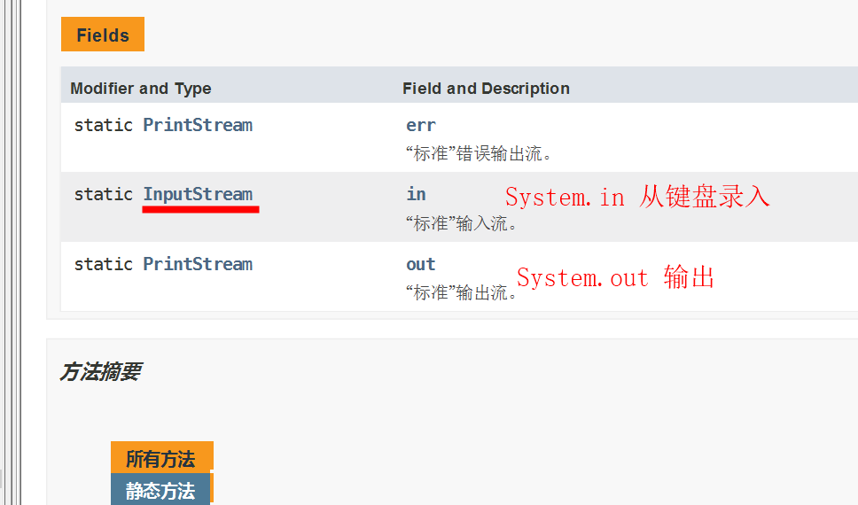

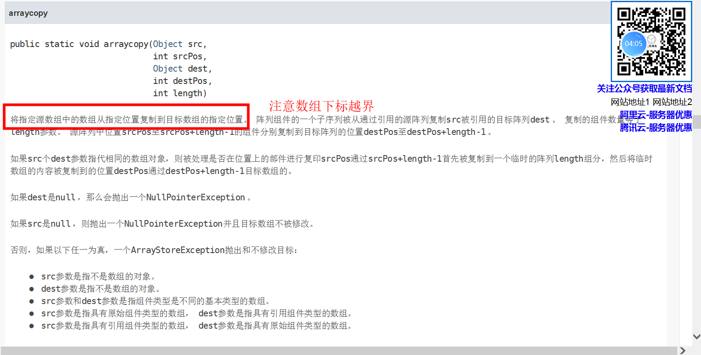


#### Math类

作用：所有的低等数学操作的类

**常用：**

Math.PI ——π


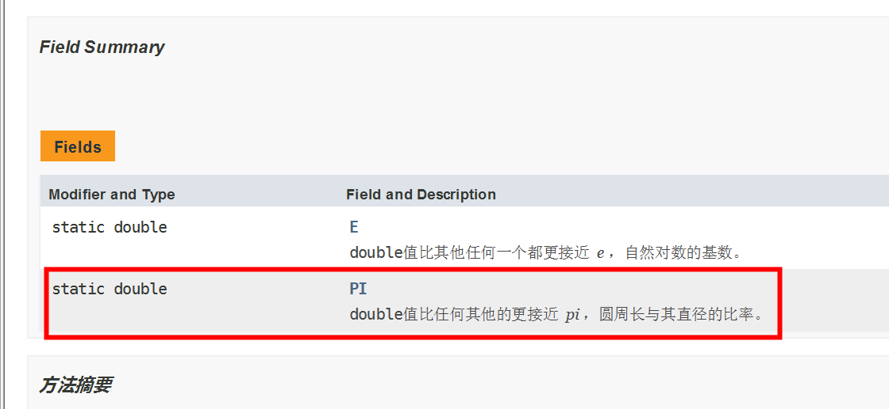

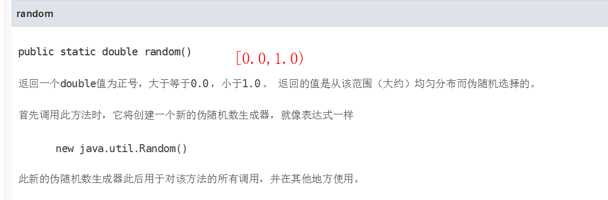

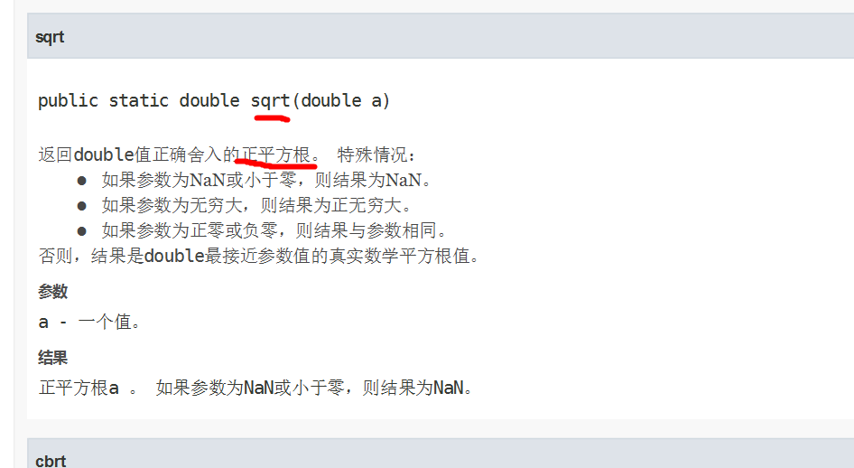


#### 包装类

**出现的原因**

由于Java完全面向对象的 ,      常用类     通过   对象.调用()

对于出现的原因的**补充**：

​		Java 是面向对象编程，所以我们会将所有的事物都堪称对象。通过对象调用具体的属性方法来运行程序。但是基本数据类型无法变为对象。那么也就是无法调用一些方法来做简便操作。也无法实现与引用类型的转换。**包装类就是对基本数据类型的封装，将其封装为一个对象。以便我们后续使用。**


**基本数据类型** 无法生成对象 , 因此Java提出一系列的基本数据类型的包装类,通过包装类进行实例化对象 , 调用方法 , 方便操作

**实质**

依然是对基本数据类型操作 , 依然符合基本数据类型的取值范围

**基本数据类型对应的包装类** ————**背会**

| 基本数据类型 | 包装类    |
| ------------ | --------- |
| byte         | Byte      |
| short        | Short     |
| int          | Integer   |
| long         | Long      |
| float        | Float     |
| double       | Double    |
| char         | Character |
| boolean      | Boolean   |


##### Integer特殊复制代码展示：

```java
package cn.fighting.domain;

public class Packages {
    public static void main(String[] args) {
        Integer a = -129;
        Integer b = -129;
        
        Integer c = -128;
        Integer d = -128;
        
        Integer e = 127;
        Integer f = 127;
        
        Integer g = 128;
        Integer h = 128;
        System.out.println("a == b? " + (a == b));
        System.out.println("c == d? " + (c == d));
        System.out.println("e == f? " + (e == f));
        System.out.println("h == g? " + (h == g));
    }
}

```

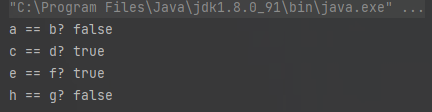


上述代码 **分析** 

相邻两个对象 值 都一致 , 为什么显示结果 有 true 有 false , Java 的 byte取值范围 [-128,127],使用 Integer 完成赋值 == 比较值 是一致 , 当超出这个范围 , 会使用 new Integer(int value) 构造器完成赋值 ,  存储在堆内存中 , 需要使用 equals 比较

就是自己简单理解一下,字节的范围是-128到127的区间中，在范围中的数值用 == 进行比较，不在范围中的，会先new一个空间（这个空间在堆中）然后通过equals进行比较，因为new过得对象是地址改变了，数值在堆里面，找值通过地址寻找，所以会出现false的情况

下面是一个改变的情况

```java
package cn.fighting.domain;

public class Packages {
    public static void main(String[] args) {
        Integer a = -129;
        Integer b = -129;
        Integer c = -128;
        Integer d = -128;
        Integer e = 127;
        Integer f = 127;
        Integer g = 128;
        Integer h = 128;
        System.out.println("a == b? " + (a == b));
        System.out.println("c == d? " + (c == d));
        System.out.println("e == f? " + (e == f));
        System.out.println("h == g? " + (h == g));
        System.out.println("h == g? " + h.equals(g));
    }
}
```

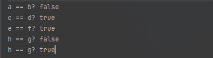


##### “包装类”    和    “基本数据类型” 和 “ String类”相互转换

因为包装类比较多，所以这里就用一个int类型进行举例子

Integer  <——>  int <———>String

###### **基本数据类型  ——>包装类**

有三种方法：

**第一种：**

可以使用包装类  的构造器完成———–但是在JDK9版本,这个方法过时,不推荐使用

```java
public Integer (int value)

默认值是null
```

```java
这个是第一个情况:
package cn.fighting.domain;

public class Package1 {
    public static void main(String[] args) {
        int sum = 12;
        Integer a = new Integer(sum);
    }
}

```


**第二种:**

自动装箱  ,JDK5开始使用

```java
package cn.fighting.domain;

public class Package1 {
    public static void main(String[] args) {
        Integer a = 12;
    }
}
```


**第三种:**

由 Integer  类提供的方法

```java
public static Integer valueOf(int value)
```


```java
package cn.fighting.domain;

public class Package1 {
    public static void main(String[] args) {
        int sum = 12;
        Integer a = Integer.valueOf(sum);
        System.out.println(sum + 6);

        //最后的结果   18
    }
}

```


###### 包装类—–>基本数据类型

**第一种**

自动拆箱   JDk5版本开始

```java
package cn.fighting.domain;

public class Package1 {
    public static void main(String[] args) {

        Integer a = Integer.valueOf(12);
        int b = a;
        System.out.println(b);
    }
}
```


**第二种**

由 Integer 提供的

```java
public int intValue()
```


```java
package cn.fighting.domain;

public class Package1 {
    public static void main(String[] args) {

        Integer a = Integer.valueOf(12);
        int b = a;
        //第二种
        int c = a.intValue();
        System.out.println(b +c);
    }
}
结果是24
```


###### 包装类    到   String    

两个方式

**方式一**

创建 String 类型的变量

```java
package cn.fighting.domain;

public class Package1 {
    public static void main(String[] args) {
        String str = "";
        Integer a = Integer.valueOf(12);
        String newStr = str + a;
        System.out.println(newStr);

    }
}
结果就是个字符串,前面有个空字符串,加上后面通过自动拆箱方式进行字符和数字的拼接
```


**方式二**

通过包装类对象调用方法  完成转换

```java
public String toString()
将任意的数据类型转换为String类型最简单的方式
```


```java
package cn.fighting.domain;

public class Package1 {
    public static void main(String[] args) {
        String str = "";
        Integer a = Integer.valueOf(12);
        String b = a.toString();
        System.out.println(b + 25);
    }
}
1225
```


###### String ——>包装类

有两个方式

**方式一**

通过包装类的  构造器完成

```java
public Integer (String str)
```

**注意**

````java
当使用String  转换数字的时候,,String值也必须是数值
无法将String  类型转换成 char  /  Character
String 转换成   boolean / Boolean
    当 String 的值  不是  true 或者 false 的时候,转换的结果一定是 false,这个时候的 false 不是 Boolean 类型本身的 false 而是 表示转换结果错误
    如果 String 值 是 true 或者 false 的时候,转换的结果才是布尔类型
````

**代码**

展示方式一

```java
package cn.fighting.domain;

public class Package1 {
    public static void main(String[] args) {
        String str = "-500";
        Integer a = new Integer(str);
        System.out.println(a + 6);
    }
}
-496
```

展示布尔

```java
public class Package1 {
    public static void main(String[] args) {
        String str = "-500";
        Boolean c = new Boolean(str);
        System.out.println(c);
    }
}
false
```


**方式二**

由包装类提供的

```java
public static Integer valueOf(String s)
```

```java
public class Package1 {
    public static void main(String[] args) {
        
        String str = "-500";
        Integer c = Integer.parseInt(str);
        System.out.println(c + 10);

    }
}
-490
```


###### 基本数据类型  ——>String

方式一

创建  String  通过  + 的方式进行实现，就可以理解为拼接字符串

```java
package cn.fighting.domain;

public class Package1 {
    public static void main(String[] args) {
        int a = 20;
        String str = "";
        System.out.println(a + str);
    }
}
20
```


方式二

```java
public static String valueOf(int num)
```


```java
public static void main(String[] args){
    int num = -50;
    String str = String.valueOf(num);
    System.out.println(str + "50");
}
```


###### String——>基本数据类型

只有一种方式就是

方法由包装类提供的

```java
public static int parseInt(String s)
```


```java
package cn.fighting.domain;

public class Package1 {
    public static void main(String[] args) {
        String sum = "99";
        int a = Integer.parseInt(sum);
        System.out.println(a);
    }
}
99
```


**图例:转换方法操作**(重点)

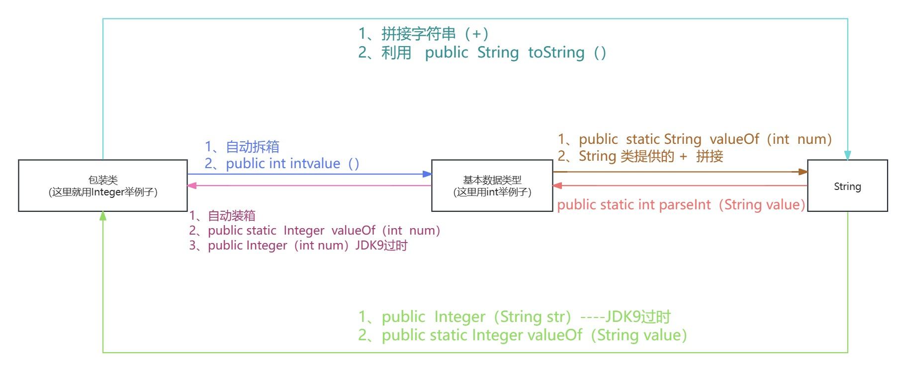


#### Object类

**简介**

江湖地位

1.是java语言中唯一 一个没有父类的类

2.是java中所有类的父亲

**直接父亲**: 类结构显示中 紧挨着当前类的上一层

**间接父亲**: 类结构中除了第一层以外的类都是间接父类

​			补充：**若父类还存在父类。那么就是间接父类。继承链是可以存在多层的。**

3.在java中可以用来表示所有引用数据类型


##### toString

这个类是Object类中的方法，如果没有重写这个Object类里面的 toString，那么将会打印的是对象的地址

```java
public String toString()-------返回对象的字符串表示形式
```


```java
Student stu = new Student();
System.out.print(stu);

没重写 toString 方法----打印的就是地址
```


如果需要打印对象的值,那么就需要重写Object类中的 toString方法,方法体中返回的是什么,打印的就是什么,

代码部分有些在继承中可以看看   和生成那个构造器中的部分一样,代码就不赘述了


##### equals

```java
public boolean equals(Object obj) ，指示其他某个对象是否和这个对象“相等”、
    
```

**注意**

- 只能用作引用数据类型进行对比（基本数据类型不能使用）。

- 若是 Object 类中的 equals 方法，那么底层本质上是对比对象的地址。（比较的是堆内存中的地址）

- 我们所有的类都继承了 Object。我们可以重写 Object 类中的 equals() 方法。那么则可以按照我们自定义的比较规则来比较（比较对象内的值是否相等）。

重写equals 的方法在后面的面试题中：

从后面面试题中可以得到一个结论：

```java
- - 若想比较地址。那么我们直接调用 equals() 方法即可。若想比较对象内的值是否一致，那么就需要我们自己去重写 equals() 方法。（可以自动生成）。

- 
```


###### hashCode简介

```java
public int hashCode()
    
返回对象的哈希码
```

一般会根据一个对象的地址通过某种算法得到了一组数字。

**java中提出：**

可在生成 equals() 方法前。建议你同时生成 HashCode。这样会提高对比效率。

相同对象的 HashCode 大部分都相同。Java 中真正的对比是先去对比 HashCode 是否一致。若不一致则一定不是一个对象。那么就没有必要在去对比 equals() 了。只有 HashCode 相同的情况下。才有可能是一个对象。在进行重写的 equals() 中值的对比。这样会提高效率。

HashCode 本质上他是按照某种算法得到要给结果后。按照大致进行对比。例如：我们要在我们班级找一个叫 Xxx 的女生。那么 HashCode 就类似于先将男女分组。若性别不等于女，则一定不是我们需要找到人。只有性别为女了。才去找 Xxx 这名女生


java提出可以自动生成 equals 方法 但是必须同时生成hashcode 方法


#### 随机类

##### Random类

**含义**

专门生成随机数字的工具类

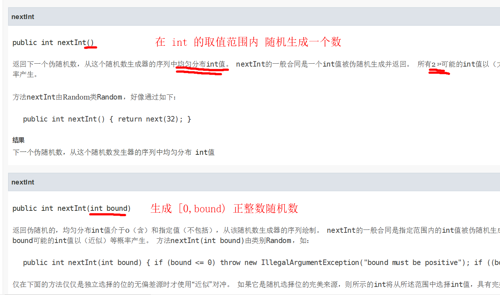


##### UUID类

含义

根据当前计算机的IP,编号等随机组成
```java
public static UUID randomUUID()
```

UUID是有五段16进制的数组组成的   中间是 短横线  - 分割

后续是需要配合String 类,完成指定数据的获取

```java
package cn.fighting.domain;

import java.util.UUID;

public class UUIDs {
    public static void main(String[] args) {
        UUID a = UUID.randomUUID();
        System.out.println(a.toString());
    }
}
UUID a = UUID.randomUUID()-----randomUUID是个里面的方法,可以类名加点调用
```


#### BigDecimal类（会用）

**作用**

用来进行金融项目中数据的精确计算(精度更高,比double的精度更高)

是浮点的一个引用类型

```java
public BigDecimal(String val)
```

```java
package cn.fighting.domain;

import java.math.BigDecimal;

public class BigDecimalMain {
    public static void main(String[] args) {
        BigDecimal a = new BigDecimal("60");
        BigDecimal b = new BigDecimal("3");
        System.out.println(a.add(b));
    }
}
63
```


构造方法中是一个String类型的时候,必须保证这个String的 内容是纯数字才可以,否则将会抛出数字格式化异常

对 BigDecimal 类型的 + - * / 运算。必须通过指定方法才可以是实现。不能使用算数运算符。


**算术运算的制定方法:**

```java
package cn.fighting.domain;

import java.math.BigDecimal;
import java.math.RoundingMode;

public class BigDecimalMain {
    public static void main(String[] args) {
        BigDecimal a = new BigDecimal("60");
        BigDecimal b = new BigDecimal("3");
        System.out.println("+"+a.add(b));
        System.out.println("-" + a.subtract(b));
        System.out.println("*" + a.multiply(b));
        System.out.println("/" + a.divide(b, 2, RoundingMode.HALF_DOWN));
    }
}
+63
-57
*180
/20.00
    
其中 除法 比较特殊,首先调用方法,传递参数,然后是保留几位小数,后面的是是否取整(怎么取整,向上,向下)
```


#### 日期类

是     java.util.Date  类

**作用**
纯 java后台操作日期的类

**简介**

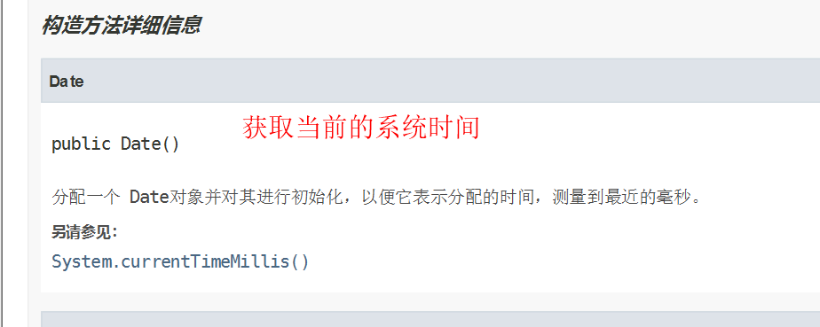


```java
package cn.fighting.domain;

import java.util.Date;

public class Time {
    public static void main(String[] args) {
        Date time = new Date();
        System.out.println(time);
    }
}
Fri Mar 22 15:57:36 CST 2024
```


##### SimpleDateFormat类

简化日期格式,就是日期的格式化,按照年月日的格式显示

**Java中常用的显示日期单位的符号**

| 日期单位符号 (严格区分大小写) | 含义                       |
| ----------------------------- | -------------------------- |
| yyyy                          | 4位的年                    |
| MM                            | 2位月                      |
| dd                            | 2位的天数                  |
| DDD                           | 当年的第几天 (一年有365天) |
| HH                            | 24进制的小时[0,23]         |
| hh                            | 12进制的小时               |
| mm                            | 分钟                       |
| ss                            | 秒钟                       |
| SS                            | 毫秒(以 1000)              |
| aa或者(a)单个a                | 上下午                     |
| EE(E)                         | 周几                       |


```java
package cn.fighting.domain;

import java.text.SimpleDateFormat;
import java.util.Date;

public class Time {
    public static void main(String[] args) {
        Date time = new Date();
        System.out.println(time);
        SimpleDateFormat time2 = new SimpleDateFormat("yyyy-MM-dd HH:mm:ss,SS");
        String time3 = time2.format(time);
        System.out.println(time3);
    }
}
```


```java
public SimpleDateFormat(String pattern) ------实例化对象，并且根据指定的符号设置显示格式

public final String format(Date time)---------通过 SimpleDateFormat 对象调用的，将指定的date对象按指定的格式以 String 显示
```


##### Calendar类

**作用**

计算机操作的时间 使用的是毫秒进行计算的，不利于程序员的操作，提出了Calendar类专门编写操作，将指定的毫秒转换成时间

**注意**

对时间只能进行 +  -  运算

calendar类显示的毫秒从1970 1.1 00:00:00（格林尼治时间）

Java 中的日期是从 1970.1.1 00:00:00 开始的。 英国 格林尼治 小镇的时间为标准日期时间。那么我们中国是东八区。所以我们使用时间是需要 +8:00 的。

**简介**

```java
public static Calendar getInstance()
    使用默认时区和区域设置获取时间,Calendar返回的是基于默认时区的当前时间,默认是FORMAT区域设置
    获得一个日历
```

```java
package cn.fighting.domain;
import java.util.Calendar;

public class Time {
    public static void main(String[] args) {
        Calendar a = Calendar.getInstance();
        System.out.println(a);
    }
}

```


**Calendar 应用**

```java
public int get(int field)
    
根据Calendar类定义好的指定的时间字段获取字段值
```

**注意**

月份是从0开始的,所以在获取月份的时候要加1

周日是一周的开始

**代码**


```java
package cn.fighting.domain;

import java.util.Calendar;

public class Time {
    public static void main(String[] args) {
        Calendar a = Calendar.getInstance();
        System.out.println(a);
        System.out.println("year" + a.get(Calendar.YEAR));
        System.out.println("month " + (a.get(Calendar.MONTH) + 1));
    }
}
上面是简单的案例
```


**Calendar 应用2**

转换:Calendar —–>Date

```java
package cn.fighting.domain;

import java.text.SimpleDateFormat;
import java.util.Calendar;
import java.util.Date;

public class Time {
    public static void main(String[] args) {
        //用Calendar进行转换成date的
        Calendar a = Calendar.getInstance();
        System.out.println(a);
        Date b = a.getTime();
        System.out.println(b);
        //直接用simpleDateFormat进行输出
        SimpleDateFormat c = new SimpleDateFormat("yyyy-MM-dd");
        String d = c.format(b);
        System.out.println(d);
    }
}
自己解释一下,转换的原理是用Calendar获取时间,创建了一个对象,然后定义了一个date的对象,通过Calendar的对象调用getTime方法,获得的时间给了date创建的对象,所以
    Date b = a.getTime();
这里就已经是date的时间

    
而后面用simpleDateFormat创建了对象的输出格式,然后调用format的方法,这个方法中传递的形参就是date的数据.
    
```


**转换:Date———–>Calendar**

```java
Date mydate = new Date();
Calendar c1 = Calendar.getInstance();
c1.setTime(mydate);
```


**Calendar 应用3**

设置

```java
package cn.fighting.domain;

import java.util.Calendar;

public class Calenders {
    public static void main(String[] args) {
        Calendar a = Calendar.getInstance();
        a.set(2024,11,31,23,59,59);
        System.out.println(a.getTime());
        a.add(Calendar.SECOND,1);
        System.out.println(a.getTime());
    }
}

```


### String类

**作用:**

存储连续多个字符的容器,值 必须定义在 “”(双引号中),且默认值为null

String是不可变字符串(生成字符串的值不可变)———a    b     ab    看似两个字符串的拼接,但实际上是创立了第三个字符去存储这个新的字符


#### 赋值方式

直接赋值:        String 变量名 = “值”;

构造器赋值:    String 变量名 = new String(“值”);

**注意**

在栈内存中,可以用 == 进行比较,这个时候的String是直接赋值

堆内存中,必须用equals 进行比较,这个是时候的String是构造器赋值,就是new了一下,存到了堆里面.

匿名赋值方式推荐使用equals 进行比较

**匿名赋值**

```java
String a = new String("abc");
```


#### String类在API的定义

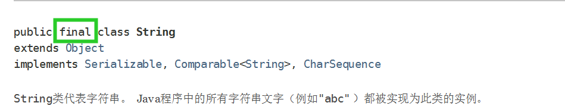


**解释**

final修饰类:      

String类不能被继承 , 后续出现的 StringBuffer和StringBuilder 类 与String没有继承关系,是在String 的基础上 拓展功能类

且String类是final修饰的,且修饰后的值不会改变


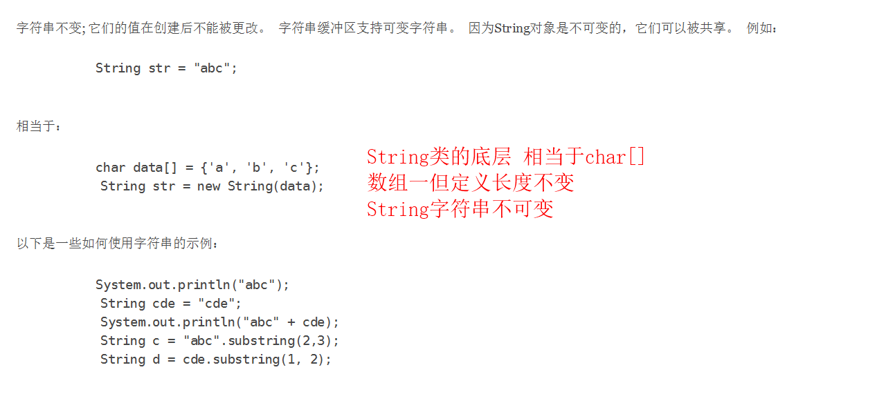

这也是String 不能转换char Character 原因char[]———数组长度一经定义无法改变.    而且String 底层本质上就是char[] 数组,所以String不可以直接转为char[]数组


#### String类常用的方法

##### 转换

##### **String <—->byte[]**

将指定的String转换成 byte[] ——-String 提供

这个是将指定的字符串转换成byte【】

```java
public byte[] getBytes()
```

这个是将byte【】转换成字符串（String）

```java
public String(byte[],int beginIndex,int length)
开始位置,一共转化多长
```


```java
package cn.fighting.domain;

import java.util.Arrays;

public class Calenders {
    public static void main(String[] args) {
        String a = "明天是好节日";
        //String变byte[]
        byte[] bbuf = a.getBytes();
        System.out.println(Arrays.toString(bbuf));
        System.out.println(bbuf.length);
        //byte[]变String
        String b = new String(bbuf,0,bbuf.length-12);
        System.out.println(b);
    }

}
一个汉字是三个字符
    一个字节是八位
在IDEA中已经设置了编码格式-----utf-8
    
    
在utf-8中,一个字符是三个字节
    相邻的两个byte组成一个汉字,其他都占一个字符
    
在gbk中,一个字符是两个字节
    统一的,一个字节是八位(bit)
```


**解释**

```java
String b = new String(bbuf,0,bbuf.length-12);
System.out.println(b);

长度不够转换的时候,会用一个特殊字符进行填充
```


##### String 和 char[]（常用）

将指定的String 转换成 char[]  ———   String提供

````java
public char[] toCharArray()
````

**有个代码展示**

```java

package cn.wolfcode.domain;

import java.util.Arrays;

public class Person {
    public static void main(String[] args) {
        String a = "今天是哥好事";
        char[] b = a.toCharArray();
        System.out.println(Arrays.toString(b));
    }
}
[今, 天, 是, 哥, 好, 事]
```


将指定的字符数组转换成 String

```java
public String (char[] cbuf , int beginIndex, int length)
    后面是开始下标和结束下标
```


````java
package cn.wolfcode.domain;

public class Person {
    public static void main(String[] args) {
        String a = "今天是哥好事";
        char[] b = a.toCharArray();
        String c = new String(b,2,4);
        System.out.println(c);
    }
}
是哥好事
    
    
````


解释一下：

就是用这个String的方法的时候，要给他传入字符的数组，就是先进行String到char数组，然后将这个数组放到String的方法中，第一个参数是数组，第二个是起始的索引，然后是进行多长的转换


**大小写转换**

```java
package cn.wolfcode.domain;

import java.util.Locale;

public class Person {
    public static void main(String[] args) {
        String a = "i lova you";
        System.out.println(a.toUpperCase(Locale.ROOT));
    }
}
I LOVA YOU

只有对英文有效，
toLowerCase()是转换成小写
```


没有增删操作

##### 有改的操作：

###### 修改指定的字符


使用新的字符，替换掉原有的字符，将替换后的String 返回（原有的字符存在的时候才会替换）

```java
public String replace (char old,char newChar)
    
```


结果是：当原有的字符存在的时候，用新的字符替换然后 返回

​			如果没有，直接返回原有的所有的字符


```java
package cn.wolfcode.domain;

import java.util.Locale;

public class Person {
    public static void main(String[] args) {
        String a = "i lova you";
        System.out.println(a.toUpperCase(Locale.ROOT));
        System.out.println(a.replace("z", "a"));
        System.out.println(a.replace("o", "hhhhhh"));
    }
}

I LOVA YOU
i lova you
i lhhhhhhva yhhhhhhu

```


###### 去除指定字符串首尾空格


```java
public String trim()
```


```java
package cn.wolfcode.domain;


public class Person {
    public static void main(String[] args) {
        String a = "          i lova yo     u      ";
        System.out.println(a);
        System.out.println(a.trim());

    }
}

          i lova yo     u      
i lova yo     u

```


**附加**

判断字符串是不是为空串,如果是空, 返回true

```java
public boolean isEmpty()
```


##### 查

###### 获取指定位置上的元素


```java
public char charAt(int index)
```


```java
package cn.wolfcode.domain;


public class Person {
    public static void main(String[] args) {
        String a = "nizhendeshihgeshabi";
        System.out.println(a.charAt(0));

    }
}
n
    这个是索引的位置,就是和数组的下标做对比,(相似的)
```

###### 获取指定元素在String中第一次或者最后一次出现的位置

第一次出现的位置

获取指定字符第一次出现的位置  如果不存在返回  -1

int a 表示–——用户即可以传递char 类型的数据，也可以传递char 对应的ASCII值

```java
获取指定字符第一次出现的位置：
public int indexOf(int a)

public int indexOf(String son)

获取指定的字符第一次出现的位置,从指定的位置之后，（就是向后找）第一次出现的位置
public int indexOf(int a,int beginIndex)

public int indexOf(String son, int beginindex)

```


首先是进行第一次出现的位置：

这个是从哪个位置开始后，再开始的位置也会进行比较,来查看是不是也出现过的

```java
package cn.wolfcode.domain;


public class Person {
    public static void main(String[] args) {
        String a = "nizhendeshihgeshabi";
        System.out.println(a.indexOf("a"));
        System.out.println(a.indexOf(97));
        System.out.println(a.indexOf("bbb"));

    }
}
16
16
-1

```


然后是从指定的位置之后获取字符串

```java
        System.out.println(a.indexOf("n", 0));
        System.out.println(a.indexOf("n", 4));

0
5

```


###### 最后一次出现的位置


获取指定字符在String中最后一次出现的位置，如果不存在就返回-1

```java
 最后一次出现的位置
public int lastindexOf(int a)

public int lastIndexOf(String son)
     
从指定的位置开始计算这个位置之前（就是向前找）最后一次出现的位置，如果不存在就返回-1

public int lastIndexOf(int a,int beginIndex)

public int lastIndexOf(String son , int beginIndex)

```


```java
package cn.wolfcode.domain;


public class Person {
    public static void main(String[] args) {
        String a = "nizhendeshihgeshabi";
        System.out.println(a.lastIndexOf("i"));
        System.out.println(a.lastIndexOf(97));
        System.out.println(a.lastIndexOf("i", 3));
        System.out.println(a.lastIndexOf("i", 18));

    }
}

18
16
1
18
```


###### 截取指定字符串

可以通过UUID获取四位验证码

截取指定字符串的格式：

```java
从指定的位置开始截取到字符串的末尾

    public String substring(int beginIndex)

从指定的位置开始，截取到指定的位置（不包含结束位置）
    public String substring(int beginIndex , int endIndex)

```


```java
package cn.wolfcode.domain;


import java.util.UUID;

public class Person {
    public static void main(String[] args) {
        UUID uuid = UUID.randomUUID();
        System.out.println(uuid);
        String code = uuid.toString();
        System.out.println(code.substring(1));
        System.out.println(code.substring(0, 4));

    }
}
6ddb1690-b38f-4898-835c-bea5875342e4
ddb1690-b38f-4898-835c-bea5875342e4
6ddb

```

解释一下这个代码：

先通过 UUID进行获取验证码，然后有很多组合，就是不重复的一种，然后通过String 的转换，uuid生成的不是字符类型，所以要进行字符类型先进行转换，否则无法进行操作。（下面这个图是没有进行转换的uuid进行获取指定字符串的错误提示）

也可以简单理解，这个substring方法是String类中的方法，uuid不属于String类，所以没有办法调用。

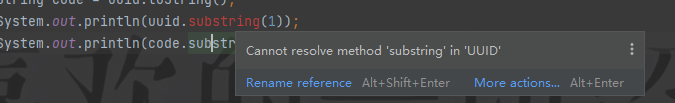


##### 判

###### 按照字典表顺序显示String


比较     **调用的字符串**  和   **参数字符串**  在字典表中顺序；严格区分大小写

规律 ：   结果 =  调用对象  -   参数对象

```java
public int compareTo(string other)
```


当  String 的值一致的时候  返回 0 

当长度一致： 值不一样   返回第一次出现不同符号的ASCII 差值

当长度不一样：

​			连续的值一样： 返回的是 长度的差值

理解：（是字符串的长度，什么叫连续的值一样，就是和调用的一样，但是比调用的长度长，所以会有长度的差值）

​			连续的值也不一样： 返回的是   第一次出现不同符号的ASCII差值

理解：（就是调用的部分不一样，和调用的部分没有一样的，才会出现第一次不同符号的差值—-ASCII，简单理解，要有ASCII差值，就得有不一样的两个字符，才可以进行差值比较，如果和基准都不一样，那么就不用出现差值，输出长度就行了）

```java
public int compareToIgnoreCase(String other)

    这个忽略大小写
```


```java
package cn.wolfcode.domain;


import java.util.UUID;

public class Person {
    public static void main(String[] args) {
        String a1 = "abc";
        String a2 = "abc";
        String a3 = "Abc";
        String a4 = "abb";
        String a5 = "abcdde";
        String a6 = "aAcdde";

        System.out.println(a1.compareTo(a2));
        System.out.println(a1.compareTo(a3));
        System.out.println(a1.compareTo(a4));
        System.out.println(a1.compareTo(a5));
        System.out.println(a1.compareTo(a6));

    }
}
0
32
1
-3
33

```

对代码的理解：

​	首先是定义了一个基准，我要和谁去比，调用的是  . 前面的；参数是括号里面的，所以会有调用的减去参数的差值。

###### 判断string类的值是否一致


```java
public boolean equals(Object obj)

严格区分大小写，用作 用户密码的判断


public boolean equalsIgnoreCase(object obj)

忽略大小写比较；一般用于验证码的判断
```


###### 判断指定的字符串是否在字符串中


```java
public boolean contains(CharSequence str)

用来判断指定的字符序列或者叫  子字符串  是否在 字符串中
```


```java
package cn.wolfcode.domain;


public class Person {
    public static void main(String[] args) {
        String a = "www.zhangweishihundan.com";
        if (a.contains("shbi")){
            System.out.println("字符串是：" + a);
        }else{
            System.out.println("输入错了");
        }
    }
}
输入错了
```


###### 判断字符是指定的数据开头或者结尾


````java
public boolean startsWith(String prefix)

	判断字符串是否是以指定的前缀开头

public boolean endWith(String suffix)
    
    判断字符串是否是以指定的东西结尾
````


```java
package cn.wolfcode.domain;


public class Person {
    public static void main(String[] args) {
        String a = "www.zhangweishihundan.com";
        if (a.contains("shbi")){
            System.out.println("字符串是：" + a);
        }else{
            System.out.println("输入错了");
        }
        if(a.endsWith(".com") || a.startsWith("www")){
            System.out.println(a);
        }else{
            System.out.println("Worry!!!!");
        }
    }
}
输入错了
www.zhangweishihundan.com
```


### StringBuffer  和  StringBuilder

#### 概念

**什么是buffer、builder？**

```JAVA
 缓冲(缓存)技术 : 由 String 底层实现原理 char[] 数组一旦创建长度固定 , 不利String 增删操作 , 因此 Java提出了缓存技术 , 在 JVM 中开辟指定的空间 , 完成对数据的操作 , 操作好了之后会将结果返还给堆栈内存
```


**为什么扩展？为什么要有StringBuffer 和 StringBuilder**

```java
StringBuffer 和 StringBuilder 都存在一个 缓冲（缓存）技术。由于 String 底层是 char[] 数组且被 final 修饰。那么也就说明 String 一旦定义好后，将无法改变。不利于做增删改操作（String类中的增删改方法得到的都是一个新的字符串）。因此 Java 提出了 StringBuffer 和 StringBuilder 。他们是存在缓冲区技术的。可以在内存空间中开辟出一块缓冲控件用来存储数据。直到操作完数据之后，再将结果存储到堆栈内存中。（说人话，就是String不可变。所以不利于增删改。每次都需要创建新的数据。所以利用了  StringBuffer 和 StringBuilder 的缓冲机制，来更好的实现字符串的增删改）。
```


**什么是Buffer**

```java
 是 JDK 1.0 就存在了，他是线程安全的。（更适合多线程操作）。但是安全带来的弊端就是速度相对会慢。之所以安全是因为 StringBuffer 底层的方法都存在 synchronized 同步锁。只有上一个执行结束了下一个才会进来。
```


**什么是buiilder？**

```JAVA
 对指定的内容重新定义 : Java中重新构建  一般 将原有的 多线程操作变为单线程操作

     补充：
- 是 JDK 5 才出现的。他线程不安全（更适合单线程操作）。但是相对来说，他的效率就会高。弊端就是若多线程操作则会容易造成并发问题。

- 
```

 

**如何选用？**

```java
若不考虑并发多线程的问题。我们建议使用 StringBuilder 。反之则使用 StringBuffer
```


**StringBuffer 和 StringBuilder 类的关系 (了解)**

```JAVA
 都是对 String 类的延伸 (照抄之后 , 进行新功能的拓展) 了StringBuffer类多线程操作 , JDK1.0 StringBuilder 类单线程操作 , 对StringBuffer进行重构 JDK5
```


#### StringBuffer类为例演示

**定义格式**

```java
public final class StringBuffer{}
```

 **常用的API**

实例化对象

```java
public StringBuffer() -------实例化对象,并且创建出缓存区

public StringBuffer(String value) ------- 实例化对象,String 存储在缓存区中
```


和 String类同名的方法参考 String就可以了

增

```java
public StringBuffer append(Object  obj)

将任意的数据追加到缓存区末尾

public StringBuffer insert(int index,Object  obj)

将任意的数据类型插入到指定位置,就是将指定的索引替换成了后面的 object 的值
```


```java
package cn.wolfcode.domain;

public class Person {
    public static void main(String[] args) {
        StringBuffer buf = new StringBuffer("多线程安全");
        buf.append(true);
        buf.append(false).append(8);
        buf.insert(1,666);
        System.out.println(buf);
    }
}
多666线程安全truefalse8
```

从键盘录入一串整数，以科学计数法显示

```java
public static void main(String[] args){
    Scanner sc = new Scanner(System.in);
    Integer num = sc.nextInt();
    StringBuilder sbud = new StringBuilder(num.toString());
    if(sbud.length() >= 4){
        for(int i = sbud.length() - 3;i>0;i -=3){
            sbud.insert(i,',');
        }
    }
    System.out.println(sbud);
    sc.close();
}
```


删

```java
public StringBuffer delete(int start , int end)
    删除字符串中 指定范围的所有数据,其中包含 start 不包含 end,左闭右开的
    找的是索引
    
public StringBuffer deleteCharAt(int index)
    删除指定位置上的元素
```


```java
package cn.wolfcode.domain;

public class Person {
    public static void main(String[] args) {
        StringBuffer buf = new StringBuffer("多线程安全");
        buf.delete(0,1);
        System.out.println(buf);
        buf.deleteCharAt(3);
        System.out.println(buf);

    }
}
线程安全
线程安
```


修改

```java
public StringBuffer replace(int start, int end , String value)
    用指定的 String 数据替换字符串中指定范围的数据,其中包含start 不包含end(也是前闭后开)
    
public void setcharAt(int index,char ch)
    使用指定的字符替换原有位置的字符

```


```java
package cn.wolfcode.domain;

public class Person {
    public static void main(String[] args) {
        StringBuffer buf = new StringBuffer("多线程安全");
        buf.replace(0,2,"new name");
        buf.setCharAt(8,'B');
        System.out.println(buf);

    }
}
new nameB安全
```


StringBuild类

```java
public final class StringBuilder

常用API和 StringBuffer 一致
```


# 正则表达式

## 含义

**作用**

````java
判断指定的 String 类型值，是否符合指定的规则存储的公式；由开发人员定义的

为了避免差异化，java提出了一些指定的符号，进行正则表达式的编写
````

补充：正则表达式是一种用于匹配字符串模式的工具。它是由一系列字符和特殊字符组成的表达式。用于约束字符串的一种规则。由开发人员进行编写。


**正则表达式的表格：**

| 符号          | 含义                                                         |
| ------------- | ------------------------------------------------------------ |
| ^             | 行起始符 (实际开发中不常用)<br />若在[ ^X] 则代表取反的意识  |
| $             | 行结束符 (实际开发中不常用)                                  |
| []            | 表示某一个位置, 当且仅当 该位置上 只有一种可能 [] 可以省略 ，一个位置上 出现多种可能 , \|可以省略      例如： [a\|b\|c] |
| \|            | 按位或 表示指定位置 出现多种可能的时候                       |
| ()            | 表示连续多个位置 ,格式组合 , 出现多个可能性的时候    \|  不可以省略 |
| {}            | 表述数据值个数范围                                           |
|               | {n} -- 表示正好出现n次（就是次数）                           |
|               | {n, } -- 表示至少出现n次                                     |
|               | {n,m} -- 表示 至少出现 n那个至多出现 m个 包含 m              |
| \d            | 表示 0-9 十个数字                                            |
| \D            | 非数字： `[^0-9]`                                            |
| \w            | 表示 A-Z  a-z 0-9 _                                          |
| \W            | 非单词字符：`[^\w]`                                          |
| -             | 表示 从  A-Z 包含区间端点                                    |
| .             | 表示任意一个符号                                             |
| +             | 表示至少出现一次 等价于 {1,}                                 |
| *             | 表示任意多个，等价于{0,}                                     |
| \u4e00-\u9fa5 | 使用 Unicode 规定的中文汉字的取值范围 (死记硬背)             |


## 正则表达式的应用

方法：由 String 类提供的，

```java
public boolean matches(String regex)
    
    根据指定的正则表达式 regex 判断 String 类型的值是否合法
```


### 校验手机号

 

```java
package cn.wolfcode.domain;


import java.util.Scanner;

public class Person {
    public static void main(String[] args) {
        Scanner sc = new Scanner(System.in);
        System.out.println("phone");
        String phone = sc.next();
        String number = "^1[3,5,7,8,9]\\d{9}$";
        System.out.println(phone.matches(number)? phone:"worry");
        sc.close();

    }
}

phone
13294838849
13294838849
```


### 邮箱的校验


```java
package cn.wolfcode.domain;


import java.util.Scanner;

public class Person {
    public static void main(String[] args) {
        Scanner sc = new Scanner(System.in);
        System.out.println("phone");
        String phone = sc.next();
        String number =  "^\\d{9}+@\\w+(.com|.163|.cn)$";
        System.out.println(phone.matches(number)? phone:"worry");
        sc.close();

    }
}

phone

677329123@163.com
677329123@163.com
    
套用上一个模版，里面的正则表达式更换了
```


### 检验QQ号


```java
package cn.wolfcode.domain;


import java.util.Scanner;

public class Person {
    public static void main(String[] args) {
        Scanner sc = new Scanner(System.in);
        System.out.println("phone");
        String phone = sc.next();
        String number =  "^[1-9]\\d{4,9}$";
        System.out.println(phone.matches(number)? phone:"worry");
        sc.close();

    }
}
12345678900
worry
```

解释一下，【1-9】：是数字1到数字9的所有数字中选取一个，就是只有一个位置

{4,9}，理解是4-9的闭区间，都是闭区间，是个数，不是限制数字大小


### 检验真实姓名


```java
package cn.wolfcode.domain;


import java.util.Scanner;

public class Person {
    public static void main(String[] args) {
        Scanner sc = new Scanner(System.in);
        System.out.println("phone");
        String phone = sc.next();
        String number =  "^[\u4e00-\u9fa5]{2,4}$";
        System.out.println(phone.matches(number)? phone:"worry");
        sc.close();

    }
}

陈真
陈真
```


### 校验注册用户名

```JAVA
package cn.wolfcode.domain;


import java.util.Scanner;

public class Person {
    public static void main(String[] args) {
        Scanner sc = new Scanner(System.in);
        System.out.println("phone");
        String phone = sc.next();
        String number =  "^[A-Z]\\w{5,17}$";
        System.out.println(phone.matches(number)? phone:"worry");
        sc.close();
    }
}
JAVAWO
JAVAWO

```


### 十八位身份证校验


```JAVA
package cn.wolfcode.domain;


import java.util.Scanner;

public class Person {
    public static void main(String[] args) {
        Scanner sc = new Scanner(System.in);
        System.out.println("phone");
        String phone = sc.next();
        String number =  "^[1-9]\\d{5}(19|20)\\d{2}(0[1-9]|1[0-2])(0[1-9]|[12][0-9]|3[01])\\d{3}[0-9xX]$";
        System.out.println(phone.matches(number)? phone:"worry");
        sc.close();
    }
}
62222520030215151X
62222520030215151X
    62222520030215151x

```


## 正则的拓展

将指定的String 转换成 数组 排序

String ———> byte[]  char[]

前提String 类型的值 分割符号必须一致


方法：由 String类提供

```JAVA
public String[] split(String regex)
	根据指定的正则表达式将 String 类型转换为 String[] 显示
```


### 案例

将 String a = “00,10,2,-8,6”进行升序排序显示

```JAVA
package cn.wolfcode.domain;

import java.util.Arrays;

public class Person {
    public static void main(String[] args) {
        String a = "0,10,2,-8,6";
        String[] b = a.split(",");
        System.out.println(Arrays.toString(b));

        for (int i = 0;i<b.length-1;i++){
            for (int j = i+1;j<b.length;j++){
                if (Integer.parseInt(b[i])>Integer.parseInt(b[j])){
                    String temp = b[j];
                    b[j] = b[i];
                    b[i] = temp;
                }
            }
        }
        System.out.println(Arrays.toString(b));
    }
}
[0, 10, 2, -8, 6]
[-8, 0, 2, 6, 10]
```


# 异常

含义：异与正常状态的显示 , 即 控制台显示的结果与预想的结果不一致，就是报错

例如

```JAVA
int[] nums = new int[2];
System.out.println(nums[2]);-------抛出异常
```


## 异常分类

**检测性异常：**

称为非运行时异常，一般在编写代码的时候直接爆出（**没有导包，还有没有代码没有编写完整，还有未被使用**）

非检测性异常（常用）：又叫运行时异常，java为运行时异常单独封装一个类————RuntimeException类；一般是编写代码时候没有问题，一旦执行代码，并没有获取到预期的结果。


## 异常类结构

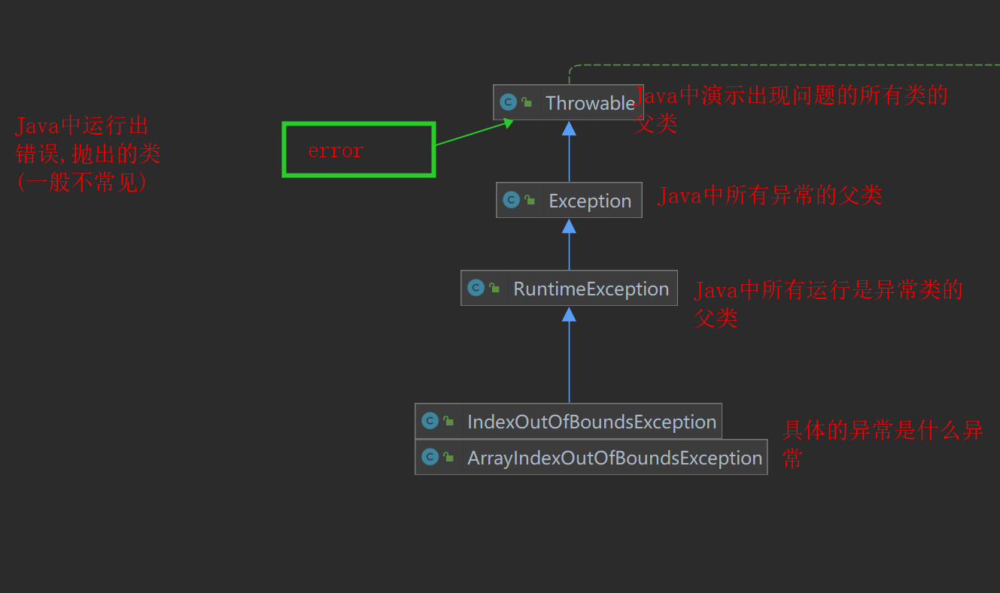

对于异常信息解析越详细，异常类的名字会越长

异常类类名分为两部分，以Exception划分

```java
Exception前：表示对当前的异常出现的详细描述
    
Exception 表示当前的类是异常类
```


## 异常解读

**自己单独写笔记，来记录所有出现过的异常**

下面是解读

Exception : 当前代码存在异常

in thread "main" : 在主线程中

java.lang.Array.... : 表示当前出现的是什么异常

: 值 -- 当前的异常是什么原因引起的

at ..... : 表示异常出现的 代码 行数 , 一定要看 at 单词后面的地址 一定是自己定义的

**特点：**

一旦出现异常，后面定义的代码都不会被执行


## 异常处理机制

**机制：**按照Java规定好的规则 , 完成对数据或者业务指定处理 , 这种操作称之为机制


**分类**

处理异常：由程序员主动处理（后期由框架完成）

抛出异常：不负责的处理，将异常向上抛出，谁调用谁处理


**处理异常**

```java
try{
     捕获异常 : 编写所有可能出现的异常代码;
}catch(异常类1 对象1){
     处理异常 : 完成指定议程的处理操作;
}catch(异常类1 对象1){
     处理异常 : 完成指定议程的处理操作;
}····
    
finally{
    编写无论是否发生异常都要执行的代码 , 一般编写 关闭资源的代码;
}

```


理解：try的后面就是用来捕获异常，发现异常交给后面的catch处理，最后异常走完后，执行后面的代码，前面说到遇到异常的时候代码会终止运行，但是这个方法会避免后面的代码不执行的问题，在finally的代码块中不论是否发生异常都会进行代码的执行


**执行原则**

当在try块中 捕获异常 , 则马上执行 catch块中的内容, try后续的代码都不执行 , 当 catch执行之后 , 再去执行finally块, 如果 try块中 没有捕获异常,直接执行try块中的代码 , 和 finally中的代码

**执行的特点**

组合操作

```java
try catch finally 可以组合出现

try catch  可以组合出现

try  finally 可以组合出现

catch finally  不可以
```


**对特点的补充**

三个代码块之间不能编写任何的代码，这三个代码必须紧密相连

当编写多个catch是否有编写的顺序 和 执行顺序？

```java
catch 既有编写顺序 也有执行顺序，必须是按照异常的详细程度，越详细的越靠前，只会执行最匹配的catch块，完成处理
```

try catch finally可以嵌套。实际开发中用的比较少

如何打印当前的异常信息

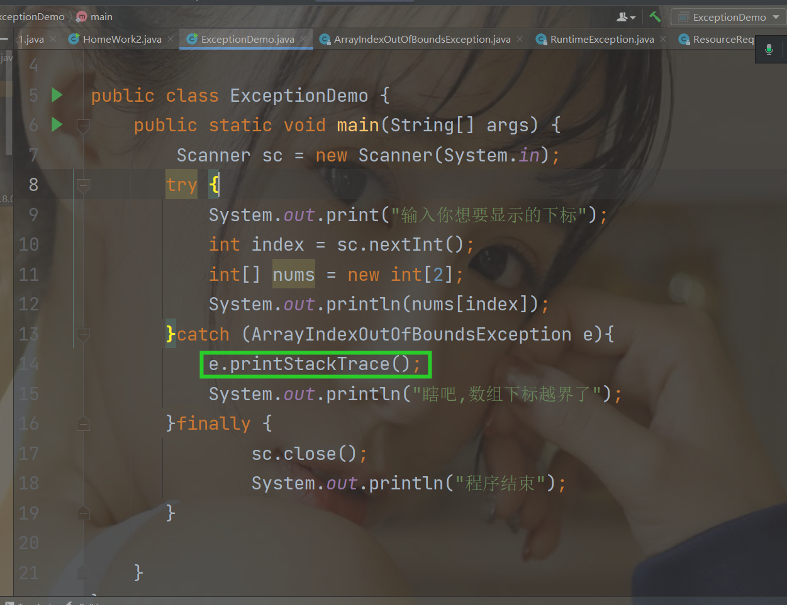


## 抛出异常

**throws**：抛出一个或者多个异常，定义的位置在方法的参数列表后面，多个异常类用“，”分隔

**throw**：抛出指定的某一个异常类对象，定义位置在方法体中

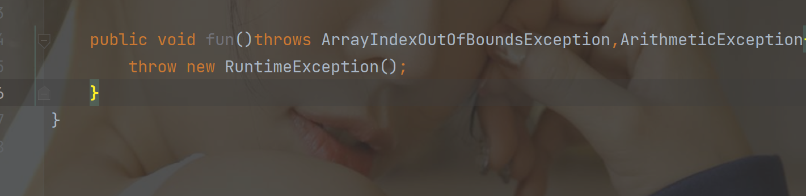


## 代码演示

### 自定义异常

```java
package cn.wolfcode.day14.part1.domain;

public class DivisorIsNotZeroExcrption extends Exception{
    public DivisorIsNotZeroExcrption(String message){
        super(message);
    }
}

```


### 自定义使用自定义异常类

```java
package cn.wolfcode.day14.part1.domain;

public class UseDiyException {
    public double div(double num1,double num2)throws DivisorIsNotZeroExcrption{
        if (num2 == 0){
            throw new DivisorIsNotZeroExcrption("除数不可以为0");
        }
        return  num1/num2;
    }
}

```


### 测试

```java
package cn.wolfcode.day14.part1.test;

import cn.wolfcode.day14.part1.domain.DivisorIsNotZeroExcrption;
import cn.wolfcode.day14.part1.domain.UseDiyException;

public class DiyExceptionTest {
    public static void main(String[] args) {
        UseDiyException useDiyException  = new UseDiyException();
        try {
            useDiyException.div(8,0);
        } catch (DivisorIsNotZeroExcrption e) {
            e.printStackTrace();
        }
    }
}
```

理解:在主函数中,我们可以直接类名点方法名,但是这样子对异常处理是有问题的, 而且一定是方法会抛出异常,没有处理,我们可以在错误的地方   alt+ enter,进行抛出异常处理,但是主函数中不推荐这样子在main后面加抛出的异常,

所以我们推荐使用try  catch方法进行捕获异常,处理异常的方法…


# 多线程

java语言的特点:

简单，健壮，多线程，完全面向对象，跨平台性

## 概念：

### 线程；

控制指定APP（进程）执行的最小的（最基本的）单位

​			是被系统独立调度和分派的基本单位，线程自己不拥有系统资源，

因为一个 CPU 在一个进程中只能同时做一件事情。那么就无法满足我们协同操作。此时我们就可以在进程中开辟多条线程来同时协作。我们就称之为多线程

**线程是为了提高进程的使用率**


### 进程；

硬件设备上每一个应用程序

​			进程是正在运行的程序的实例

程序进入到我们的内存中。统一交给 CPU 进行管理。

**进程是为了提高CPU的使用率**


### 时间片

提高CPU的利用率，

我们希望在 A 使用用 Scanner 输入时，我们将程序切换到 B 这边运行。直到 A 输入结束。在切换回 A 执行。这样的话 CPU 就可以在多个程序之间来回切换。 此时我们就需要一个能够记录之前完成具体位置的标记。这个标记我们称之为 CPU 的时间片。


### 并行和并发


并行：在同一时刻，多个进程同时使用各自的 CPU,多个进程是并行着执行的。（需要有个 CPU）

并发：在同一时刻，只有一个程序在使用 CPU，但是 CPU 在多个程序之间高速切换。（只需要一个 CPU）（我们要讲解的）


单线程；一个进程中只有一个线程执行，实际生活中不存在

多线程；一个进程至少有两个或者两个以上的线程在执行（线程之间可以并发执行）


进程可以有多个线程，

**Java是如何体现多线程的**

```java
in thread “main”：主线程

垃圾回收处理机制
    
    
java中的线程是抢占式的
```


## 多线程创建方式

### **分三种：**

Thread类

Runnable接口

Callable接口

### 多线程操作：

多个线程在同一时刻操作共同资源

### 第一种：Thread类

Thread类是所有线程类的父亲。线程是程序中的执行程序。java虚拟机允许应用程序并发的运行多个执行程序


继承Thread类，重写run方法（编写多线程操作的代码）通过Thread类或者 Thread类的子类，调用start方法开启多线程并且调用run方法执行多线程操作，每一次执行结果都不一样

——Thread类：java封装的所有关于线程的操作

**代码演示**

**单线程**

先进行**直接调用**run方法的

```java
package cn.wolfcode.day14.part2.domain;

public class SonThreat extends Thread{
    @Override
    public void run() {
        for (int i = 50;i>0;i--){
            System.out.println("SonThreat" + i );
        }
    }
}

```

main

```java
package cn.wolfcode.day14.part2.test;

import cn.wolfcode.day14.part2.domain.SonThreat;

public class ThreatTest {
    public static void main(String[] args) {
        SonThreat a = new SonThreat();
        a.run();//这里是调用执行了run方法，不是开启新线程

        for (int i = 0; i < 50; i++) {
            System.out.println("mainThreat::::::::" + i);
        }
    }
}

```

结果就是按照顺序执行，因为调用的是run方法，可以说没有开启多线程操作，只是调用了方法进行了方法的打印。


上面演示的可以理解为单线程操作

特点就是按照指定顺序执行


**实现多线程操作**

通过Thread类中的  

```java
public void start()
    执行run方法
```


```java
package cn.wolfcode.day14.part2.test;

import cn.wolfcode.day14.part2.domain.SonThreat;

public class ThreatTest {
    public static void main(String[] args) {
        SonThreat a = new SonThreat();
        a.start();

        for (int i = 0; i < 50; i++) {
            System.out.println("mainThreat::::::::" + i);
        }
    }
}

```

最后的结果就是不按照顺序进行, 两个部分同时进行,但是是随机的,没有固定的优先级.


**注意：**

必须调用start() 方法才是开启线程，如果用run（）方法就是调用该线程对象中的run（）方法，不是开启新的线程。

**几个问题**

One：ThreadDemo 程序执行的过程中，存在几条线程？

```java
至少3条线程：主线程、et线程、后台线程
```

Two:进程执行时，从 main 函数开始，main 中可以创建很多其他线程。但是为什么执行的顺序不一致？

```java
因为 Java 是抢占式的。这些线程轮流的在抢占 CPU 资源。程序的执行轨迹是不确定的。
```

拓展：

```java
我们是绝对不能控制 CPU 具体去操作那一条线程的。但是我们可以提高某条线程的优先级。
    

- 每一个线程的优先级默认值为5。取值范围是[1~10]。
- public final void setPriority(int newPriority)    更改线程的优先级。 
- public final int getPriority()                                 获取线程的优先级。 
```


### 第二种:实现Runnable接口

重写  run  方法,  需要调用  Thread  类中的  start()  方法.

```java
- 实现
	- 首先我们需要自定义一个类去实现 Runnable 接口。
	- 重写Runnable 接口中的 run() 方法。
	- 在启动该线程时，我们需要创建一个线程对象 Thread。将该接口实现类作为参数通过构造方法传递给 Thread 对象。
	- 启动线程都是通过 Thread对象.start() 方法才可以开启线程。
```


**直接上代码**

```java
package cn.wolfcode.day14.part2.domain;

public class ThreadRunnableImpl implements Runnable{

    @Override
    public void run() {
        for (int i = 0;i<50;i++){
            System.out.println("Runnable::::" + i);
        }
    }
}

```

main

```java
package cn.wolfcode.day14.part2.test;

import cn.wolfcode.day14.part2.domain.ThreadRunnableImpl;

public class RunnableTest {
    public static void main(String[] args) {
        ThreadRunnableImpl a = new ThreadRunnableImpl();
        Thread t = new Thread(a);
        t.start();

        for (int i = 50;i>0;i--){
            System.out.println("main" + i);
        }
    }
}
需要将  实现 Runnable接口 类 和 Threat 构成联系------通过 Threat 构造器

```


### 一个用法的小总结

通过上述多线程操作,每一次执行之后,效果都不一样

```java
多线程在同时操作相同的资源,就是每个线程去抢占CPU的执行权,谁抢到就是谁去执行,实际上,是CPU在开启的多线程之间快速地切换,称为多线程的执行特点-----"-随机性"
```


能否通过“充值”,提高特定线程的执行权限

```java
可以,java中为每一线程设置初始  vip等级  是5的取值范围[1-10],通过 Thread类 指定的 set方法 设置 vip 等级,就是所谓的优先级,但是并不是优先级越大就越先执行,优先级的大小提高是说提高被执行完的可能性(就是优先级高的有可能先执行完),实际开发中没有特殊要求,不需要设置优先级
```


## Thread类中常用的API


**Thread 类本质上就实现了 Runnable 接口，就是对 Runnable 接口的扩展**


### 创建Thread对象方法

```java
public Thread()----创建Thread类对象

public Thread(Runnable  t)
    将指定的Runnable接口实现类对象,通过Thread构造器和Thread类建立联系
```


### 编写多线程操作代码的方法

```java
public void run()
```


### 开启多线程

```java
public void start()
```


### 获取当前线程的名字

```java
public final String getName()
```


```java
package cn.wolfcode.day14.part2.test;

import cn.wolfcode.day14.part2.domain.SonThreat;

public class ThreatTest {
    public static void main(String[] args) {
        SonThreat a = new SonThreat();
        a.start();

        for (int i = 0; i < 50; i++) {
            System.out.println("mainThreat::::::::" + i);
        }
    }
}

```

这个就是获取到了线程的名字


### **在非Thread子类中互殴当前正在执行的线程对象**

```java
public static Threat currentThread() ----返回当前正在执行的线程
```

可以用在主函数的输出或者重写run的函数里面

```java
package cn.wolfcode.day14.part2.domain;

public class ThreadRunnableImpl implements Runnable{

    @Override
    public void run() {
        for (int i = 0;i<50;i++){
            System.out.println (Thread.currentThread() + "Runnable::::" + i);
        }
    }
}

```


直接打印currentThread方法的值,表示打印当前正在执行的Thread对象

格式:

[线程名,   优先级  当前线程执行的位置]

### 让指定的线程睡眠指定的时间(时间单位   毫秒)

```java
public static void sleep(long millis)
```


### 给线程设置线程名 

一般不常用

```java
public void setName(String name)
```

**这个是Thread的方法,设置名字的方法**

```java
package cn.wolfcode.day14.part2.domain;

public class SonThreat extends Thread{
    @Override
    public void run() {
        setName("134");
        for (int i = 50;i>0;i--){
            System.out.println(getName() +"SonThreat" + i );
        }
    }
}

```


**这个是实现Runnable接口   改名的方法**

```java
package cn.wolfcode.day14.part2.domain;

public class ThreadRunnableImpl implements Runnable{

    @Override
    public void run() {
        Thread.currentThread().setName("123");

        for (int i = 0;i<50;i++){
            System.out.println (Thread.currentThread() + "Runnable::::" + i);
        }
    }
}
重点看改名的地方,用的是
    
    Thread.currentThread().setName()
```


### 设置线程的优先级

优先级的取值范围是[1   -   10]

```java
public void setPriority()
```


### 获取当前线程的优先级

```java
public int getPriority()
```


```java
package cn.wolfcode.day14.part2.domain;

public class ThreadRunnableImpl implements Runnable{

    @Override
    public void run() {
        Thread.currentThread().setName("123");
        Thread.currentThread().setPriority(7);

        for (int i = 0;i<50;i++){
            System.out.println (Thread.currentThread() + "Runnable::::" + i);
            System.out.println(Thread.currentThread().getPriority());
        }
    }
}

```


主要是以Runnable接口方法来看,比较常见,所以多来


## 多线程 的状态和每种状态下线程具备的权限

### 状态图


### 每种状态下是有权限的

| 状态            | 权限                        |
| --------------- | --------------------------- |
| 创建状态        | 只有生存权                  |
| 运行状态        | 既有生存权, 也有执行权      |
| 消亡状态        | 既没有生存权,, 也没有执行权 |
| 临时(阻塞) 状态 | 只有生存权 , 没有执行权     |


**创建状态下的生存权和临时状态下的生存权有区别么**

```java
有
    区别在于多线程的操作是否被开启,创建状态下,没有进行多线程操作,而临时状态下生存权是开启了多线程之后,没有获取到执行权
```


### **处理临时组赛状态的线程的存储位置:**

```java
由JVM提供的线程池中存储.
    先进先出原则-------队列
```


### 等待唤醒机制

**等待**

有的类都继承Thread类,但是只要是java的类,就是多线程操作,等待和唤醒方法共性的方法,定义在所有类的父类中

**目前不常用java提出的接口Lock接口实现该功能**

实际中更喜欢使用sleep方法完成多线程的操作,到时候自动唤醒()


### 让多线程并发变串行

Join

理解：就是必须等A线程查询结果回来以后，B线程才可以去做自己的操作

代码：

```java
package cn.demo.thread.one.domain;

public class JoinThread extends Thread{
    public JoinThread(String name){
        super(name);
    }
    @Override
    public void run() {
        for (int i = 0;i<10;i++){
            System.out.println(Thread.currentThread().getName() + i);
        }
    }
}

```


main

```java
package cn.demo.thread.one.test;

import cn.demo.thread.one.domain.JoinThread;

public class JoinThreadTest {
    public static void main(String[] args) throws InterruptedException {
        JoinThread a = new JoinThread("线程A");
        a.start();
        for (int i = 0;i<10;i++){
            if (i == 2){
                a.join();
            }
            System.out.println(Thread.currentThread().getName() + i);
        }
    }
}

```


### 课堂案例

**多线程安全隐患问题**

原因:

```java
在执行多线程操作的时候,多线程可以同时操作共同资源,当一个线程操作的时候,其他线程有操作的可能性
```


需求：模拟火车售票窗口（3个）统一出售400张票

#### **下面是继承操作**

**首先展示的是没有设置保护的代码**

线程窗口类

```java
package cn.demo.thread.one.domain;

public class ExtendThreads extends Thread {
    public ExtendThreads(String name){
        super(name);
    }
    private int tickets = 50;

    @Override
    public void run() {
        for (int i = 0; i < 10; i++) {
            if (tickets > 0){
                this.tickets--;
                System.out.println(Thread.currentThread().getName() +  "and" + this.tickets);
            }
        }
    }
}

```


main

```java
package cn.demo.thread.one.test;

import cn.demo.thread.one.domain.ExtendThreads;

public class ExtendThreadsTest {
    public static void main(String[] args) {
        ExtendThreads t1 = new ExtendThreads("窗口1:::::");
        ExtendThreads t2 = new ExtendThreads("窗口2~~~~");
        ExtendThreads t3 = new ExtendThreads("敞口3");

        t1.start();
        t2.start();
        t3.start();

    }
}

```

上面的代码看似没有问题，也开启了多线程，但是实质上是每个窗口都开启了一个多线程，就是看似总共卖了10张票，其实是每个窗口都卖了10张，总共30张。

原因：    是因为每个线程访问了同一个资源（共享资源）

如果我们使用了继承的方式，那么说明每次都新建了一个对象，每个对象都有自己的五十张票，说明不是共享了同一个50张，而是各自都有50张————线程安全问题

**解决**

将变量赋值为了静态变量，但是实际中并没有解决超卖的问题，虽然共享了同一个资源，但是还是有同一个时间几个窗口同时访问一个资源并且进行修改，然后数据任然不对

main没有改变，这里不在赘述

```java
package cn.demo.thread.one.domain;

public class ExtendThreads extends Thread {
    public ExtendThreads(String name){
        super(name);
    }
    private static int tickets = 10;

    @Override
    public void run() {
        for (int i = 0; i < 5; i++) {
            if (tickets > 0){
                tickets--;
                System.out.println(Thread.currentThread().getName() +  "and" + this.tickets);
            }
        }
    }
}

```

**出现的问题：**

```java
静态区本就不大。若频繁操作且数据量过多。会造成内存溢出。且拼房的大量资源去操作静态区解决方式也不好。
```


#### **下面是实现的操作**

**首先展示的没有设置保护的代码**

代码：

```java
package cn.wolfcode.day14.part3.domain;

public class TicketsWindow implements Runnable{
    private  int ticket = 400;
    @Override
    public void run() {
        while (true){
            if (ticket > 0){
                System.out.println(Thread.currentThread().getName() + ";;;;;" + ticket--);
            }
        }
    }
}

```

main

```java
package cn.wolfcode.day14.part3.test;

import cn.wolfcode.day14.part3.domain.TicketsWindow;

public class TicketsWindowTest {
    public static void main(String[] args) {
        TicketsWindow a = new TicketsWindow();
        Thread b3 = new Thread(a);
        Thread b1 = new Thread(a);
        Thread b2 = new Thread(a);
        b3.start();
        b1.start();
        b2.start();

    }
}

```

总结就是一个字,,快,但是有报错,就是资源抢占的问题,,同时访问这个资源,同时修改但是没有记录的问题.


我们创建了实现接口的对象只有一个。我们是将该对象作为参数传递给了不同的3个 Thread 类对象。但是本质上我们操作变量的对象就创建了一个。所以不需要静态变量也能解决超卖的问题。


里面有个注意事项,就是在设置  **Thread.sleep 的时候有个报错,就是说我们需要try  catch方法**,代码如下:

```java
package cn.wolfcode.day14.part3.domain;

public class TicketsWindow implements Runnable{
    private  int ticket = 400;
    @Override
    public void run() {
        while (true){
            try {
                Thread.sleep(10);
            }catch (InterruptedException e){
                e.printStackTrace();
            }
            if (ticket > 0){
                System.out.println(Thread.currentThread().getName() + ";;;;;" + ticket--);
            }
        }

```


#### 继承方式和接口方式对比

继承方式：（若没有共享资源可以使用它，相对书写较为简单）

```java
java单继承，若继承了 Thread 类，那么就不能在继承其他的直接父类了。（局限性更大了，耦合度高）。

操作分析：相对操作较为简单，获取线程名字也简单。

多线程分析：继承方式不能多线程共享一个资源。（除非静态。但是！！！不建议使用静态为多线程！！！）。
```


接口方式（若有共享资源可以使用它，相对书写较为复杂）

```java
java类可以实现多个接口，且可以继承一个直接父类。（设计上更优雅，扩展都更高。耦合度相对较低。面向接口编程。接口就是提供规范的）

操作分析：相对复杂，获取线程名字 Thread.currentThread() 方法。

多线程分析：实现方式可以多线程共享一个资源。
```


### 隆重介绍:加锁

在操作共同资源的时候,为操作加锁   —— 同步技术

**synchronized** 理解相关操作

```java
synchronized(Object obj)
    参数是 旗舰锁 三种方式


1.Object obj = new Object()  -------不推荐  Object 锁

2.this ------本类对象锁(推荐)
    
3.TicketWindow.class ------反射机制锁:通过单签类底层字节码文件获取,,超级推荐

这里面TicketWindow 是编写同步的类名,后面的 .class  不变
```


这个是**同步代码块,**下面的是同步代码块,上面的是简单的理解


```java
package cn.wolfcode.day14.part3.domain;

public class TicketsWindow implements Runnable{
    private  int ticket = 400;
    @Override
    public void run() {
        while (true){
            synchronized (TicketsWindow.class){
                try {
                    Thread.sleep(10);
                }catch (InterruptedException e){
                    e.printStackTrace();
                }
                if (ticket > 0){
                    System.out.println(Thread.currentThread().getName() + ";;;;;" + ticket--);
                }
            }
        }
    }
}

```


同步代码块，就是可以为代码块内的内容加锁。这样就能保证每一条线程执行结束之后。另一条线程才能强进来。


**同步函数**

就是将要保护的执行代码单独拿出来,加上关键字,,构成同步函数

```java
package cn.wolfcode.day14.part3.domain;

public class TicketsWindow implements Runnable{
    private  int ticket = 400;
    @Override
    public void run() {
        while (true){
            fun();
        }

    }
    
    public synchronized void fun(){
        try {
            Thread.sleep(10);
        }catch (InterruptedException e){
            e.printStackTrace();
        }
        if (ticket > 0){
            System.out.println(Thread.currentThread().getName() + ";;;;;" + ticket--);
        }
    }
}
这个是一个整体
```


#### 同步函数和同步代码块的区别

```java
锁的数目（个数） 不同
    同步代码块：-----三个锁----常用
    
    	Object 锁
    	this 本类对象锁
    	反射机制锁----上面提及过的

    同步函数  ---- 1个锁

		this 本类对象锁
```


# 集合

## 概念

+ 什么是集合
	+ java的集合框架其实就是对数据结构的封装。
	+ 集合就是用来存储数据的容器。所以我们先了解数据结构。

## 数据结构

+ 所谓的数据结构其实本质就是计算机用来存储数据的方式。

+ 数据结构主要是用来操作数据的存储。增删改查(CRUD)。

+ 常见的数据结构

	+ 数组（Array）

		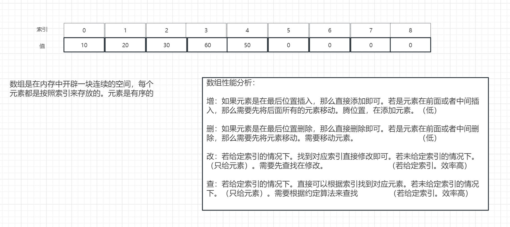

		+ 结论：

			+ 在非特定条件下：数组是适合做修改和查询的。不适合做新增和删除。

			

	+ 链表（Link）

		+ 单向链表：只能从头找到尾
		+ 双向链表：能从头找到尾，也能从尾找到头

		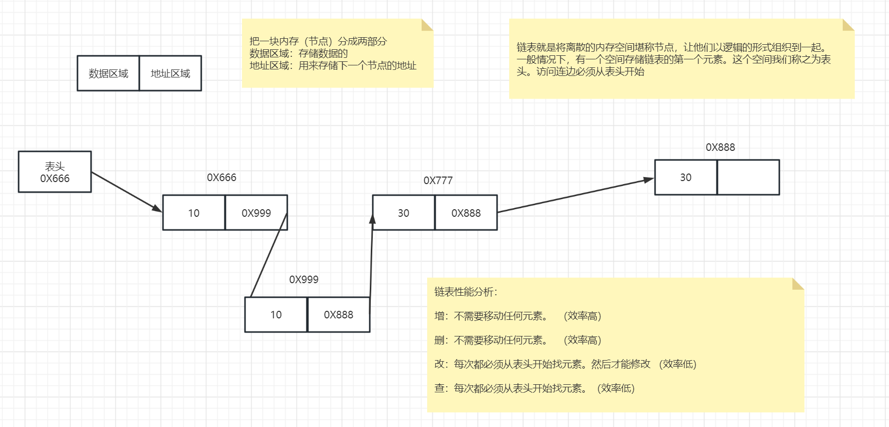

		+ 结论：链表是适合做增加和删除，不适合做修改和查询

		

	

	+ 队列（Queue）
		+ 队列：只允许我们在表前进行删除，在表后进行插入
			+ 插入在尾部（队尾），删除在头部（队头）
			+ 特点：先进先出
			+ 也分为：
				+ 单项队列：只能从头到尾
				+ 双向队列：能从头到尾，也能从尾到头

	

	

	+ 栈（Stack）
		+ 又称之为堆栈，后进先出（LIFO）。（类似手枪弹夹）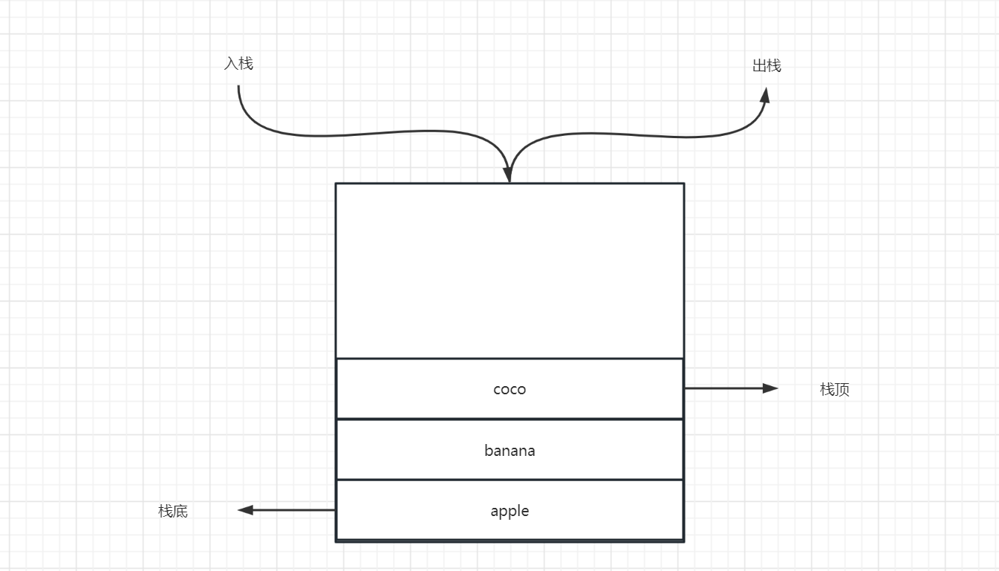
	+ 树
	+ 哈希表
	+ 图
	+ 堆

+ 不同的数据结构，底层采用的存储方式是不同的（算法）。再具体的操作的时效率都是不同的

	+ 有些查询和修改速度快
	+ 有些添加和删除速度快
	+ 有些是操作首尾速度快

## 集合的概念

+ 集合是 Java 中的一种容器。可以用来存储多个数据。根据不同的数据结构来进行存储管理数据。

+ 数组也可以存储多个数据（集合与数组的区别）

	+ 数组的长度固定，集合长度可变
	+ 数组只能存储一种数据类型。集合可以存储多种数据类型（虽然可以，但是实际开发中我们只存储一种）
	+ 数组可以存储任意类型（基本数据类型和引用数据类型）。集合只能存储对象（引用数据类型）。（若存储了基本数据类型。那么集合会默认把其使用自动装箱转换为其包装类）

+ 集合分为单列集合和双列集合

	+ 单列集合的最高接口 Collection，之所以是接口，就是为了给我们提供规范，不同的实现类来使用不同的数据结构去做更适合做的事情
	+ 单列集合类结构图

	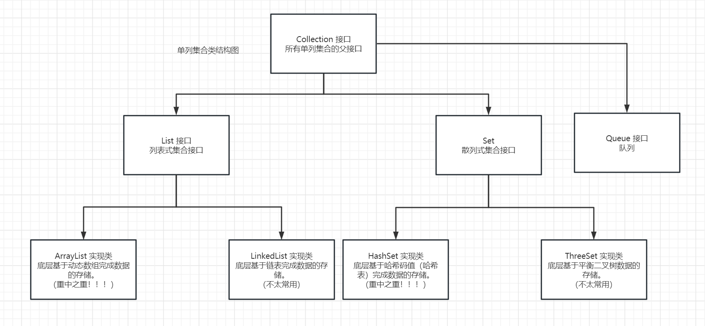

	+ 双列集合类结构图

	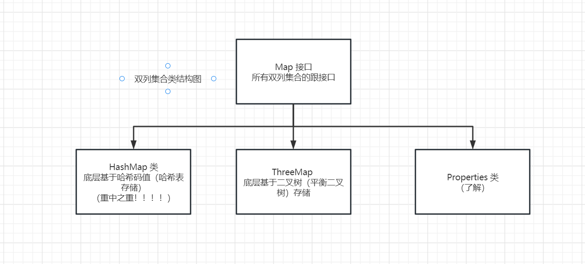


### 单列集合

+ Collection接口：主要就表示了List 和Set两种存储方式

+ list（列表）：允许重复添加数据，元素可以重复，有序（数据存储的顺序）

	+ 常见实现类：

		+ ArrayList：数组列表，表示数组结构，底层采用动态数组。开始发中用的最多！！！重中之重。
		+ LInkedList：链表，表示双链表和双队列结构。实际开发中使用的并不多。
		+ Stack：栈，表示栈结构。实际开发中使用的并不多。
		+ Vector：向量，其实它本质上就是古老的 ArrayList，采用数组实现。实际开发中使用的并不多。

	+ List中常见的API

		+ 增：

			+ **boolean add(E e)：向列表的尾部添加指定的元素。（重点）**

			+ ```java
				void add(int index,E element)
				```

				+ 在列表的指定位置插入指定元素

			+ ```java
				boolean addAll(Collection c) 
				```

				+ 将指定列表的所有元素添加到当前列表中。（说人话：向集合中添加另一个集合中的所所有数据）。
					+ 注意:都是在集合的尾部添加

			+ 这个是List中的add方法的使用

				```java
				package cn.demo.thread.one.domain;
				
				import java.sql.SQLOutput;
				import java.util.ArrayList;
				import java.util.List;
				
				public class LitArr {
				    public static void main(String[] args) {
				        List list = new ArrayList();
				        list.add("apple");
				        list.add("elephant");
				        list.add(78);
				        System.out.println(list);
				
				        list.add(1,"niubi");
				        list.add(0,"z");
				        System.out.println(list);
				
				        List a = new ArrayList();
				        a.add("zheg");
				        a.add("asdfasf");
				        a.add("asdga");
				        System.out.println(list.addAll(a));
				        System.out.println(list);
				    }
				}
				
				
				```

				

		+ 删

			+ ```java
				E remove(int index)
				```

				+ 从列表中移除指定位置的元素(根据索引删除),,返回被删除的数据

			+ ```java
				boolean remove(Object o)
				```

				+ 从列表中国一处第一次出现的指定元素(根据指定元素删除)

			+ ```java
				boolean removeAll(collection c)
				```

				+ 将指定列表所有元素从当前列表中删除(就是从一个集合中删除一个集合的所有数据)

			+ 代码:

				+ ```java
					package cn.demo.thread.one.domain;
					
					import java.util.ArrayList;
					import java.util.List;
					
					public class DelListArr {
					    public static void main(String[] args) {
					        //集合的添加
					        List list = new ArrayList();
					        list.add("aa");
					        list.add("bb");
					        list.add("cc");
					        list.add("dd");
					        list.add(78);
					        System.out.println(list);
					        //根据元素删除aa
					        System.out.println(list.remove("aa"));
					        System.out.println(list);
					        //在上面的基础山,删除索引为1的元素  数据类型是Object
					        Object a = list.remove(1);
					        System.out.println(a);
					        //在上面删除后的基础上,在进行删除索引是1的元素
					        System.out.println(list.remove(1) + "删除");
					        System.out.println(list);
					        //这个很有意思,如果直接输入数字,就会认为是索引,所以需要进行一个转换,将数值转换成包装类,就可以
					        list.remove(Integer.valueOf(78));
					        System.out.println(list);
					    }
					}
					
					```

				+ 其中比较重要的就是删除数值类型的数据的时候要转换成包装类

		+ 改:

			+ ```java
				E set(int index,E element)
				```

				+ 用指定元素替换列表中指定位置的元素,返回被替换的旧元素

				+ 代码:

				+ ```java
					        list.set(0,"aa");
					        System.out.println(list);
					```

					+ 这个就是结合上面删除的代码,然后一起表示,进行最后一个元素的修改

		+ 查:

			+ ```java
				int size()
				    返回列表中的元素数(数组长度一样),
				```

			+ ```java
				boolean isEmpty()
				    如果列表中不含这个元素,就会返回 true  判断是否是空集合
				```

			+ ```java
				E get(int index)  
				    返回列表中指定位置的元素
				```

			+ ```java
				boolean contains(Object o)
				    如果列表包含指定的元素,则返回 true
				```

			+ ```java
				Object[] toArray()
				    返回按适当顺序包含列表中的所有元素的数组
				```

			+ 代码：

			+ ```java
				package cn.demo.thread.one.domain;
				
				import java.lang.reflect.Array;
				import java.util.ArrayList;
				import java.util.Arrays;
				import java.util.List;
				
				public class SearchArr {
				    public static void main(String[] args) {
				        List a = new ArrayList();
				        a.add("aa");
				        a.add("dd");
				        a.add("rr");
				        a.add("tt");
				        a.add("yy");
				        System.out.println(a);
				
				        System.out.println(a.size());
				        System.out.println(a.isEmpty());
				        System.out.println(a.get(2));
				        System.out.println(a.contains("aa"));
				        //这个展示的是地址
				        System.out.println(a.toArray() + "array展示的");
				
				
				        Object[] b = a.toArray();
				        System.out.println(Arrays.toString(b) + "数组的展示");
				
				        System.out.println(a + "这个是集合的打印");
				    }
				}
				
				```

	+ ArrayList:

		+ ArrayList对象是否有初始长度？如果有，扩容机制是什么

			+ 创建为0，初始化后长度为10，扩容机制是原长度的 1.5 倍。

		+ ArrayList：常用方法

			+ ```java
				public void clear()
				    从列表中移除所有元素(可选操作)
				```

			+ ```java
				public int indexOf(Object  o)
				    返回列表中第一次出现的指定元素的索引
				```

			+ ```java
				public int lastIndex(Object o)
				    返回列表中最后出现的指定元素的索引
				```

				

			+ 代码:

			+ ```java
				package cn.demo.arraylist.one.domain;
				
				import java.util.ArrayList;
				import java.util.List;
				
				public class UserArrList {
				    public static void main(String[] args) {
				        User user1 = new User("张三",10);
				        User user2 = new User("李四",40);
				        User user3 = new User("王五",20);
				
				        List tips = new ArrayList();
				        tips.add(user1);
				        tips.add(user2);
				        tips.add(user3);
				
				        System.out.println(tips.size());
				        System.out.println(tips);
				    }
				}
				
				```

			+ 其中,长度是可以出现,为三,但是输出集合的时候,显示的是地址,不是里面具体值

				+ 说明:向集合中存储了自定义对象。那么存储的是对象的地址

			+ 集合中如何存储对象类型数据:

			+ 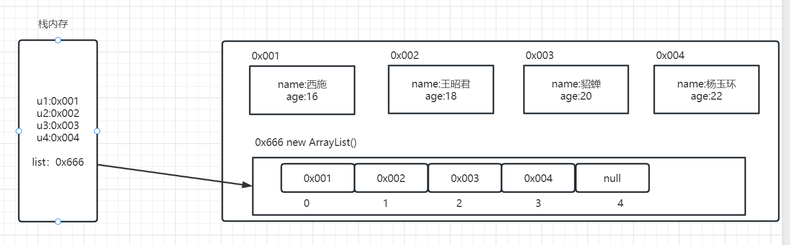

			+ 想看到对象中的内容:需要重写对象的toString方法

			+ 

			+ 总结：集合类中存储的都是对象的引用。而且不是对象自身。

	+ LinkedList: 

		+ 双链表 + 双向队列 + 栈的数据结构实现的地层采用的是

		+ LinkedList作为List接口的实现类,他继承了List接口中所有的方法

		+ LinkedList作为栈(stack)使用

			+ ```java
				public void push(E e) 
				    将元素推入此列表所表示的堆栈,将元素插入列表的开头
				```

			+ ```java
				public E pop() 
				    从表中所表示的堆栈处弹出来一个元素,返回出栈元素
				```

			+ ```java
				public E peek()
				    获取但是不移除列表的头
				```

			+ 

			+ 代码

			+ ```java
				package cn.demo.arraylist.two.damain;
				import java.util.LinkedList;
				public class LinklList {
				    public static void main(String[] args) {
				        LinkedList tips = new LinkedList();
				        tips.push("aaa");
				        tips.push("bbb");
				        tips.push("ccc");
				        tips.push("ddd");
				
				        System.out.println(tips.pop());
				        System.out.println(tips.peek());
				        System.out.println(tips);
				    }
				}
				
				```

		+ LinkedList作为双向队列使用

		+ 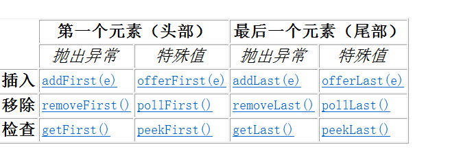

		+ 代码

		+ ```java
			package cn.demo.arraylist.two.damain;
			
			import java.util.LinkedList;
			
			public class DouLinkedList {
			    public static void main(String[] args) {
			        LinkedList a = new LinkedList();
			        a.addLast("aa");
			        a.addLast("rr");
			        a.addFirst("bb");
			        Object c = a.removeFirst();
			        System.out.println(c);
			        Object d = a.removeLast();
			        System.out.println(d);
			
			        Object e = a.getFirst();
			        System.out.println(e);
			        Object h = a.getLast();
			        System.out.println(h);
			    }
			}
			
			```


## 泛型

+ 含义:

	+ 一种参数类型。主要用于某个类或接口中的数据不确定时。我们可以通过一种标识符来表示位置的数据类型。然后当我们使用该类或接口时，我们传递的真实类型来去覆盖泛型。

+ 可以使用泛型的场景

	+ 接口、类、方法（集合中）。我们可以理解为它就是一个数据类型的模板。

+ 为什么使用泛型

	+ 以集合为例：从容器中获取元素，需要将类型强制转换。若不限制容器的类型。那么数据过多则容易记忆混乱。若强转错误则会抛类型转换异常。
	+ 结论:实际中,我们都会为集合规定泛型

+ 语法:

	+ ```java
		public class 类名<T>{
		    //类中的泛型规定了该类中的方法以及变量可以使用那种泛型
		    变量上使用:
		    	修饰符  泛型  变量名
		        private T x;
		
			方法上使用:
		    	返回值直接写对应的泛型.如果是参数,参数类型就是泛型
		            public class Point<T>{
		                
		            }
		    		
		    		public Point(T x,T y){
		                this.x = x;
		                this.y = y;
		            }
		}
		```

	+ 泛型的使用:

		+ ```java
			Point<string> point = new Point<>();
			```

	+ 常用的泛型字母

		+ | Java中规定的泛型字母 | 含义                                                        |
			| -------------------- | ----------------------------------------------------------- |
			| E                    | Element，表示元素。集合中使用代表集合中可以存储元素的类型。 |
			| R                    | Result，表示方法的返回值类型。（二阶段会看到）              |
			| K                    | Key，表示 Map 集合中的键类型。                              |
			| V                    | Value，表示 Map 集合中的值类型。                            |
			| T                    | Type，表示当前存储的数据类型                                |
			| ?                    | 表示不确定是任意的一种数据类型                              |

	+ 集合中泛型的使用

		+ 给集合规定指定类型。使用泛型的集合。那么将来使用该集合时。只能存储指定泛型被传递后的类型。

		+ 当我们不使用泛型的时候,参数是Object类型,也就是我们可以传递任意类型,获取数据也是Object

			+ 没有使用泛型的时候

		+ 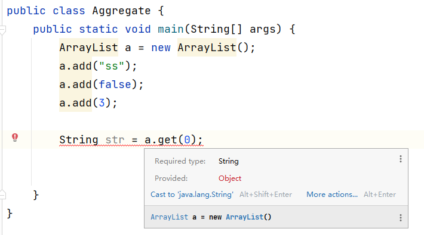

			+ 使用泛型后

		+ 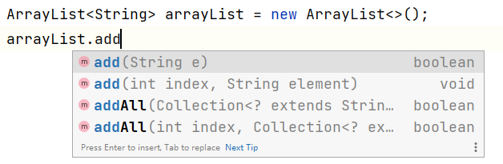

		+ 代码:

			+ ```java
				package cn.demo.arraylist.three.domain;
				
				import java.util.ArrayList;
				
				public class Aggregate {
				    public static void main(String[] args) {
				        ArrayList a = new ArrayList();
				        a.add("ss");
				        a.add(false);
				        a.add(3);
				
				        ArrayList<String> arrayList = new ArrayList<>();
				        arrayList.add("dd");
				        System.out.println(arrayList);
				        String b = arrayList.get(0);
				
				
				    }
				}
				
				```

			+ 


# Java中的设计模式

### 概念

**含义**

按照已有的项目模式,进行项目搭建,称已有的项目模式为设计模式

**分类**

```
一共23种设计模式
1.代理设计模式
2.工厂设计模式----生产出来的长得都一样
3.装饰设计模式---核心类库
4.单例设计模式---框架部分常用:一个对象只能实例化一次
5.模版设计模式
6.适配器模式
```

### **单利设计模式**

**特点:**

```
构造器私有化----private
本类中一定要实例化对象一次
对外一定是提供一个获取本类对象的方法
```

#### **两种表现形式————饿汉式  和 懒汉式**

**饿汉式**（无论是否使用本类，都贱这个对象创建出来）

只要你想获取定义的对象,代码就会new一次,而且new的名字是一样的,下面代码中,就是es

```
静态的获取,一定要new一次(一定要实例化对象一次)
private static Esingleton es = new Esingleton();
构造器私有化
private Esingleton(){}
对外提供的能够获取本来对象的方法 
public static Esingleton getEsingleton(){
    return es;
}
```

主函数中

```
Esingleton es = Esingleton.getEsingleton();
System.out.print(es)------打印的地址,而且每次打印的地址都是一样的,说明是实例化对象实例化一次,
```

**懒汉式(掌握)**（不会主动创建对象，什么时候使用到了该对象才会创建这个对象）

```
private static lazSingleton ls;
private lanSingleton(){}

同步:如果是多线程操作,更安全,(多人同时操作一个资源) 
(死锁,PV操作)
public static synchronized lanSingleton getlanSingleton(){
    //额外一次的判断,是否为空 
    if(ls == null){
        ls = new lanSingleton();
    }
    return ls;
}
```

#### 懒汉式和饿汉式的区别

```
懒汉式:
	多线程操作,更安全,体现synchronized
饿汉式:
	单线程操作,更加快捷，用户体验更好

线程需要额外的操作才可以进行,这个时候的多线程和单线程才是正常的说法
```


## 装饰设计模式(理解)

**含义**

```java
在不改变原有类结构的(类成员 和 类的设计结构)基础上,提供更强大的操作功能,一种类的设计模式
```


# API帮助文档

作用

由指定人编写好的文档，，帮助开发者查看java中定义好的类，如何使用该工具，类似字典

**如何查询**

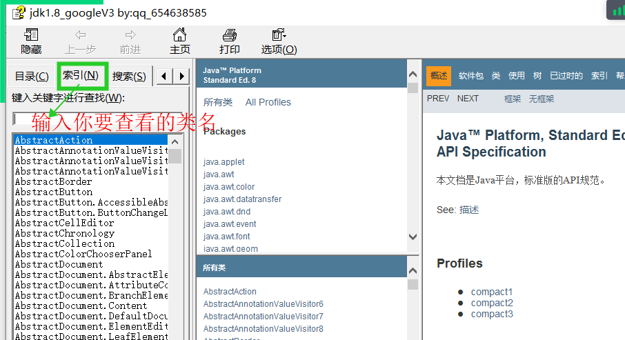

**查询到多个类 ,如何处理**


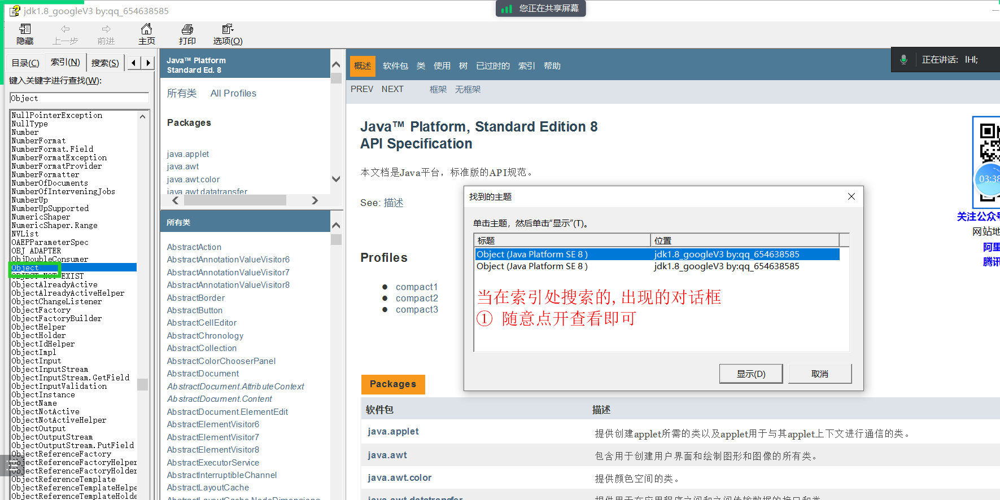

**如何查看类**

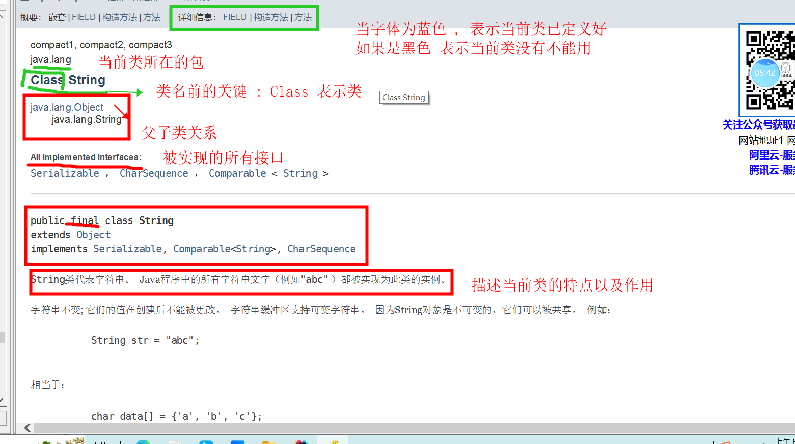


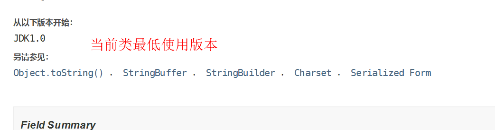


**查看类成员**

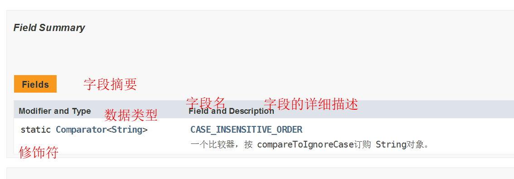

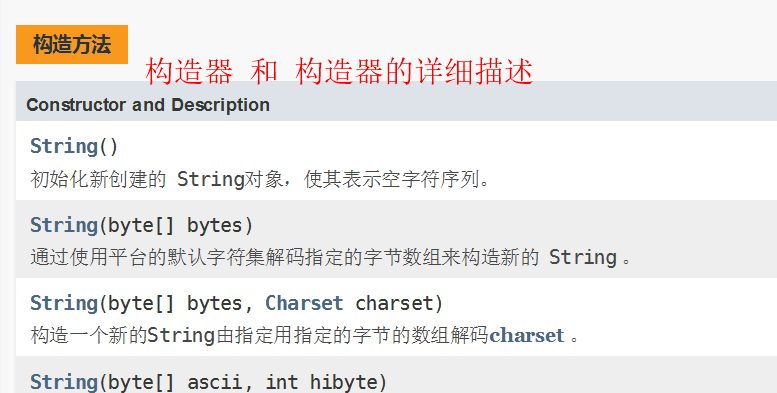


# Java常见面试题


**简述return  break   continue的区别**

```java
作用不同:
	break和continue都是用来结束流程控制语句的
	return 是结束方法

用法不同:

	break:终止语句,执行到break流程控制语句结束,适用于所有的流程控制语句和switch
	continue中断语句,执行到continue跳过本次循环执行下一次,适用于所有的循环控制语句
	return:结束方法,一般定义在有返回值的方法中
```


**阐述你学过的修饰符有哪些,含义是什么,能修饰什么?修饰的特点是什么?**

| 修饰符       | 含义   | 能修饰什么               | 特点                                                  |
| ------------ | ------ | ------------------------ | ----------------------------------------------------- |
| static       | 静态的 | 成员属性;成员方法;代码块 | 类名.直接打点调用;代码块优先主函数加载,并且只加载一次 |
| abstract     | 抽象的 | 类;成员方法              | 类不能实例化对象;方法没有方法体                       |
| final        | 最终的 | 类;成员字段;成员方法     | 类没有子类;成员字段必须有初始值;方法不能被重写        |
| synchronized | 同步的 | 成员方法;代码块          | 同步操作                                              |


**实际开发中,使用递归和递推那个最好**

```java
没有最好,只有最合适
	当操作次数较少的时候,推荐使用递归方式,编写更加便捷,递归是从根往上进行一步一步推理的,会把之前没运行出结果的算式保留,然后层层反复.
    当操作次数较多的时候,推荐使用递推,更节省栈内存空间

递推方式更节省栈内存空间
    递归方式实现原理:在方法的本身再次调用方法,当且仅当执行到某一确定值得时候才能计算出结果,并不断地向前计算,结束之前开辟出来的方法,如果操作次数过多,容易造成栈内存溢出
```


**发现if   else   和条件运算符操作类型,这两中技术的适用场景**

```
如果根据条件判断之后,直接显示结果,推荐使用条件运算符,如果条件判断之后,还有其他的业务逻辑操作,推荐使用if   else
```


**等值表达式计算的结果类型支持五种**

```
byte,short,int,char,String
```


**if   else  if   和switch语句的区别**

```java
条件不同
    if else if   语句:条件是任意的关系或者逻辑表达式,可以判断范围,也可以判断等值条件,判断的结果类型一定是布尔
        
	switch 语句:条件是等指表达式,只能判断等值结果,结果的类型支持五种-----byte , short , int ,char String

结束标志不同
	if  else  if  :以  }   为结束标志
	switch: 以break为首选的结束标志,如果没有,  以  }  为结束标志
适用场景:
	当且仅当判断条件是等值表达式,,且结果满足byte , short ,int ,char,String并且值得可能性比较少,推荐使用switch,效率较高;其余的情况都是 if ... else if  
```


**while 和do  ..while的区别**

```
原版:
	当初始化值和判断条件都一样的时候,且初始化值不满足判定条件,do  ...while  会比while循环多执行一次
简易版:
	while先判断,在执行,do...while先执行,后判断
```


**for 和while的区别**

```
区别:
	相同条件下,for会比while更节省内存空间

适用场景:
	for循环适用于已知循环次数
	while循环适用于未知循环次数,一般的判定条件是true
```


**结束语句的面试题,continue和break的辨析**

```
相同点
	都是用来结束流程控制语句的
	都是可以定义在任意的流程控制语句当中
	对if语句不起作用的

不同点
	break语句:终止语句,当代码执行到break语句后,,流程控制语句结束,不是当前的一个,而是整个.即对switch起作用,也对所有的循环语句起作用
	continue:中断语句,当代码执行到continue后,流程控制语句会结束本次循环,然后执行下一次,例如1 2 3 4 5   7  8  9,只对所有的循环语句起作用
```


**JavaBean定义规范**

```
定义的java类必须使用public作为访问权限修饰符
定义的成员字段,必须使用private作为访问权限修饰符
必须提供公有的无参构造器
必须提供所有字段的公有的get/set方法
```


**简述java中的访问权限修饰符有哪些?????**

```
类:public  和   缺省
    
类成员:public,protected,缺省,private
```


**this和super关键字分别表示什么,用法**

```
this:
	表示本类(当前)类对象,一定是定义在方法体中,当成员字段和局部变量名相同,且使用局部变量给成员字段赋值的时候,同 this.成员字段 = 局部变量
super
	表示父类对象,一定是定义在方法体中,当在子类调用父类构造器同名方法,必须通过super调用

this和super同时编写,一定先写super
```


**对比方法的特性:方法重载和方法重写**

| 比较项     | 方法重载(OverLoad)         | 方法重写(OverRide)                                 |
| ---------- | -------------------------- | -------------------------------------------------- |
| 定义位置   | 本类                       | 子类                                               |
| 方法名     | 一致                       | 一致                                               |
| 参数列表   | 不同(个数\|\|顺序\|\|类型) | 一致                                               |
| 返回值类型 | 无关                       | 一致或父类返回值类型的子类                         |
| 访问权限   | 无关                       | 不严于父类(子类的访问权限修饰符比父类的大或者相同) |


**简述:instanceof  implements interface 关键字**

```
instanceof:判断指定的对象,是否是指定的类或者其子类对象的运算符,结果一定是布尔类型

implements:实现接口的关键字

interface:定义接口的关键字
```


**口述:java中面向对象的特征有哪些,使用面向对象编程的好处,怎么体现的**

```java
特征:
	封装,继承,多态       抽象
```

```
好处和体现
	封装:降低类和类之间的耦合度 --- 封装
		提高代码的安全性
	简化代码:
		封装:简化主函数
		继承和抽象:简化子类
		多态:简化业务
		继承  多态  抽象:------提高代码的重用性(复用性)
```


**简述: ==  和  equals  方法的区别**

```java
 ==  只能比较栈内存
	当用来判断基本数据类型，比较的是栈内存的值是否一致
     当用判断引用数据类型，比较的是栈内存中引用数据类型的对象的地址是否一致

```

```java
equals方法只能比较引用数据类型
    如果是Object类中的 equals 方法，底层实现原理和 == 一致，比较的是栈内存中引用数据类型对象的地址是否一致
    如果是子类重写 equals 方法，则比较的是堆内存中的 是否引用同一个构造器和构造器的传递的值是否一致

```


**为什么 再重写equals 方法但是必须同时生成hashCode方法**

为了提高方法的执行的效率,当hashCode返回值一致的的时候,才有调用equals方法比较的意义,否则直接pass

**代码展示：（下面是解释）**

Person 没有重写equals方法之前

Person类

```java
package cn.fighting.domain;

public class Person {
    private String name;
    private int age;
    
    public Person(String name, int age) {
        this.name = name;
        this.age = age;
    }

    @Override
    public String toString() {
        return "Person{" +
                "name='" + name + '\'' +
                ", age=" + age +
                '}';
    }

}


```


```java

package cn.fighting.test;

import cn.fighting.domain.Person;

public class PersonTest {
    public static void main(String[] args) {
        Person p1 = new Person("lihua",18);
        Person p2 = new Person("lihua's friend",18);
        System.out.println(p1);
        System.out.println(p2);
        System.out.println("?" + p1.equals(p2));


    }
}

//结果：
Person{name='lihua', age=18}
Person{name='lihua's friend', age=18}
?false
```


**Person类 重写 父类的 equals 方法**

Person的修改类

```java
package cn.fighting.domain;

public class Person {
    private String name;
    private int age;

    public Person(String name, int age) {
        this.name = name;
        this.age = age;
    }

    @Override
    public boolean equals(Object obj) {
        if (obj instanceof Person) {
            return this.name.equals(((Person) obj).name) && this.age == (((Person) obj).age);
        }
        return false;
    }
    
	@Override
    public int hashCode() {
        return Objects.hash(name, age);
    }

    @Override
    public String toString() {
        return "Person{" +
                "name='" + name + '\'' +
                ", age=" + age +
                '}';
    }

}


```


其中main没有改变

```java
package cn.fighting.test;

import cn.fighting.domain.Person;

public class PersonTest {
    public static void main(String[] args) {
        Person p1 = new Person("lihua",18);
        Person p2 = new Person("lihua",18);
        System.out.println(p1);
        System.out.println(p2);
        System.out.println("?" + p1.equals(p2));


    }
}
//结果
Person{name='lihua', age=18}
Person{name='lihua', age=18}
?true
```


‘


**抽象类和接口的区别**

````java
- 抽象类是类  关键字abstract class。接口关键字 interfact。
- 抽象类有构造方法，但不能实例化对象。接口没有方法。
- 抽象类有可以有抽象方法，也可以没有。接口中只能是抽象方法。
- 抽象类中可以有普通成员变量。接口中只能由常量。
- 抽象类只能存在单继承。接口可以被多实现。
````


**和append都可以实现尾部追加,,区别是什么**

```java
首先是:操作的元素不同
	+:操作的是String，操作的是常量池中的原意字符串。会产生一个新的字符串。
    append 操作的是 StringBuffer \ StringBuilder，操作的是缓冲区。可以不产生新的字符串。

然后是:操作的位置是不同的
	+操作的是堆栈内存
	append方法:操作的是缓存区
```


**StringBuffer  和   Stringbuilder  和  String  三个特点**

```java
相同点:(共有的相同点)
	这三个类 操作都是 字符串类型的数据

String 和 StringBuffer 的相同点:
	都是多线程安全的操作
	出现的版本都是JDK1.0

StringBuffer 和 StringBuilder 相同点:
	都是可变字符串类
	操作的都是缓存区

String 是定长字符串,操作的是堆栈内存

StringBuilder 是单线程操作更加便捷,出现在JDK5
```


**装饰设计模式和继承下的方法重写那个更好**

```jajva
继承下的方法重写:
	类和类之间必须继承,必须是对父类的已有方法进行功能性的增强

装饰设计模式:
	类和类之间不需要必须是继承关系,但是操作的数据类型必须一致,在原始类中不一定存在

实际开发过程中,一般都是继承 + 装饰设计模式一块用,后续的IO流就是这样的设计
```


**java的异常处理机制？如何处理？**

```java
分为两种处理机制：处理异常 和 抛出异常
    
通过 try 块进行 异常的捕获，通过 catch 对指定的异常进行处理，在 finally 中执行无论是否发生异常都要执行的代码
```


**final 和 finally 异同点**

```java
相同点:都是修饰符,都表示最终的含义

不同点:
	修饰的内容不同
final 能够修饰类(不能被继承),成员字段(定义的时候需要赋予初始值),成员方法(不能被重写)

finally 能够修饰代码块,表示无论是否出现异常都要执行的操作
```


**java中创建多线程的方式有什么?如何开启多线程,用哪个更好**

```java
有什么
	继承Thread类
	实现Runnable接口
	实现Callable接口
    
如何开启多线程:
	通过 Thread 类中的 start 方法开启多线程,并且调用run方法执行多线程操作

实际开发中,推荐使用 Runnable接口 的操作,可以避免单继承的局限性和继承带来的类和类之间的耦合度增加
```


