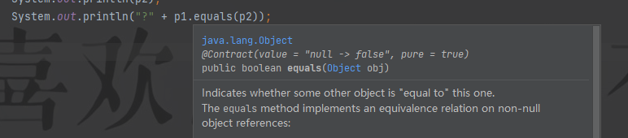
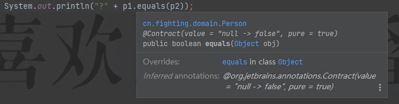

awesome

# Java常见面试题

# 第一阶段


## **1 简述java变量的含义和特点**

```java
含义:
	一个数据存储空间的表示
        
特点:
	唯一性 
    随机性
```


## **2 java中数据类型定义的关键字有那些,默认值是什么**

```java
引用数据类型-----String  数组    接口    --->>null
    
    
基本数据类型
    整数型:byte  short  int(0) long
    浮点型(小数):float   double(0.0)
    字符型:char---->>>空格
    布尔型:boolean --->false
```


## **3简述  /   和%  的使用场景**

```java
当判断两个数的关系的时候,推荐使用%   ,  其余情况按照需求使用
```


## **4简述x++  和   ++x的区别**

```java
作为单条语句编写时候,x++ 和++x没有区别

当作为组合语句编写时候
    x++:先执行,操作结束后在自身 +1
        
	++x:先自身 +1 ,再执行操作
```


## **5简述 &(按位与) 和 &&(逻辑与,或者短路与)的区别**

```java
当前表示能够判断出整体表达式的结果时,&&只运行当前表达式,&会执行所有的表达式
```


## **6双重for循环的特点**

```java
外循环控制行,内循环控制列
    
外循环执行一次,内循环执行一遍
```


## **7简述你使用过的结束操作有哪些,作用是什么**

| 结束操作 | 作用                                                         |
| -------- | ------------------------------------------------------------ |
| }        | 表示代码块结束                                               |
| ;        | 表示一条语句结束                                             |
| break    | 终止语句,结束流程控制语句,执行到break,流程控制语句结束,对switch和所有的循环语句起作用 |
| continue | 中断语句,结束流程控制语句,执行到continue,结束本次,执行下一次,只对所有的循环语句起作用 |
| return   | 返回,结束有返回值类型的方法,可以多次定义,但是只能返回一个,表示方法结束,  其之后不能定义任何的功能代码 |


## **8简述你所熟悉的JVM虚拟机中的内存空间,并且进行简要说明作用**

| JVM虚拟机内存空间 | 作用                                                         |
| ----------------- | ------------------------------------------------------------ |
| 栈内存            | 存储基本数据类型，引用数据类型的声明，方法的调用             |
| 堆内存            | 通过new关键字实例化的引用数据类型和数组中的数据的存储        |
| 垃圾回收处理机制  | JVM认为当前的内存不足以支持程序运行时，会自动启动，处理内存空间中无效数据 |


## 9简述java中对象的声明和实例化的区别

```java
个数不同:
	声明:定义一个
        
	实例化：创建两个

位置不同：
        声明：只在栈内存中定义

        实例化：在栈内存定义地址（对象名），在堆内存存储数据

是否能够使用：
        声明：不能使用，会抛出空指针异常
        
        实例化：可以使用
```


## 10简述使用封装的好处

```java
提高代码安全性
    
简化代码编写(简化主函数代码编写)
    
降低类和类之间的耦合度(解耦合)
```


## 11简述使用继承的优缺点和特点

```java
简化代码编写(简化子类代码编写)
    
提高代码复用性(复用性)

不足:
	一定程度上提高类和类之间的耦合度

特点:
	java中只支持单继承
```


## 12简述普通类,抽象类,接口中能够定义那些类成员

| 比较项             | 普通类               | 抽象类               | 接口                     |
| ------------------ | -------------------- | -------------------- | ------------------------ |
| 定义关键字         | class                | abstract class       | interface                |
| 继承或实现的关键字 | extends              | extends              | implements               |
| 成员字段           | 变量、常量           | 变量、常量           | 常量                     |
| 构造器             | 既能定义，也能实例化 | 只能定义，不能实例化 | 既不能定义，也不能实例化 |
| 成员方法           | 普通方法             | 普通方法、抽象方法   | 抽象方法                 |


## 13使用多态的好处

```
简化代码编写(简化业务类代码编写)

提高代码复用性
```


## 14简述面向对象的特点有哪些,使用面向对象编程的好处

```
面向对象思想的实质就是封装,继承,多态,抽象的综合应用

好处：
	简化 代码编写（封装，继承，多态）
	提高代码安全性（封装）
	提高代码复用性（继承，多态）
	降低类和类之间的耦合度（封装）
```


## 15单利设计模式的特点

```
私有化构造器

只能在本类实例化对象一次

对外提供获取本类对象的静态方法
```


## 16饿汉式和懒汉式的区别

```
懒汉式: 多线程操作更安全

饿汉式: 单线程操作更快捷
```


## 17简述使用匿名 操作的优缺点

```
优点: 节省栈内存空间

不足: 不利于用户获取
```


## 18简述构造器的特点和作用

```
作用:实例化对象和值传递

特点:
	构造方法名和类名一致
	构造方法没有返回值部分
	使用new关键字调用
	当类中没有明确定义构造器时候,JVM虚拟机会提供一个默认无参构造器,如果定义,则JVM不会提供任何形式的构造器
```


## 19简述数组的含义，特点，使用数组的好处

```
含义：
	存储一组相同数据类型的  容器
	
特点：
	存储相同数据类型，一定程度上保证数据安全性
	数组一旦创建，长度固定，灵活性较差
好处：
	将具有相同含义和类型的一组数据统一存储，方便调用者获取
```


## **20简述什么是序列化？什么是反序列化？**

```java
序列化：使用指定的技术，将对象中的数据上传到指定文件中或网络地址上
    
反序列化：使用指定的技术，将指定文件中或网络地址中的数据下载到指定对象中
```


## **21简述return  break   continue的区别**

```java
作用不同:
	break和continue都是用来结束流程控制语句的
	return 是结束方法

用法不同:

	break:终止语句,执行到break流程控制语句结束,适用于所有的流程控制语句和switch
	continue中断语句,执行到continue跳过本次循环执行下一次,适用于所有的循环控制语句
	return:结束方法,一般定义在有返回值的方法中
```


## **22阐述你学过的修饰符有哪些,含义是什么,能修饰什么?修饰的特点是什么?**

| 修饰符       | 含义   | 能修饰什么               | 特点                                                  |
| ------------ | ------ | ------------------------ | ----------------------------------------------------- |
| static       | 静态的 | 成员属性;成员方法;代码块 | 类名.直接打点调用;代码块优先主函数加载,并且只加载一次 |
| abstract     | 抽象的 | 类;成员方法              | 类不能实例化对象;方法没有方法体                       |
| final        | 最终的 | 类;成员字段;成员方法     | 类没有子类;成员字段必须有初始值;方法不能被重写        |
| synchronized | 同步的 | 成员方法;代码块          | 同步操作                                              |


## **23实际开发中,使用递归和递推那个最好**

```java
没有最好,只有最合适
	当操作次数较少的时候,推荐使用递归方式,编写更加便捷,递归是从根往上进行一步一步推理的,会把之前没运行出结果的算式保留,然后层层反复.
    当操作次数较多的时候,推荐使用递推,更节省栈内存空间

递推方式更节省栈内存空间
    递归方式实现原理:在方法的本身再次调用方法,当且仅当执行到某一确定值得时候才能计算出结果,并不断地向前计算,结束之前开辟出来的方法,如果操作次数过多,容易造成栈内存溢出
```


## **24发现if   else   和条件运算符操作类型,这两中技术的适用场景**

```
如果根据条件判断之后,直接显示结果,推荐使用条件运算符,如果条件判断之后,还有其他的业务逻辑操作,推荐使用if   else
```


## **25等值表达式计算的结果类型支持五种**

```
byte,short,int,char,String
```


## **26if   else  if   和switch语句的区别**

```java
条件不同
    if else if   语句:条件是任意的关系或者逻辑表达式,可以判断范围,也可以判断等值条件,判断的结果类型一定是布尔
        
	switch 语句:条件是等值表达式,只能判断等值结果,结果的类型支持五种-----byte , short , int ,char String

结束标志不同
	if  else  if  :以  }   为结束标志
	switch: 以break为首选的结束标志,如果没有,  以  }  为结束标志
适用场景:
	当且仅当判断条件是等值表达式,,且结果满足byte , short ,int ,char,String并且值得可能性比较少,推荐使用switch,效率较高;其余的情况都是 if ... else if  


相同点:
	都是进行多个条件选择判断
        
	都能够使用   }   作为结束标志
```


## **27while 和do  ..while的区别**

```
原版:
	当初始化值和判断条件都一样的时候,且初始化值不满足判定条件,do  ...while  会比while循环多执行一次

简易版:
	while先判断,在执行,do...while先执行,后判断
```


## **28 for 和while的区别和适用场景**

```
区别:
	相同条件下,for会比while更节省内存空间

适用场景:
	for循环适用于已知循环次数
	while循环适用于未知循环次数,一般的判定条件是true
```


## **29结束语句的面试题,continue和break的辨析**

```
相同点
	都是用来结束流程控制语句的
	都是可以定义在任意的流程控制语句当中
	对if语句不起作用的

不同点
	break语句:终止语句,当代码执行到break语句后,,流程控制语句结束,不是当前的一个,而是整个.即对switch起作用,也对所有的循环语句起作用
	continue:中断语句,当代码执行到continue后,流程控制语句会结束本次循环,然后执行下一次,例如1 2 3 4 5   7  8  9,只对所有的循环语句起作用
```


## **30JavaBean定义规范**

```
定义的java类必须使用public作为访问权限修饰符

定义的成员字段,必须使用private作为访问权限修饰符

必须提供公有的无参构造器

必须提供所有字段的公有的get/set方法
```


## **31简述java中的访问权限修饰符有哪些?????作用范围是什么**

```
类:public  和   缺省
    
类成员:public,protected,缺省,private
```


类成员的访问权限修饰符

| 访问权限修饰符/作用域                   | 本类 | 同包 | 子类、子包 | 任意 |
| --------------------------------------- | ---- | ---- | ---------- | ---- |
| public（公有的）                        | *    | *    | *          | *    |
| protected（受保护的） -- 必须是继承前提 | *    | *    | *          |      |
| 缺省                                    | *    | *    |            |      |
| private（私有的）                       | *    |      |            |      |


## **32this和super关键字分别表示什么,用法**

```java
this:
	表示本类(当前)类对象,只能定义在方法体中,当成员字段和局部变量名相同,且使用局部变量给成员字段赋值的时候,同 this.成员字段 = 局部变量，通过this关键字区分
	
super
	表示父类对象,只能是定义在方法体中,当在子类调用父类构造器同名类成员时候,通过super区分

this和super同时编写,一定先写super
```


## **33对比方法的特性:方法重载和方法重写**

| 比较项     | 方法重载(OverLoad)         | 方法重写(OverRide)                                 |
| ---------- | -------------------------- | -------------------------------------------------- |
| 定义位置   | 本类                       | 子类                                               |
| 方法名     | 一致                       | 一致                                               |
| 参数列表   | 不同(个数\|\|顺序\|\|类型) | 一致                                               |
| 返回值类型 | 无关                       | 一致或父类返回值类型的子类                         |
| 访问权限   | 无关                       | 不严于父类(子类的访问权限修饰符比父类的大或者相同) |


## **34简述:instanceof  implements interface 关键字**

```
instanceof:判断指定的对象,是否是指定的类或者其子类对象的运算符,结果一定是布尔类型

implements:实现接口的关键字

interface:定义接口的关键字
```


## **35口述:java中面向对象的特征有哪些,使用面向对象编程的好处,怎么体现的**

```java
特征:
	封装,继承,多态       抽象
```

```
好处和体现
	封装:降低类和类之间的耦合度 --- 封装
		提高代码的安全性
	简化代码:
		封装:简化主函数
		继承和抽象:简化子类
		多态:简化业务
		继承  多态  抽象:------提高代码的重用性(复用性)
```


## **36简述: ==  和  equals  方法的区别**

```java
 ==  只能比较栈内存
	当用来判断基本数据类型，比较的是栈内存的值是否一致
     
    当用判断引用数据类型，比较的是栈内存中的地址是否一致

```

```java
equals方法只能比较引用数据类型
    如果是Object类中的 equals 方法，底层实现原理和 == 一致，比较的是栈内存中的地址是否一致
    如果是子类重写 equals 方法，则比较引用数据类型实例化后,堆内存中存储的数据值是否一致

```


## 37为什么String是不可变的

```
在类结构式String 被final 修饰,表示最终类,因此类结构相对稳定

由于String底层赋值相当于char[]，而数组一旦创建长度固定，因此String值不可改变
```


## **38为什么 再重写equals 方法但是必须同时生成hashCode方法**

```为了提高方法的执行的效率,当hashCode返回值一致的的时候,才有调用equals方法比较的意义,否则直接pass```


**代码展示：（下面是解释）**

Person 没有重写equals方法之前

Person类

```java
package cn.fighting.domain;

public class Person {
    private String name;
    private int age;
    
    public Person(String name, int age) {
        this.name = name;
        this.age = age;
    }

    @Override
    public String toString() {
        return "Person{" +
                "name='" + name + '\'' +
                ", age=" + age +
                '}';
    }

}


```


```java

package cn.fighting.test;

import cn.fighting.domain.Person;

public class PersonTest {
    public static void main(String[] args) {
        Person p1 = new Person("lihua",18);
        Person p2 = new Person("lihua's friend",18);
        System.out.println(p1);
        System.out.println(p2);
        System.out.println("?" + p1.equals(p2));


    }
}

//结果：
Person{name='lihua', age=18}
Person{name='lihua's friend', age=18}
?false
```




**Person类 重写 父类的 equals 方法**

Person的修改类

```java
package cn.fighting.domain;

public class Person {
    private String name;
    private int age;

    public Person(String name, int age) {
        this.name = name;
        this.age = age;
    }

    @Override
    public boolean equals(Object obj) {
        if (obj instanceof Person) {
            return this.name.equals(((Person) obj).name) && this.age == (((Person) obj).age);
        }
        return false;
    }
    
	@Override
    public int hashCode() {
        return Objects.hash(name, age);
    }

    @Override
    public String toString() {
        return "Person{" +
                "name='" + name + '\'' +
                ", age=" + age +
                '}';
    }

}


```


其中main没有改变

```java
package cn.fighting.test;

import cn.fighting.domain.Person;

public class PersonTest {
    public static void main(String[] args) {
        Person p1 = new Person("lihua",18);
        Person p2 = new Person("lihua",18);
        System.out.println(p1);
        System.out.println(p2);
        System.out.println("?" + p1.equals(p2));


    }
}
//结果
Person{name='lihua', age=18}
Person{name='lihua', age=18}
?true
```




‘


## **39抽象类和接口的区别**

````java
- 抽象类是类  关键字abstract class。接口关键字 interfact。
- 抽象类有构造方法，但不能实例化对象。接口没有方法。
- 抽象类有可以有抽象方法，也可以没有。接口中只能是抽象方法。
- 抽象类中可以有普通成员变量。接口中只能由常量。
- 抽象类只能存在单继承。接口可以被多实现。
````


## **40和append都可以实现尾部追加,,区别是什么**

```java
首先是:操作的元素不同
	+:操作的是String，操作的是常量池中的原意字符串。会产生一个新的字符串。
    append 操作的是 StringBuffer \ StringBuilder，操作的是缓冲区。可以不产生新的字符串。

然后是:操作的位置是不同的
	+操作的是堆栈内存
	append方法:操作的是缓存区
```


## **41  StringBuffer  和   Stringbuilder  和  String  三个特点**

```java
相同点:(共有的相同点)
	这三个类 操作都是 字符串类型数据的类
	都是被final修饰的类结构稳定得类

String 和 StringBuffer 的相同点:
	都是多线程安全的操作
	出现的版本都是JDK1.0

StringBuffer 和 StringBuilder 相同点:
	都是可变字符串（可变指的是长度可变）
	操作的都是缓存区（缓冲区）

String 是定长字符串,操作的是堆栈内存

StringBuilder 是单线程操作更加便捷,出现在JDK5
```


## **42装饰设计模式和继承下的方法重写那个更好**

```jajva
继承下的方法重写:
	类和类之间必须继承,必须是对父类的已有方法进行功能性的增强
	
    好处：
        当不需要提供增强方法时，可以直接调用父类中定义好的方法
	
    不足：
        类和类之间必须是继承关系，耦合度高

装饰设计模式:
	类和类之间不一定是继承关系,但是操作的数据类型必须一致，而且增强功能的方法，在原始类中不一定存在
	好处：
		降低类和类之间的耦合度
		
	不足：
		需要调用相同功能的方法，则需要在装饰类中重新定义，比较麻烦

实际开发过程中,一般都是继承 + 装饰设计模式组合使用，扬长避短
```


## **43 java的异常处理机制？如何处理？**

```java
分为两种处理机制：处理异常 和 抛出异常
    java中的异常处理机制是通过java语言设计好的5个关键字实现的，其中throw表示抛出指定的异常类对象；
    throws表示抛出一个或者多个异常类；
    try表示捕获异常；
    catch表示打印异常信息和处理异常操作，可以定义多个；
    finally表示无论是否出现异常都要执行的代码定义代码块
    
    
    
	如何处理： 
    	通过 try 块进行 异常的捕获，通过 catch 对指定的异常进行处理，在 finally 中执行无论是否发生异常都要执行的代码
        抛出异常时，在定义方法时，在参数列表后面通过throws抛出指定的某个异常类或者多个异常类，在方法体中通过throw关键字抛出指定的某个异常类对象信息
```


## **44 final 和 finally 异同点**

```java
相同点:都是修饰符,都表示最终的含义

不同点:
	修饰的内容不同
final 能够修饰类(不能被继承),成员字段(定义的时候需要赋予初始值),成员方法(不能被重写)

finally 能够修饰代码块,表示无论是否出现异常都要执行的操作
```


## 45 集合和数组的异同点

```java
相同点:
	都是用来存储多个数据的 容器
        
	都可以存储引用数据类型
        
不同点:(见下表)
```

| 比较项           | 数组                                           | 集合                                 |
| ---------------- | ---------------------------------------------- | ------------------------------------ |
| 存储数据灵活性   | 一旦创建，长度固定，灵活性差                   | 不受长度限制，灵活性强               |
| 存储数据的类型   | 既可以存储基本数据类型，也可以存储引用数据类型 | 只支持引用数据类型存储               |
| 存储数据的安全性 | 只支持同一种类型，更安全                       | 需要使用辅助技术保证数据存储的安全性 |


## 46 单列集合存储数据的特点,以及不同集合和实现类底层如何存储数据

```
特点:
	Collection接口: 既可以存储重复元素, 也可以存储唯一元素, 既可以存储有序数据, 也可以存储无序数据
	List接口: 有序不唯一
	Set接口: 无序且唯一
	Queue接口: 先进先出的队列式存储
	
	
底层如何存储数据
	ArrayList类： 基于动态数组存储， 更适合查询操作
	LinkedList类： 基于双链表式存储，更适合增删操作
	TreeSet类： 基于二叉树存储
	HashSet类：基于哈希值存储
```


## 47 Map集合存储数据的特点

```
以KEY - VALUE键值对形式存储,为 一一对应的映射关系,其中KEY不可以重复 , VALUE可以重复
```


## 48Java中操作多线程的方式有哪些,如何开启多线程操作

```
创建方式: 继承Thread类, 实现Runnable 接口, 实现Callable接口

通过Thread类对象调用start 方法开启多线程,并调用run方法执行操作
```


## 49每种状态下多线程所具备的操作权限

| 线程状态         | 权限                     |
| ---------------- | ------------------------ |
| 创建状态         | 只具备生存权             |
| 运行状态         | 既有生存权，又有执行权   |
| 消亡状态         | 没有任何权限             |
| 阻塞（临时）状态 | 只具备生存权，没有执行权 |


## 50 创建状态下和临时状态下的线程生存全是否一致,如果不一致 ,区别是什么

```java
不一致 : 
	创建状态下线程生存权,表示线程只是被创建,没有开启,
	临时状态下的生存权,表示线程已经开启,但是由于抢占CPU执行权失败
```


## 51 处于临时状态下的线程,在JVM中那个位置存储,进出原则是什么

```
存储在由JVM提供的线程池中,存储原则是先进先出的队列式存储
```


## 52 sleep方法和wait方法都能让运行状态下的线程处于临时状态? 那个更好，简述sleep和wait方法的异同点


```
实际开发中 更推荐sleep方法,可以通过传参设置"睡眠时间“，到时会自动苏醒

相同点：
	当线程执行到sleep方法或wait方法时，都不会继续向后执行，由运行状态转为阻塞状态，进入到线程池中存储
	
	
不同点：
	sleep方法：到时自动醒来，但是不会释放锁对象
	wait方法：需要配合指定方法进行手动唤醒，但是会释放锁对象


```


## 53 java中解决多线程安全隐患问题的方式有哪些，区别是什么，适用场景

``` 
方式:  同步代码块   ,   同步函数

区别:锁的个数不同
        同步代码块有3种锁:
            本类对象锁(this)
            Object锁(obj)
            反射机制锁(类名.class)
            
		同步函数只有一种锁：本类对象锁（this）

适用场景：	
	根据具体用户的实际需求进行具体问题具体分析
	当业务逻辑较少的时候，推荐在run方法中直接定义同步代码块，不需要再次调用，“锁”的样式较多
	当业务逻辑较复杂的时候，推荐自定义同步函数，简化run方法中的业务逻辑，但是千万不要忘记在run方法中调用
```


## 54 简述java中IO流的分类

```java
按照流向分：
    	输入流  和  输出流

字符流: 
	字符输入流  ---   Reader ------
        FileReader /  BufferedReader
	字符输出流 ---  Write ---
        FileWriter  / BufferedWriter
        
字节流:
	字节输入流-----   InputStream----
        FileInputStream  /  BufferedInputStream
	字节输出流  ----  OutputStream -----
        FileOutPutStream  /  BufferedOutputStream
```


## **55 java中创建多线程的方式有什么?如何开启多线程,用哪个更好**

```java
有什么
	继承Thread类
	实现Runnable接口
	实现Callable接口
    
如何开启多线程:
	通过 Thread 类中的 start 方法开启多线程,并且调用run方法执行多线程操作

实际开发中,推荐使用 Runnable接口 的操作,可以避免单继承的局限性和继承带来的类和类之间的耦合度增加
```


## **56当调用 Map 集合的 put 方法 传递的KEY为重复操作 , 则代码在运行是会报错吗 ? 如果报错 抛出什么异常 ?如果不报错value显示什么**

```java
不会报错,为重复的KEY最后一次对应的VALUE值
```


## **57 简述是否所有的高效流都提供高效方法？如果提供请说出高效方法是什么，作用是什么？如果没有提供，请简述为什么还要使用高效流？**

```java
不是所有的高效流都提供高效方法；只有字符流提供，
    其中字符输出高效流提供newLine()方法表示换行，体现了java语言的跨平台性
    字符输入高效流提供readLine()方法表示读一行；之所以使用高效流原因是操作缓冲区，一定程度上降低堆栈内存的损耗
```


## 58 传递基本数据类型和引用数据类型的异同点

```
相同点: 都是在栈内存中完成参数传递

不同点:
	参数数据传递形式不同
		基本数据类型传递的是指定的值
		引用数据类型传递的是地址
	参数数据引用的位置不同
		基本数据类型在栈内存中完成引用
		引用数据类型在堆内存中完成引用
```


## 59 简述继承Thread类和实现Runnable接口的优缺点

```
继承Thread类
	优点:直接调用父类中的所有操作多线程的方法
	不足:提高类和类之间的耦合度
	
实现Runnable接口
	优点： 避免java中单继承的局限性
	不足：需要先和Thread类建立关联后，才能调用方法完成对线程的操作
```


## 60 简述MySQL中常见的存储引擎，以及特点

| 常见的存储引擎 | 优点           | 不足             |
| -------------- | -------------- | ---------------- |
| InnoDB         | 支持外键和事物 | 查询速度稍慢     |
| MySAM          | 查询速度快     | 不支持外键和事物 |


## 61 简述java中常见的文件格式和作用

```
.java文件: 源码文件 ,主要用于编写java源代码,需要具备权限才能修改

.class文件: 字节码文件,主要在JVM虚拟机上运行的文件;由.java通过javac命令编译而来
```


## 62 简述java中常见的指令,并说明作用

````
javac 命令: 用于将指定的.java源码文件编译成同名的 .class字节码文件

java命令: 用于在JVM虚拟机上运行指定的.class文件,注意千万不要编写文件后缀
````


## 63 简述变量的含义和特点

```
含义: 
	一个数据存储空间的表示
	
特点:
	随机性, 唯一性
```


## 64 简述java中的数据类型有那些,定义的关键字是什么,默认值是什么

```
分类:
	引用数据类型, 和基本数据类型
	
基本数据类型关键字:
	数值型:
	整数型:byte short int long 其中int是默认整数型,默认值为0
	浮点型:float double 其中double是默认浮点型,默认值位0.0
	字符型:char 只能存储一个字符,值定义在''中,默认值是空格符号
	布尔型:boolean 值只有两个,一个是false 一个是ture 默认值是false
```


## 65 简述JVM虚拟机中熟悉的分区有哪些，作用是什么

```java
栈内存:
	主要用于存储基本数据类型变量,引用数据类型对象地址和调用方法时开辟的方法栈
        
        
堆内存:
	主要用于存储通过new关键字完成的引用数据类型赋值  和  数组数据

垃圾回收处理:
	由JVM虚拟机判定当前运行内存不足以支持程序运行时,会自动启动,清除无用数据
        
类加载器:
	在JVM虚拟机上运行指定的.class文件
        

```


## 66 简述构造器的作用和特点

```
作用： 
	实例化对象 和 通过有参构造器完成值传递
	
特点：
	构造器方法名与类名一致
	构造器方法没有返回值部分
	通过new关键字调用
	当类中没有明确定义构造器时候，JVM会提供一个默认的无参构造器，如果明确定义了。则不会提供任何形式的构造器，构造器方法允许重载
```


## 67 简述数组中是否提供长度的方法，如果有，如何获取，如果没有，怎样获取，String类获取元素个数的方式是什么，集合获取元素的个数的方式是什么

```
首先，数组中没有提供获取长度的方法，数组是通过数组名.length属性获取元素个数；

String类：通过String类中的length（）----方法获取

集合：通过集合对象调用size（）----方法获取元素的个数
```


## 68 简述java中集合框架结构的分类，并说明不统计和的存储特点，以及底层具体实现类是如何实现

```
分类：
	单列集合   和  双列集合
	
存储数据的特点：
	单列集合
		Collection根接口：既可以重复，也可以唯一；既可以有序，也可以无序
		List接口：有序不唯一
		Set接口：无序且唯一
		Queue接口：先进先出
		
	双列集合：
		以KEY - VALUE键值对存储，遵循一一对应的映射关系，其中KEY不能重复，以Set集合存储；VALUE可以重复，以Collection集合存储
		
具体实现类实现依据：
	ArrayList类：依赖于动态数组，具有初始容量，为10，支持以1.5倍机制自动扩容
	LinkedList类：依赖于双向链表实现
	HashSet类：依赖于哈希码值存储
	TreeSet类：依赖于二叉树存储
	HashMap类：依赖于哈希码值存储
	TreeMap类：依赖于二叉树存储
	
	
```


## 69 简述什么是并行和并发

```
并发：
	单核操作，适用于数据量较小的操作，按照顺序执行
	
并行:
	多核操作，适用于数据量较大的操作，随机执行（等于是时间片分片进行执行进程）
```


## 70 简述java中多线程的创建方式有哪些，如何开启多线程操作，不同方式的优缺点是什么，实际开发中更推荐那种

```
创建方式：
	继承Thread类，实现Runnable接口，实现Callable接口
	
如何开启多线程：
	通过Thrad类中的start方法开启多线程
	
优缺点：
	继承Thread类：
		优点：由于是继承关系，可以直接调用Thread类中的方法
		不足：会提高类和类之间的耦合度
	实现Runnable接口和实现Callable接口
		优点：避免java中单继承的局限性，降低类和类之间的耦合度
		不足：在执行多线程之前需要和Thread类先建立关联
实际开发中：
	需要根据用户的实际需求具体问题具体分析；但更多使用实现接口操作
```


## 71简述java中的显式锁和隐式锁是什么，特点

```
显式锁：
	Lock接口，需要手动创建，"上锁" 和 释放锁
	
隐式锁：
	synchronized修饰符，无需手动创建，实现自动 上锁 和释放锁
```


## 72简述线程池的七大参数是什么，表示什么

```
核心线程数：  一直存在，就是默认的初始化线程对象个数 
最大线程数：	当核心线程数不足以支持当前操作的时候，会由线程工厂创建新的线程对象，但是个数不会超过最大线程数
等待时长：	非核心线程对象最大等待时间
时间单位：	设置等待时长的时间单位
消息队列：	存储超过当前最大线程处理范围的操作
线程工厂：	创建线程对象，可以省略不写，使用默认就行
拒绝策略：	通过调用java定义好的拒绝策略类，防止过度调用
```


## 73 简述什么是反射机制，使用反射机制的好处和前提是什么

```
含义：
	通过指定类的字节码文件对象，动态操作类成员
	
好处：
	一定程度上减低堆栈内存的损耗
	
前提：
	类必须符合JavaBean定义规范
```


## 74 简述内省机制和反射机制的内在联系和适用场景

```
内在联系：
	内省机制的实现底层依赖于反射机制

适用场景：
	当操作成员方法和构造器时候，推荐使用反射机制
	当操作成员字段时，推荐使用内省机制
```


## 75 简述内省机制和反射机制操作成员字段的区别

```
内省机制底层是通过调用指定成员字段的get/ set方法完成操作

反射机制底层就是通过 对象名.字段名 = 值 的方式完成操作 ，当字段的访问权限是private则需要先获取操作权限后，才能进行操作
```


## 76 简述使用过Lambda表达式的好处

```
降低单独编写实现类的单元开销

提高用户的代码阅读性

```


## 77 简述JavaBean 和Map集合相互转换的条件

```
存储特点类似：
	javabean的字段名和 Map集合中的KEY特点一致，都不能重复
	
存储格式类似：
	JavaBean是以字段名 = 值 的形式存储
	Map集合是以KEY-VALUE键值对的形式存储
```


# 第二阶段

## 简述什么是Stream

```
并不是传统意义上的IO流，更像是数据传输的管道，通过制定的API完成对元素排列（集合，数组）中数据的操作的一种技术
```


## 简述你知道的代码优化的方式有什么，怎样优化

```
1、导包时候，使用指定类代替 * 编写 ----  一定程度上提高代码执行效率

2、Lambda表达式：   简化方法传参操作

3、Stream对象API    简化对元素序列的操作

```


## 简述Lambda表达式的特点

```java
能省则省
    
数据类型可以省略,()可以省略,{}可以省略,return关键字可以省略
```


## 简述MySQL数据库中常见的存储引擎，优缺点是什么

| 常见存储引擎                         | 优点           | 不足             |
| ------------------------------------ | -------------- | ---------------- |
| InnoDB（MySQL5.x开始为默认存储引擎） | 支持外键和事务 | 查询速度较慢     |
| MyISAM                               | 查询速度快     | 不支持事务和外键 |


## 简述DELETE语句和DROP语句的异同点

+ 相同点：都能实现表中数据删除的操作
+ 不同点：
	+ DELETE语句：隶属于DML语句，主要操作表中的数据，当执行DELETE语句时，是删除表中的数据，但是保留表结构
	+ DROP语句： 隶属于DDL语句，主要操作表，当执行DROP语句时候，销毁表结构，从而实现删除表数据的效果。


## 简述MySQL中支持的表约束有那些，特点是什么

+ NOT NULL ： 非空约束，限定当前列中不允许出现的NULL值
+ UNIQUE： 唯一约束，限定当前列中不允许出现重复值
+ DEFAULT值：默认值约束
+ PRIMARY KEY ： 主键约束
+ FOREIFN KEY：外键约束，主要用于多表操作，建立表和表之间的关联
+ AUTO_INCREMENT：主键自增长，必须定义在主键列上，值从1开始，每次增长1


## 简述主键约束的特点，定义规则

+ 特点：限定当前列的值非空且唯一，每张表中有且仅有一个主键列
+ 定义规则：一般使用表中没有逻辑意义个列作为主键列


## 简述 HTML和XML的异同点：

+ 相同点：
	+ 都是由W3C组织定义的
	+ 都是使用标签定义，完成数据存储的编程语言
+ 不同点：
	+ XML：可扩展性标签语言，支持自定义标签和中文标签，严格区分大小写，主要用于数据存储
	+ HTML语言，超文本标签语言，只支持W3C定义好的标签，忽略大小写，主要用于数据展示和数据获取


## 简述JDBC事物处理 的四大特性——ACID

| 特点                       | 详解                                             |
| -------------------------- | ------------------------------------------------ |
| 原子性（A -- Atomicity）   | 多个操作要么同时成功，有一个失败，则视为整体失败 |
| 一致性（C -- Consistency） | 操作前后数据总量不变                             |
| 隔离性（I -- Isolation）   | 多个线程操作共同资源，互不影响                   |
| 持久性（D -- Durability）  | 当操作成功后，对数据的操作是永久的               |


## 简述MyBatis框架中 #{} 和 ${}的异同点

+ 相同点：

	+ 都是OGNL表达式
	+ 都是用于获取传递参数值

+ 不同点：

+ | 比较项         | #{}                          | ${}                                                       |
	| -------------- | ---------------------------- | --------------------------------------------------------- |
	| 使用位置       | 用于Mapper映射文件中         | 用于MyBatis主配置文件中                                   |
	| 传递的参数含义 | 表中列名映射的JavaBean字段名 | 指定.properties文件中KEY的名字                            |
	| 底层实现原理   | 根据指定字段的get方法获取值  | 通过Properties集合中的getProperty方法，根据KEY，获取VALUE |


## 是否使用连接池思想的区别

+ 没有使用连接池 ：通过DriverManager类管理连接对象，需要一个创建一个，且使用完成后，需要手动关闭，造成资源的浪费
+ 使用连接池：通过DataSource类管理连接对象，会在连接池中创建好指定个数的连接对象，用户可以直接调用，使用完成后，会自动归还连接池，提高性能


## 简述什么是并行，什么是并发

+ 并发：单核操作，按照顺序执行，适用于数据量较小的操作，通过stream方法实现
+ 并行：多核操作，随机执行，适用于数据量较大的操作，通过parallelStream方法实现

